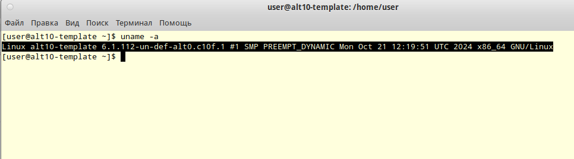
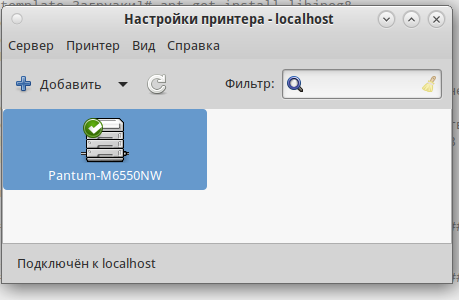

# Less10. Управление пакетами. Дистрибьюция софта 
- [Less10. Управление пакетами. Дистрибьюция софта](#less10-управление-пакетами-дистрибьюция-софта)
    - [Цель:](#цель)
    - [Содержание](#содержание)
    - [Задание:](#задание)
    - [Компетенции:](#компетенции)
    - [Комментарии к выполнению задания:](#комментарии-к-выполнению-задания)
    - [Решение проблемы работоспособности драйверов принтеров Pantum на ОС Альт10СП](#решение-проблемы-работоспособности-драйверов-принтеров-pantum-на-ос-альт10сп)
    - [Links:](#links)

### Цель: 
Научиться собирать RPM-пакеты.
Создавать собственный RPM-репозиторий.

### Содержание
- сборка пакетов (deb и rpm) из исходников;
- создание собственного репозитория с пакетами rpm;

### Задание:
Что нужно сделать?

  -  создать свой RPM (можно взять свое приложение, либо собрать к примеру Apache с определенными опциями);
  -  cоздать свой репозиторий и разместить там ранее собранный RPM;
  -  реализовать это все либо в Vagrant, либо развернуть у себя через Nginx и дать ссылку на репозиторий.


### Компетенции:
Администрирование, установка, настройка, отладка серверов Linux
- собирать установочные пакеты RPM

### Комментарии к выполнению задания:
> задание выполнено на базе ОС Rocky8

1. сборка пакета
   - использован исходник nginx
   - использован исходник ngx_brotli
   - для сборки пакета nginx в файл spec добавлен параметр "--add-module=/root/ngx_brotli"
   - сборка пакета с помощью rpmbuild

```bash
...
Checking for unpackaged file(s): /usr/lib/rpm/check-files /root/rpmbuild/BUILDROOT/nginx-1.14.1-9.el8.alma.x86_64
Wrote: /root/rpmbuild/SRPMS/nginx-1.14.1-9.el8.alma.src.rpm
Wrote: /root/rpmbuild/RPMS/x86_64/nginx-1.14.1-9.el8.alma.x86_64.rpm
Wrote: /root/rpmbuild/RPMS/noarch/nginx-all-modules-1.14.1-9.el8.alma.noarch.rpm
Wrote: /root/rpmbuild/RPMS/noarch/nginx-filesystem-1.14.1-9.el8.alma.noarch.rpm
Wrote: /root/rpmbuild/RPMS/x86_64/nginx-mod-http-image-filter-1.14.1-9.el8.alma.x86_64.rpm
Wrote: /root/rpmbuild/RPMS/x86_64/nginx-mod-http-perl-1.14.1-9.el8.alma.x86_64.rpm
Wrote: /root/rpmbuild/RPMS/x86_64/nginx-mod-http-xslt-filter-1.14.1-9.el8.alma.x86_64.rpm
Wrote: /root/rpmbuild/RPMS/x86_64/nginx-mod-mail-1.14.1-9.el8.alma.x86_64.rpm
Wrote: /root/rpmbuild/RPMS/x86_64/nginx-mod-stream-1.14.1-9.el8.alma.x86_64.rpm
Executing(%clean): /bin/sh -e /var/tmp/rpm-tmp.aKPzDe
+ umask 022
+ cd /root/rpmbuild/BUILD
+ cd nginx-1.14.1
+ /usr/bin/rm -rf /root/rpmbuild/BUILDROOT/nginx-1.14.1-9.el8.alma.x86_64
+ exit 0
```

```bash
# Проверка наличия пакетов
[root@less10 ~]# ll ~/rpmbuild/RPMS/x86_64/
total 1316
-rw-r--r--. 1 root root 1056896 Apr 27 07:26 nginx-1.14.1-9.el8.alma.x86_64.rpm
-rw-r--r--. 1 root root   34636 Apr 27 07:26 nginx-mod-http-image-filter-1.14.1-9.el8.alma.x86_64.rpm
-rw-r--r--. 1 root root   45880 Apr 27 07:26 nginx-mod-http-perl-1.14.1-9.el8.alma.x86_64.rpm
-rw-r--r--. 1 root root   33376 Apr 27 07:26 nginx-mod-http-xslt-filter-1.14.1-9.el8.alma.x86_64.rpm
-rw-r--r--. 1 root root   67320 Apr 27 07:26 nginx-mod-mail-1.14.1-9.el8.alma.x86_64.rpm
-rw-r--r--. 1 root root   91880 Apr 27 07:26 nginx-mod-stream-1.14.1-9.el8.alma.x86_64.rpm

# Установка nginx
[root@less10 x86_64]# yum localinstall *.rpm
Last metadata expiration check: 1:08:19 ago on Sun 27 Apr 2025 06:32:00 AM UTC.
Dependencies resolved.
===============================================================================================================================================================
 Package                                          Architecture                Version                                  Repository                         Size
===============================================================================================================================================================
Installing:
 nginx                                            x86_64                      1:1.14.1-9.el8.alma                      @commandline                      1.0 M
 nginx-all-modules                                noarch                      1:1.14.1-9.el8.alma                      @commandline                       22 k
 nginx-filesystem                                 noarch                      1:1.14.1-9.el8.alma                      @commandline                       23 k
 nginx-mod-http-image-filter                      x86_64                      1:1.14.1-9.el8.alma                      @commandline                       34 k
 nginx-mod-http-perl                              x86_64                      1:1.14.1-9.el8.alma                      @commandline                       45 k
 nginx-mod-http-xslt-filter                       x86_64                      1:1.14.1-9.el8.alma                      @commandline                       33 k
 nginx-mod-mail                                   x86_64                      1:1.14.1-9.el8.alma                      @commandline                       66 k
 nginx-mod-stream                                 x86_64                      1:1.14.1-9.el8.alma                      @commandline                       90 k

Transaction Summary
===============================================================================================================================================================
Install  8 Packages
...

```

link: [https://github.com/google/ngx_brotli](https://github.com/google/ngx_brotli)

``` 
cmake -DCMAKE_BUILD_TYPE=Release -DBUILD_SHARED_LIBS=OFF -DCMAKE_C_FLAGS="-Ofast -m64 -march=native -mtune=native -flto -funroll-loops -ffunction-sections -fdata-sections -Wl,--gc-sections" -DCMAKE_CXX_FLAGS="-Ofast -m64 -march=native -mtune=native -flto -funroll-loops -ffunction-sections -fdata-sections -Wl,--gc-sections" -DCMAKE_INSTALL_PREFIX=./installed ..

cmake --build . --config Release --target brotlienc
```

2. развертывание локального репозитория
   - подготовлен каталог для репозитория /usr/share/nginx/html/repo
   - выполнена инициализация репозитория:
   ```bash
   createrepo /usr/share/nginx/html/repo/
   ```
   - в конфигурацию nginx добавлен параметр autoindex on;
  ```bash
  [root@less10 x86_64]# curl -a http://localhost/repo/
<html>
<head><title>Index of /repo/</title></head>
<body bgcolor="white">
<h1>Index of /repo/</h1><hr><pre><a href="../">../</a>
<a href="repodata/">repodata/</a>                                          27-Apr-2025 07:43                   -
<a href="nginx-1.14.1-9.el8.alma.x86_64.rpm">nginx-1.14.1-9.el8.alma.x86_64.rpm</a>                 27-Apr-2025 07:43             1056896
<a href="nginx-all-modules-1.14.1-9.el8.alma.noarch.rpm">nginx-all-modules-1.14.1-9.el8.alma.noarch.rpm</a>     27-Apr-2025 07:43               22804
<a href="nginx-filesystem-1.14.1-9.el8.alma.noarch.rpm">nginx-filesystem-1.14.1-9.el8.alma.noarch.rpm</a>      27-Apr-2025 07:43               23776
<a href="nginx-mod-http-image-filter-1.14.1-9.el8.alma.x86_64.rpm">nginx-mod-http-image-filter-1.14.1-9.el8.alma.x..&gt;</a> 27-Apr-2025 07:43               34636
<a href="nginx-mod-http-perl-1.14.1-9.el8.alma.x86_64.rpm">nginx-mod-http-perl-1.14.1-9.el8.alma.x86_64.rpm</a>   27-Apr-2025 07:43               45880
<a href="nginx-mod-http-xslt-filter-1.14.1-9.el8.alma.x86_64.rpm">nginx-mod-http-xslt-filter-1.14.1-9.el8.alma.x8..&gt;</a> 27-Apr-2025 07:43               33376
<a href="nginx-mod-mail-1.14.1-9.el8.alma.x86_64.rpm">nginx-mod-mail-1.14.1-9.el8.alma.x86_64.rpm</a>        27-Apr-2025 07:43               67320
<a href="nginx-mod-stream-1.14.1-9.el8.alma.x86_64.rpm">nginx-mod-stream-1.14.1-9.el8.alma.x86_64.rpm</a>      27-Apr-2025 07:43               91880
</pre><hr></body>
</html>

  ```
   - репозиторий добавлен в список доступных системе (/etc/yum.repos.d)
```bash
[root@less10 repo]# yum repolist enabled | grep otus
otus                          otus-linux
```
   - репозиторий доступен для наполнения пакетами и их установки 
```bash
[root@less10 repo]# yum list | grep otus
percona-release.noarch                                 1.0-30                                                     @otus                     
[root@less10 repo]# 

```
### Решение проблемы работоспособности драйверов принтеров Pantum на ОС Альт10СП

_Описание проблемы:_ 
Для принтеров данной марки производитель предоставляет драйверы в виде пакетов rpm не совместимые с ОС Альт10


_Решение:_ 
Перепаковка драйвера _deb_ в _rpm_ утилитой _eepm_

Используемы команды и вывод представлены в файле [typescript01](./appendix/typescript01)

_Результат:_ Работоспособный драйвер, установленный в ОС Альт10


### Links:

- [Пакетные менеджеры RPM DPKG. Основные команды](./appendix/less10.md)
---
- [Пример репозитория Ubuntu](http://ru.archive.ubuntu.com/ubuntu/)
- [https://wiki.debian.org/DebianRepository/Format  ](https://wiki.debian.org/DebianRepository/Format)
- [https://ubuntu.com/server/docs/package-management ](https://ubuntu.com/server/docs/package-management)
- [https://wiki.archlinux.org/title/Pacman/Rosetta](https://wiki.archlinux.org/title/Pacman/Rosetta)
- [https://wiki.debian.org/RPM  ](https://wiki.debian.org/RPM  )
- [https://rpm.org/documentation.html  ](https://rpm.org/documentation.html)
- [https://habr.com/ru/articles/301292/   ](https://habr.com/ru/articles/301292/   )
- [https://debian-handbook.info/browse/ru-RU/stable/sect.source-package-structure.html  ](https://debian-handbook.info/browse/ru-RU/stable/sect.source-package-structure.html  )
- [https://habr.com/ru/articles/282217/  ](https://habr.com/ru/articles/282217/  )
- [https://snapcraft.io/docs/installing-snap-on-ubuntu ](https://snapcraft.io/docs/installing-snap-on-ubuntu )
- [https://girirajsharma.wordpress.com/2015/09/27/build-your-own-custom-nginx/ ](https://girirajsharma.wordpress.com/2015/09/27/build-your-own-custom-nginx/ )
- [https://github.com/google/ngx_brotli ](https://github.com/google/ngx_brotli )
- [https://github.com/nixuser/package-example/blob/main/shellspec.spec ](https://github.com/nixuser/package-example/blob/main/shellspec.spec )
- 
