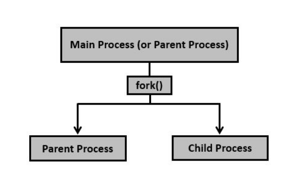
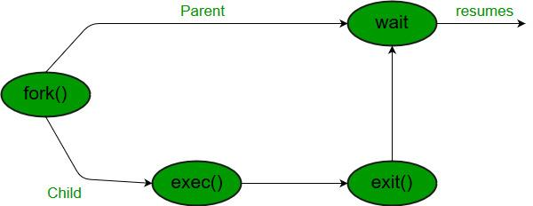
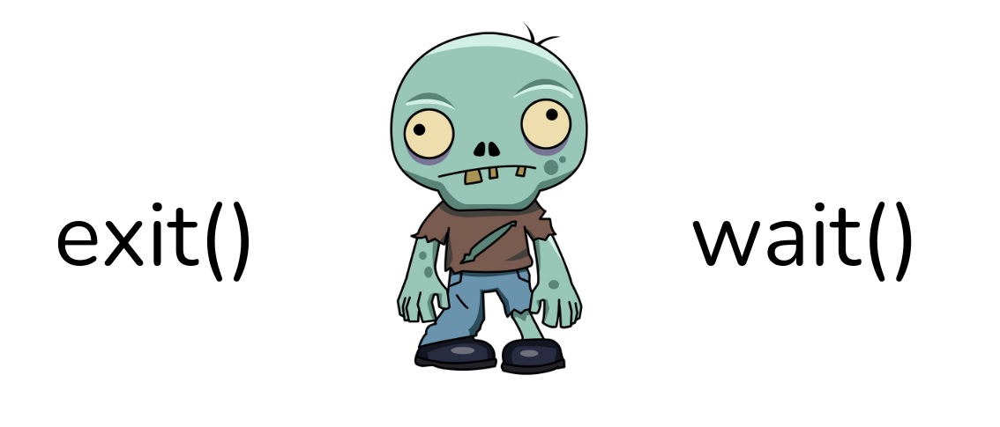

# Less15. PROC

Системные вызовы для управления процессами
- fork() - создание процесса
- exec() - загрузка (запуск) программы в процесс
- exit() - завершение работы программы (не процесса)
- wait() - считывание кода возврата процесса

```bash
 ╭─alex@smith in ~ as 🧙 took 40s
[🔴] × ls -l /sbin/init
lrwxrwxrwx 1 root root 22 апр 19 03:42 /sbin/init -> ../lib/systemd/systemd

```



## Системные вызовы:

    - fork() создание процесса (единственный способ создания процесс)
        |- parent proc (код возврата равный PID дочернего процесса)
        |- child proc (дочернему возвращает 0)
        стартует в одном процессе, завершается в двух

    exec() - способ запустить программу в Linux
        ● работает в существующем процессе
        ● заменяет программу процесса на ту, что была передана exec() в кач-ве аргумента
        ● exec() - семейство системных вызовов (execl, execle, execlp, execv, execve, execvp)

    exit() - завершение работы программы в Linux
        ● приводит к обычному завершению программы
        ● после завершения программы ее переменная status будет доступна
        родительскому процессу (status - код возврата)
        ● exit() - не завершает процесс

    wait() – считывает код возврата дочернего процесса в Linux
        ● приостанавливает выполнение текущего процесса до тех пор, пока дочерний процесс не прекратит выполнение
        ● получает код возврата дочернего процесса
        ● после вызова wait() дочерний процесс полностью исчезает из системы

## Жизненный цикл процесса в Linux


0:32 

    - exec() загрузка (запуск) программы в процесс
    - exit() не завершает процесс, теперь есть возможность прочитать status - код возврата. Только родитель может считать код возврата 
        *
    - wait() считывание кода возврата процесса
        после получения от потомка кода возврата, процесс перестает существовать

## Состояния процесса:
    - R выполняется (самый кратковременный)
    - S ожидание
    - D ожидание ввода-вывода
    - T процесс остановлен
    - Z зомби (состояние между exit() и wait())
        |- обязательное состояние любого процесса
        |- не потребляют ресурсов
        |- его нельзя завершить


> Демон - процесс, работающий в фоне без прямого взаимодействия с пользователем

## Zombi

нормальное состояние процесса



### Сирота
    ● процесс оставшийся без родителя
    ● будет мгновенно усыновлен процессом init (в современных системах systemd)
    ● явление очень кратковременное (увидеть процесс сироту не получится)

### Как убить зомби?
А нужно ли...?

        ● сделать его сиротой
        ● заставить родителя послать wait()

    kthreadd - родитель потоков в пространстве ядра
    [] - потоки ядра 

## Практика
1:00

``` ps -efl```

1:27 - разбор процессов, каталог PROC 
```
lsof - ифн об открытых файлах
ls -l /proc 

/proc/*/exe     - бинарные файлы
/proc/*/fd      - открытые файлы
/proc/*/maps    - загруженные файлы библиотек (.so)


```
1:30 - 1:50 для ДЗ


```bash
# найдем многопоточный процесс
ls -l /proc/*/task 2> /dev/null
[root@smith ~]# ls -l /proc/687589/task
итого 0
dr-xr-xr-x 7 alex alex 0 июл  8 11:42 687589
dr-xr-xr-x 7 alex alex 0 июл  8 11:42 687590
dr-xr-xr-x 7 alex alex 0 июл  8 11:42 687591
dr-xr-xr-x 7 alex alex 0 июл  8 11:42 687592
dr-xr-xr-x 7 alex alex 0 июл  8 11:42 687593
dr-xr-xr-x 7 alex alex 0 июл  8 11:42 687594
dr-xr-xr-x 7 alex alex 0 июл  8 11:42 687595
dr-xr-xr-x 7 alex alex 0 июл  8 11:42 687596
dr-xr-xr-x 7 alex alex 0 июл  8 11:42 687598
dr-xr-xr-x 7 alex alex 0 июл  8 11:42 687603
[root@smith ~]# ls -l /proc/687589/exe
lrwxrwxrwx 1 alex alex 0 июл  8 11:42 /proc/687589/exe -> /opt/visual-studio-code/code

```

strace - все системные вызовы 
```bash
[root@smith ~]# strace -e trace=process ls
execve("/usr/bin/ls", ["ls"], 0x7ffec5937b60 /* 40 vars */) = 0
ansible  nano.943634.save
exit_group(0)                           = ?
+++ exited with 0 +++

```