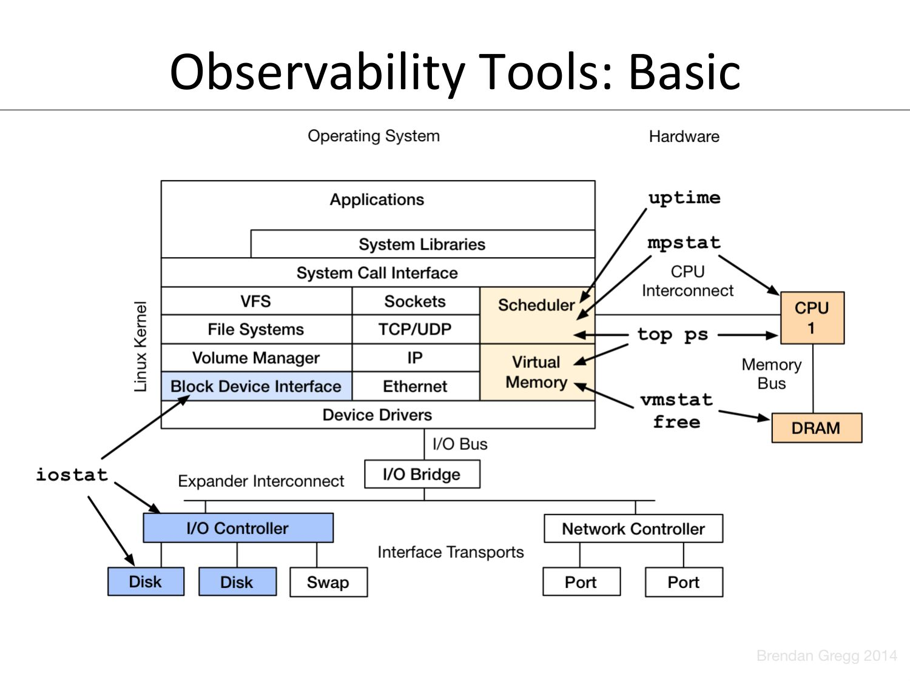
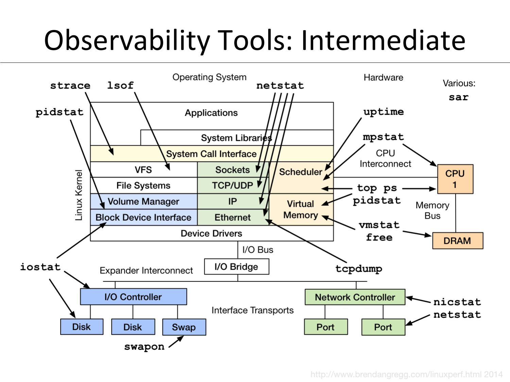
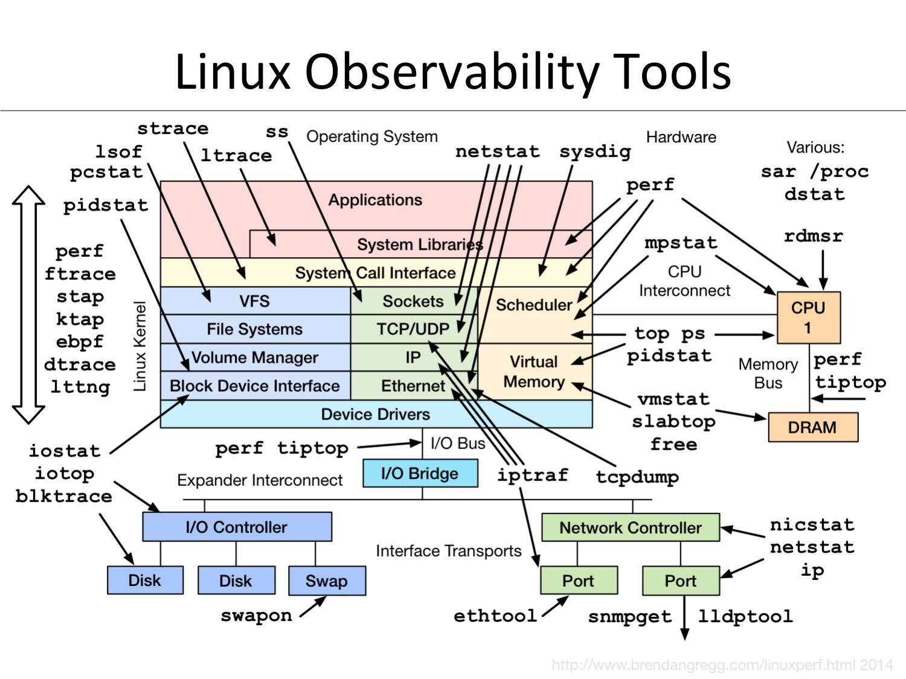
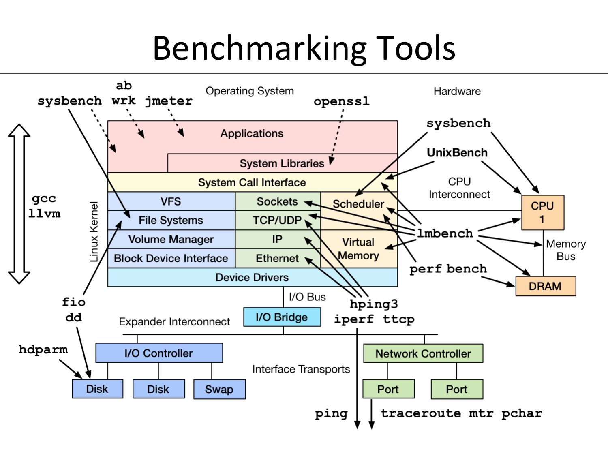
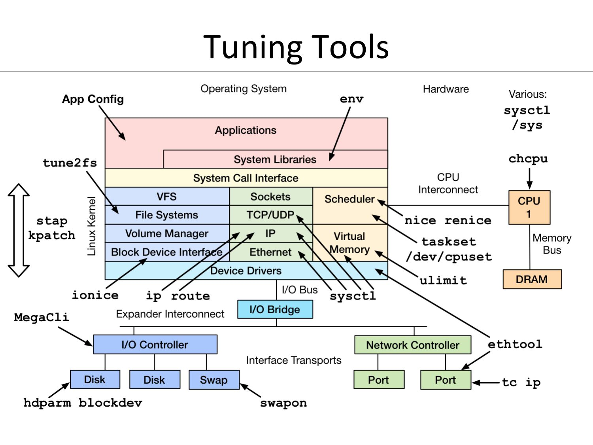

# Мониторинг

- [Мониторинг](#мониторинг)
- [Методологии поиска проблем](#методологии-поиска-проблем)
- [Инструменты анализа](#инструменты-анализа)
  - [Инструменты тестирования. Observability Base](#инструменты-тестирования-observability-base)
      - [uptime](#uptime)
      - [top](#top)
      - [dmesg | tail](#dmesg--tail)
      - [vmstat](#vmstat)
      - [mpstat](#mpstat)
      - [pidstat](#pidstat)
      - [iostat](#iostat)
      - [free](#free)
      - [sar](#sar)
- [Инструменты тестирования. Observability Intermediate](#инструменты-тестирования-observability-intermediate)
    - [ss](#ss)
    - [nicstat](#nicstat)
    - [swapon](#swapon)
    - [lsof](#lsof)
    - [iotop](#iotop)
  - [Инструменты тестирования. Observability Advanced](#инструменты-тестирования-observability-advanced)
    - [trace](#trace)
    - [pcstat](#pcstat)
    - [perf](#perf)
  - [Инструменты тестирования. Benchmark](#инструменты-тестирования-benchmark)
    - [mtr](#mtr)
  - [Инструменты настройки. Tuning](#инструменты-настройки-tuning)


# Методологии поиска проблем
1. Problem statement method (описание проблемы)
2. Workload characterization method (описание нагрузки)
3. USE method
4. Off-CPU Analysis (анализ простоев)
5. CPY profile method
6. RTFM method (читай документацию)
7. Active benchmarking (тестирование производительности)
8. Static performance tuning (настройка системы)


# Инструменты анализа

Типы инструментов:

● Observability - посмотреть что происходит, обычно безопасно, но может быть overhead по ресурсам.

● Benchmarking - проверка того, что система может выдержать. Можно что-нибудь поломать…

● Tuning - изменения настроек в системе

● Static - просмотр конфигов

https://www.brendangregg.com/Slides/LinuxConEU2014_LinuxPerfTools/
https://www.brendangregg.com/USEmethod/use-linux.html 

## Инструменты тестирования. Observability Base


- [https://www.youtube.com/watch?v=ZdVpKx6Wmc8](https://www.youtube.com/watch?v=ZdVpKx6Wmc8)
- [https://habr.com/ru/companies/vk/articles/335326/](https://habr.com/ru/companies/vk/articles/335326/)
- [https://phoenixnap.com/kb/swappiness](https://phoenixnap.com/kb/swappiness)

Стресс-тест:
```stress --cpu 4 --io 4 --vm 2 --vm-bytes 1024M --timeout 3600s```

● uptime
● dmesg | tail; dmesg -T
● vmstat 1
● mpstat -P ALL 1
● pidstat 1
● iostat -xz 1
● free -m
● sar -n DEV 1
● sar -n TCP,ETCP 1
● top

#### uptime
```
 ╭─alex@smith in ~ took 0s
 ╰─λ uptime
 11:35:47 up 16 min,  1 user,  load average: 0,83, 1,19, 0,96
```
_load average_ - средняя загрузка (cpu+disks) за 1, 5 и 15 минут, усреднённая длина очереди на исполнение процессов, которые были в системе

#### top


> Варианты вывода из proc:
```
cat /proc/loadavg
cat /proc/meminfo
```

#### dmesg | tail

#### vmstat

```
 ╭─alex@smith in ~ as 🧙 took 2m29s
 ╰─λ vmstat 1
procs -----------memory---------- ---swap-- -----io---- -system-- -------cpu-------
 r  b   swpd   free   buff  cache   si   so    bi    bo   in   cs us sy id wa st gu
 0  0      0 25880824 54400 3527788  0    0   800   309 3605   13  9  7 84  0  0  0
 0  0      0 25880696 54400 3527844  0    0     0     8 1963 2857  3  3 94  0  0  0
 0  0      0 25882072 54400 3527804  0    0     0     0 1791 2778  1  2 97  0  0  0
 0  0      0 25881752 54400 3527804  0    0     0     0 1762 2735  1  1 98  0  0  0
 0  0      0 25881752 54400 3527824  0    0     0     0 1718 2662  1  2 97  0  0  0
 3  0      0 25811828 54400 3527824  0    0     0     0 4251 5841  3 19 79  0  0  0
^C
```
- ---procs--- : r - процессы в работе, b - блокированные. Часто меняют состояние.
- ---swpd---  : использование swap
- ---swap---  : si - swap in, so - swap out. Показывает активность чтения/записи swap
- ---io---    : i/o для блочных устройств
- ---system---: in - interupt (прерывания), cs - context switch (переключение контекста исполнения на процессоре)
- ---cpu---   : us (userspace) sy (systemspace) id (idle) wa (i/o wait) st (stolen) gu -? _*Нагрузка рассчитывается как средняя на все ядра._

#### mpstat
_загрузка по каждому процессору_

```# mpstat -P ALL 1```

#### pidstat
 _показывает процессы с ненулевым потреблением, помогает отловить недолгоживущие процессы_

```# pidstat 1```

#### iostat
_утилита с большим количеством опций_

```# iostat -xz 1```
> _%util_ - процент утилизации диска, сколько времени он задействован

#### free
```
 ╭─alex@smith in ~ took 20m34s
 ╰─λ free -m
               total        used        free      shared  buff/cache   available
Mem:           31588        3635       24126          97        4375       27952
Swap:          40599           0       40599
```
> _available - сколько памяти будет доступно в случае необходимости (приближенно) = примерно free + 70% от кэша_

#### sar
_статистика по сетевым интерфейсам_ ```# sar -n DEV 1```

_по tcp_ ```# sar -n TCP,ETCP 1```


# Инструменты тестирования. Observability Intermediate


● strace
● tcpdump
● netstat/ss
● nicstat
● pidstat
● swapon
● lsof
● sar

### ss
- какие сокеты открыты: ```# ss -s```
- сокеты tcp в состоянии lesten: ```# ss -ntlp```
- для статистики, все сокеты во всех состояниях: ```# ss -tulpan```
- с выводом расширеных состояний сокета ```# ss -tulpane```
-  ```# ss -tulpanes```
- потребление памяти сокетами ```# ss -m```
- для congestion control (контроль перегрузок), etc ```# ss -i```

### nicstat

### swapon
```swapon -s```

### lsof
_Открытые файловые дескрипторы:_ ```lsof -iTCP -sTCP:ESTABLISHED```

### iotop
_загрузка дисков_

## Инструменты тестирования. Observability Advanced


● ltrace
● ethtool
● iotop
● blktrace
● slabtop
● /proc
● pcstat

CPU performance counters:
● perf (perf_events), tiptop, rdmsr

Advanced tracers:
● perf (perf_events), ftrace, eBPF,
dtrace

[https://www.brendangregg.com/perf.html](https://www.brendangregg.com/perf.html)
[https://github.com/tobert/pcstat](https://github.com/tobert/pcstat)

### trace
_утилита для отслеживания обращений к библиотекам_

### pcstat
_проект github. показывает статистику насколько файл находится в кэше_
[https://github.com/tobert/pcstat](https://github.com/tobert/pcstat)

### perf
_для взаимодействия с ядром_
[https://www.brendangregg.com/perf.html](https://www.brendangregg.com/perf.html)

```# perf top```

```# perf record```


## Инструменты тестирования. Benchmark


- Все бенчмарки врут
- Универсальные: unixbench/sysbench/perf bench
- Диски: dd/hdparm
- Приложение: ab/wrk/jmeter/openssl/yandextank
- Сеть: ping/hping3/iperf/ttcp/mtr/pchar

### mtr
_гибрид traceroute и ping_


## Инструменты настройки. Tuning


- Настройки ядра: sysctl или /sys
- Настройки приложения
- Планировщик, CPU/scheduler: nice/renice/taskset/ulimit/chcpu
- Диски, ввод-вывод: tune2fs/ionice/hdparm/blockdev
- Сеть: ethtool/tc/ip/route
- Динамические патчи: stap/kpatch


