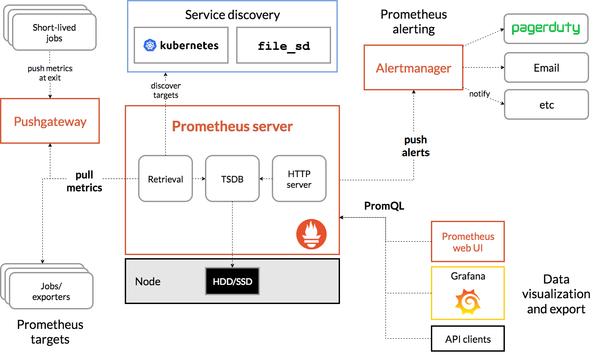

# Prometheus

## Ожидания от мониторинга:
    - информация о текущем состоянии
    - предупреждения
    - сбор статистики
    - отчеты
    - визуализация

**blackbox-мониторинг** (оценивающий внешнее состояние системы/сервиса)

    - ping
    - http-request
    - открытые порты
    - наличие процессов

**whitebox-мониторинг** (базирующийся на метриках, которые даёт само приложение (сервис))

    - логи
    - интерфейсы
    - API
    - SNMP

## Метрики

Основные метрики системы:
  - LoadAvg, CPU, Net (bps/pps), DISK Load 
  - Утилизация Mem/DISK
  - "Чистота" системных логов (dmesg/messages)
  - Актуальность и состояние резервных копий

Метрики процесса:
  - Наличие процесса и правильное количество этих процессов
  - Открытый сокет/порт процесса
  - Статус процесса (если есть возможность получить)

Метрики сервиса:
  - "Диагностический запрос", который взаимодействует все или большинство компонентов
  - Время отклика/обработки запроса
  - Количество обращений в единицу времени
  - Количество одновременных обращений

Метрики нужны:

  - для анализа проблемы
  - для гадания на графиках или trend monitoring

Где хранить метрики?
  - специализированные бд (time series databases): Wisper, influxDB, Prometheus (нереляционная бд)

Что из себя представляют метрики:
  - пара дата_время + значение (привязано к имени метрики и хранится определенное время)
      
| Инструменты мониторинга: | Особенности:|
| --- | --- |
| - zabbix            |(свой агент, свой веб-интерфейс, SQL database)|
| - nagios/icinga    | (свой агент, свой веб-интерфейс, SQL database)|
| - graphite         | (carbon (агент), whisper (tsdb), graphie-web)|
| - prometheus       | (node_exporter, prometheus (база и веб), alertmanager)|
| - influxData        |(telegraph (агент), influxdb, chronograph (web), capasitor (alert))|
| - grafana           |(интерфейс для дашбордов и алертинга)|


==================
# Prometheus 

## Architecture


### Способы сбора метрик:
1. инструментировать отдачу метрик в формате prometheus (instrumentation)
2. exporters (бинарником или контейнером); node_exporter - системные метрики, порт 9100
3. pushgateway


## Установка Prometheus (CentOS 7)
[Порядок установки и настройки Prometheus](./install_prometheus.md)

Проверить соединение: http://server-ip:9090/graph

> _configs prometheus: port 9090_

> _node_exporter: port 9100 (запускается без конфига)_

## Установка Node Exporter (CentOS 7)
[Порядок установки node_exporter](./install_node_exporter.md)

Проверить коннект ноды на сервере: http://server-ip:9090/targets
Проверить соединение с нодой: http://nodeexporter-ip:9100/metrics


# Grafana
## Установка Grafana

- _репо доступен через впн,_
- _бд только для своих настроек_

```bash
# Скачать grafana-enterprise-9.5.2-1.x86_64.rpm через VPN и поместить на сервер
$ yum -y install grafana-enterprise-9.5.2-1.x86_64.rpm
# Стартуем сервис
$ systemctl daemon-reload
$ systemctl start grafana-server
```

#### Проверить соединение
 (admin/admin): http://server-ip:3000/

    /etc/grafana/
    grafana.ini 
    port: 3000

    data sourses
        prometheus
        localhost:9090

    dashboards:
        на основе json model
        можно загрузить готовые модели

#### Добавить источник данных Prometheus

    Home/Administration/Data source/Prometheus
    HTTP/url http://IP-address_Prometheus:9090

#### Создание Dashboard
    HOME/Dashboards - Import - выбрать панель на стороннем сайте
    Взять ID отсюда https://grafana.com/grafana/dashboards/


## Alert manager

### Установка AlertManager
[Порядок установки AlertManager](./install_alertmanager.md)

Проверить соединение с сервисом: http://server-ip:9093/

Проверить доступность сервиса на Prometheus: http://server-ip:9090/

    /etc/alertmanager/
    port: 9093
    как формировать алерты
        rules.yml 


### Links:

- [prometheus.io ](https://prometheus.io/)
- [https://www.yamllint.com/](https://www.yamllint.com/)
- https://grafana.com/grafana/dashboard
- [https://jsonnet.org/](https://jsonnet.org/)
  