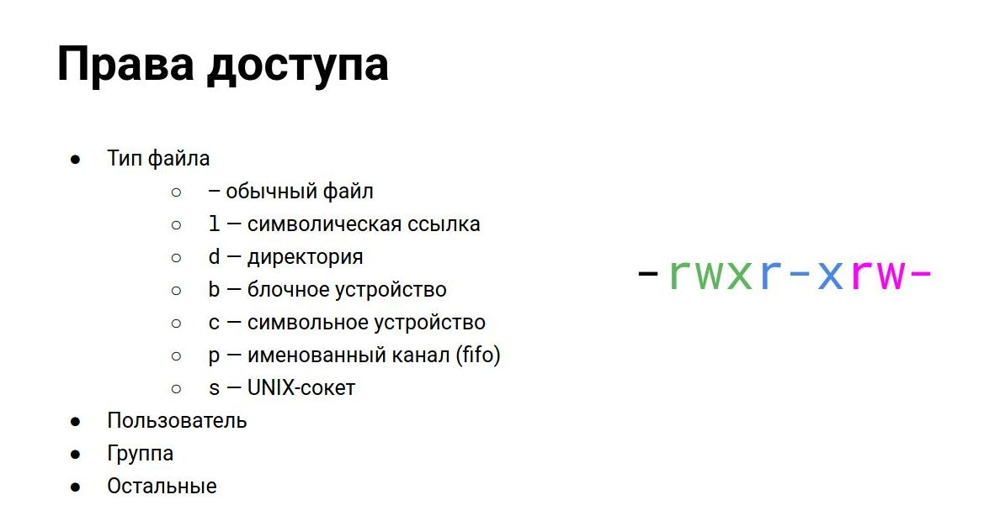
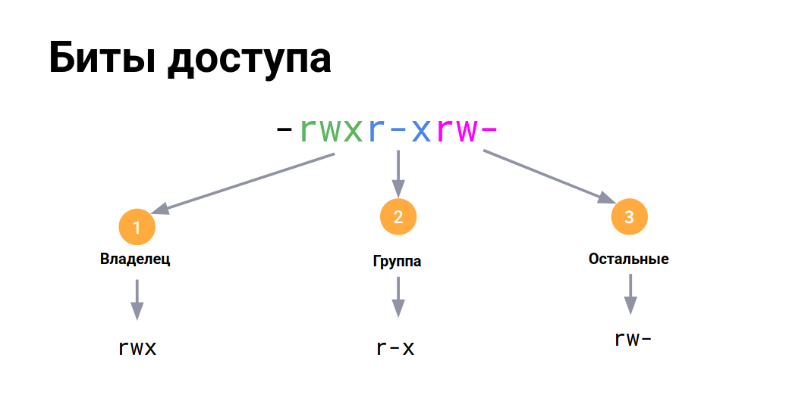
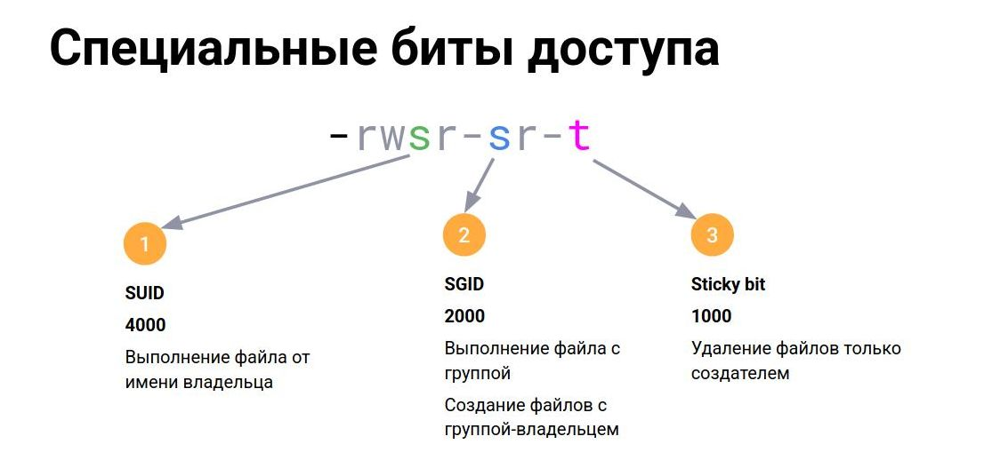

# Пользователи и группы. Авторизация и аутентификация
- [Пользователи и группы. Авторизация и аутентификация](#пользователи-и-группы-авторизация-и-аутентификация)
- [1. Базовые понятия и ACL](#1-базовые-понятия-и-acl)
  - [AAA (Authentication, Authorization, Accountig)](#aaa-authentication-authorization-accountig)
  - [Пользователи](#пользователи)
    - [Типы пользователей](#типы-пользователей)
    - [/etc/passwd — список пользователей](#etcpasswd--список-пользователей)
    - [/etc/group — группы пользователей](#etcgroup--группы-пользователей)
    - [/etc/shadow — пароли пользователей](#etcshadow--пароли-пользователей)
    - [Authentication](#authentication)
    - [Управление пользователями](#управление-пользователями)
    - [Механизм sudo](#механизм-sudo)
    - [Права доступа к файлам](#права-доступа-к-файлам)
      - [Биты доступа](#биты-доступа)
      - [Специальные биты](#специальные-биты)
      - [umask и права доступа по умолчанию](#umask-и-права-доступа-по-умолчанию)
  - [ACL access control list](#acl-access-control-list)
      - [getfacl](#getfacl)
      - [setfacl](#setfacl)
      - [Расширенные атрибуты файлов](#расширенные-атрибуты-файлов)
- [2. Capabilities (привилегии)](#2-capabilities-привилегии)
    - [флаги для процесса](#флаги-для-процесса)
    - [флаги для файла](#флаги-для-файла)
    - [просмотр и расшифровка](#просмотр-и-расшифровка)
    - [утилиты](#утилиты)
    - [тестирование настроек](#тестирование-настроек)
- [3. polkit (PolicyKit)](#3-polkit-policykit)
    - [утилиты](#утилиты-1)
- [4. PAM (Pluggable Authentication Modules)](#4-pam-pluggable-authentication-modules)
    - [конфигурация](#конфигурация)
    - [Типы модулей](#типы-модулей)
    - [control](#control)
    - [pam\_script](#pam_script)


# 1. Базовые понятия и ACL

## AAA (Authentication, Authorization, Accountig)
- **Authentication** (процесс подтверждения пользователем своей подлинности)
    - логин и пароль

- **Authorization** (наделение пользователя правами)
    - предоставления доступа к каким-либо
объектам

- **Accountig** (запись инф о произошедших событиях)

## Пользователи
### Типы пользователей

|            |                   |                               |                                 |
| ---------- | ----------------- | ----------------------------- | ------------------------------- |
|            | суперпользователь | обычный пользователь          | системный пользователь          |
|            | root              | user                          | daemon                          |
|            | UID=0             | UID >1000                     | UID < 1000                      |
| home       | /root             | /home/user                    | отстутствует, либо произвольная |
| пароль     | не всегда         | установлен                    | нет                             |
| shell      | +                 | +                             | -                               |
| полномочия | неограниченные    | в пределах домашнего каталога | ограниченныe                    |
|            |

###    /etc/passwd — список пользователей
```bash
 ╭─alex@smith in ~ took 3s
[🧱] × sudo cat  /etc/passwd
[sudo] пароль для alex:         
root:x:0:0::/root:/bin/bash
bin:x:1:1::/:/usr/bin/nologin
daemon:x:2:2::/:/usr/bin/nologin
mail:x:8:12::/var/spool/mail:/usr/bin/nologin
ftp:x:14:11::/srv/ftp:/usr/bin/nologin
http:x:33:33::/srv/http:/usr/bin/nologin
nobody:x:65534:65534:Kernel Overflow User:/:/usr/bin/nologin
...
stunnel:x:16:16::/var/run/stunnel:/usr/bin/nologin
smith:x:1001:1001::/home/smith:/usr/bin/bash
alpm:x:951:951:Arch Linux Package Management:/:/usr/bin/nologin
```
> - Имя пользователя
> - Цифровой идентификатор пользователя (UID)
> - Цифровой идентификатор основной группы пользователя (GID)
> - Полное имя пользователя
> - Домашний каталог пользователя
> - Оболочка входа в систем

###    /etc/group — группы пользователей
```bash
 ╭─alex@smith in ~ as 🧙 took 2s
 ╰─λ sudo cat  /etc/group
[sudo] пароль для alex:         
root:x:0:brltty,root
sys:x:3:bin,alex,smith
...
nobody:x:65534:
...
alex:x:1000:
...
smith:x:1001:
alpm:x:951:
virtlogin:x:950:
```
> - Имя группы
> - Пароль группы
> - Цифровой идентификатор группы (GID)
> - Список пользователей, входящих в эту группу, как в дополнительную
> - Основная группа пользователя — в /etc/passwd

###    /etc/shadow — пароли пользователей
```bash
 ╭─alex@smith in ~ as 🧙 took 2s
 ╰─λ sudo cat  /etc/shadow
root:$6$iP9.A8xYP//:19749::::::
bin:!*:19659::::::
daemon:!*:19659::::::
mail:!*:19659::::::
ftp:!*:19659::::::
http:!*:19659::::::
nobody:!*:19659::::::
...
polkitd:!*:19659::::::
rtkit:!*:19659::::::
alex:$6$APMz/:19749:0:99999:7:::
...
smith:GEKyA3:19749:0:99999:7:::
```
> - Регистрационное имя
> - Захэшифрованный пароль
> - Дата последнего изменения пароля
> - Минимальное число дней между изменениями пароля
> - Максимальное число дней между изменениями пароля
> - Количество дней до истечения срока действия пароля
> - Количество дней по истечении срока действия пароля
> - Срок действия учетной записи
> - Зарезервированное поле, которое в настоящее время всегда пусто

### Authentication

    ● Условия для входа:
        ○ shell должен существовать и быть перечисленным в /etc/shells
        ○ установлен пароль
    ● Блокировка пользователя:
        ○ установка shell в /bin/nologin
        ○ установка expiry date в прошлое
        ○ Блокировка пароля (делаем его непроверяемым, добавляя "!")
    ● Файл настроек для управления политиками при создании пользователей: /etc/login.defs
_Examples:_
```bash
usermod -[L|U] <user_name>  # заблокировать/разблокировать пользователя
        [-g | --gid] <group>    # принудительно назначить первичную ГРУППУ
cat /etc/login.defs         # дефолтные настройки пользователей
newgrp adm                  # изменение основной группы пользователя
```
> 0:16 блокировка пользователя

adduser

### Управление пользователями
| утилита  | назначение                       |
| -------- | -------------------------------- |
| useradd  | — создание пользователя          |
| adduser  | — создание пользователя (скрипт) |
| usermod  | — изменение пользователя         |
| userdel  | — удаление пользователя          |
| passwd   | — изменение пароля               |
| chage    | — изменение свойств пароля       |
| groupadd | — создание группы                |
| groupdel | — удаление группы                |
| id       | — просмотр свойств пользователя  |

```bash
 ╭─alex@smith in ~ took 0s
 ╰─λ id
uid=1000(alex) gid=1000(alex) группы=1000(alex),3(sys),96(scanner),209(cups),955(libvirt),956(sambashare),969(realtime),985(video),991(lp),992(kvm),994(input),998(wheel)
```

### Механизм sudo
0:24 

_substitude user do_

| команда      | назначение                                       |
| ------------ | ------------------------------------------------ |
| su           | — переключение пользователя                      |
| sudo su      | — переключение на суперпользователя (root)       |
| sudo         | — выполнение команды с правами суперпользователя |
| /etc/sudoers | — конфигурация sudo                              |
| visudo       | — редактирование                                 |


```bash
 ╭─alex@smith in ~ as 🧙 took 0s
[🔴] × sudo visudo
...
##
## User privilege specification
##
root ALL=(ALL:ALL) ALL

## Uncomment to allow members of group wheel to execute any command
# %wheel ALL=(ALL:ALL) ALL

## Same thing without a password
# %wheel ALL=(ALL:ALL) NOPASSWD: ALL
...
```
_Example:_
```bash
# /etc/sudousers
# дать пользователю права выполнять из под любого пользователя
# но только при выполнении команды cat
sample_user ALL= NOPASSWD: /usr/bin/cat
```

    root ALL=(ALL:ALL) ALL The first field indicates the username that the rule will apply to (root).

    root ALL=(ALL:ALL) ALL The first “ALL” indicates that this rule applies to all hosts.

    root ALL=(ALL:ALL) ALL This “ALL” indicates that the root user can run commands as all users.

    root ALL=(ALL:ALL) ALL This “ALL” indicates that the root user can run commands as all groups.

    root ALL=(ALL:ALL) ALL The last “ALL” indicates these rules apply to all commands.

_Источник: [https://www.digitalocean.com/community/tutorials/how-to-edit-the-sudoers-file](https://www.digitalocean.com/community/tutorials/how-to-edit-the-sudoers-file)_


### Права доступа к файлам


#### Биты доступа
0:32 



| тип доступа | для файлов       | для директорий                            |
| ----------- | ---------------- | ----------------------------------------- |
| r           | чтение файла     | просмотр списка имён файлов               |
| w           | изменение файла  | изменение объектов в директории           |
| x           | исполнение файла | доступ к inode в директории (вход, поиск) |

Минимальные биты доступа для полноценной работы:
- r-x - для директории
- r-- - для файла

#### Специальные биты
0:36 



- -s   SUID
- -s   SGID
- -t   Sticky bit 

```bash
 ╭─alex@smith in ~ as 🧙 took 3m39s
 ╰─λ stat /usr/bin/passwd 
  Файл: /usr/bin/passwd
  Размер: 80856     	Блоков: 160        Блок В/В: 4096   обычный файл
Устройство: 0/35	Инода: 8380183     Ссылки: 1
Доступ: (4755/-rwsr-xr-x)  Uid: (    0/    root)   Gid: (    0/    root)
Доступ:        2025-03-25 22:28:46.000000000 +0700
Модифицирован: 2025-03-20 21:22:48.000000000 +0700
Изменён:       2025-03-25 22:28:46.419365817 +0700
Создан:        2025-03-25 22:28:46.419365817 +0700
```


_Источник: [https://www.gnu.org/software/coreutils/manual/html_node/Changing-Special-Mode-Bits.html](https://www.gnu.org/software/coreutils/manual/html_node/Changing-Special-Mode-Bits.html)_

#### umask и права доступа по умолчанию

|                    | файл | директория |
| ------------------ | ---- | ---------- |
| полные права       | 666  | 777        |
| umask              | 022  | 022        |
| права по умолчанию | 644  | 755        |

## ACL access control list

-  Повышение гибкости назначения прав доступа
-  Поддержка на уровне файловой системы
-  Может потребовать установки утилит

#### getfacl
```bash
# показать ACL
 ╭─alex@smith in ~ took 0s
 ╰─λ getfacl backups/
# file: backups/
# owner: alex
# group: alex
user::rwx
group::r-x
other::r-x
```
#### setfacl

    setfacl -u:[uid] <dir>
            -g:[gid] <dir>


```bash
setfacl -m u:zabbix:rw test_file # установить ACL
setfacl -x u:zabbix FILE        # убрать ACL
setfacl -m d:u:vagrant:rwx -R /usr/local/upload/ #установить дефолтные ACL (только для директорий)
```

#### Расширенные атрибуты файлов
0:57 

    chattr +i test_file     # изменение
    lsattr                  # просмотр

Атрибуты:
    
    ○ a — файл может быть открыт только в режиме добавления
    ○ A — не обновлять время перезаписи
    ○ c — автоматически сжимать при записи на диск
    ○ C — отключить копирование при записи
    ○ i — сделать неизменяемым (даже для root) IMMUTABLE
    ○ s — безопасное удаление с последующей перезаписью нулями

# 2. Capabilities (привилегии)
1:06

Привилегии, которые в традиционных Unix-подобных системах были доступны
только процессам, запущенным с правами root (uid==0)
- CAP_SYS_ADMIN     -   разрешить диапазон системных административных операций
- CAP_SYS_BOOT      -   разрешить вызовы к reboot
- CAP_SYS_CHROOT    -   разрешить вызовы к chroot
- ...

> _man capabilities_

### флаги для процесса
- _**Permitted**_   — требуется запрос на выполнение
- _**Inheritable**_ — можно унаследовать потомкам
- _**Effective**_   — какие действия может выполнить процесс
- _**Bounding**_ (ограничивающий набор) — до Linux 2.6.25 был общесистемным
атрибутом, общим для всех потоков, предназначенным для описания набора, за
пределы которого разрешения расширяться не могут. В настоящее время это
набор для каждой задачи и является лишь частью логики execve
- _**Ambient**_ (наружные, начиная с Linux 4.3) — добавлены, чтобы легче
предоставлять разрешения не-root пользователю, без использования setuid
или файловых разрешений

### флаги для файла

- Permitted     — разрешенный набор для файла
- Inheritable   — список свойств, которые можно унаследовать от родителя
- Effective     — бит разрешения для permitted set

### просмотр и расшифровка
```bash 
cat /proc/self/status | grep Cap
CapInh: 0000000000000000
CapPrm: 000001ffffffffff
CapEff: 000001ffffffffff
CapBnd: 000001ffffffffff
CapAmb: 0000000000000000

capsh --decode=000001ffffffffff
```
### утилиты
|                 | назначение                                                 |
| --------------- | ---------------------------------------------------------- |
| setcap          | – устанавливает и удаляет capabilities на исполняемый файл |
| getcap/getpcaps | - узнать установленные capabilities                        |

```bash
 ╭─alex@smith in ~ as 🧙 took 0s
[🔴] × setcap -h
usage: setcap [--license] [-f] [-h] [-n <rootid>] [-q] [-v] (-r|-|<caps>) <filename> [ ... (-r|-|<capsN>) <filenameN> ]

 Note <filename> must be a regular (non-symlink) file.
 -r          remove capability from file
 -           read capability text from stdin
 <capsN>     cap_from_text(3) formatted file capability
 [ Note: capsh --suggest="something..." might help you pick. ]
 --license   display the license info
 -f          force setting even when the capability is invalid
 -h          this message and exit status 0
 -n <rootid> write a user namespace (!= 0) limited capability
 -q          quietly
 -v          validate supplied capability matches file

setcap cap_net_admin,cap_net_raw+eip /usr/bin/tcpdump
setcap -r /usr/bin/ping
getcap /usr/bin/tcpdump
```
_Example:_

```bash
docker run -d --name=wg-easy -e WG_HOST=176.124.1.42 \
-e WG_MTU=1280 -e PASSWORD='11111111111' \
-v ~/.wg-easy:/etc/wireguard \
-p 51820:51820/udp -p 51821:51821/tcp \
--cap-add=NET_ADMIN --cap-add=SYS_MODULE \
--sysctl="net.ipv4.conf.all.src_valid_mark=1" \
--sysctl="net.ipv4.ip_forward=1" --restart unless-stopped \
weejewel/wg-easy
```
### тестирование настроек

```bash
su - vagrant
export -p > ./savedenv
sudo capsh --caps="cap_net_raw+eip
cap_setpcap,cap_setuid,cap_setgid+ep" --keep=1 --user=vagrant -- -c
"source ./savedenv; rm ./savedenv; /usr/bin/env bash"
capsh --print
whoami
echo $$
```

# 3. polkit (PolicyKit)
Polkit (прежнее название: PolicyKit) — библиотека для UNIX-подобных
операционных систем

- API библиотеки используется для предоставления непривилегированным
процессам возможности выполнения действий, требующих прав
администратора
- Polkit противопоставляется использованию таких систем, как sudo, но не
наделяет процесс пользователя правами администратора
- Позволяет точно контролировать, что разрешено, а что запрещено

###  утилиты
|            |                                                                                                                                                |
| ---------- | ---------------------------------------------------------------------------------------------------------------------------------------------- |
| pkaction   | — служит для просмотра возможных действий, которые отслеживает PolicyKit                                                                       |
| pkcheck    | — позволяет проверить, авторизовался ли процесс для выполнения действия                                                                        |
| pkexec     | — позволяет пользователю выполнить действие или программу от имени другого пользователя                                                        |
| pkttyagent | — позволяет выполнить текстовую авторизацию таким приложениям, которые запускаются без пользовательского графического окружения, например, ssh |

```bash
# Включаем логирование
$ vim /etc/polkit-1/rules.d/00-access.rules
polkit.addRule(function(action, subject) {
polkit.log("action=" + action);
polkit.log("subject=" + subject);
});
```
```bash
# Право на запуск сервисов systemd
$ vim /etc/polkit-1/rules.d/01-systemd.rules
polkit.addRule(function(action, subject) {
if (action.id.match("org.freedesktop.systemd1.manage-units") &&
subject.user === "ivan") {
return polkit.Result.YES;
}
});
```


1:31
# 4. PAM (Pluggable Authentication Modules)
### конфигурация
> /etc/pam.d/

- Конфигурация для каждого сервиса определяется в формате:
    - type control module-path module-arguments

- В конфигурации, внутри каждого стека (type) есть один или несколько
модулей, которые просматриваются по порядку (сверху-вниз)
- в зависимости от control-а (sufficient, required) проверка либо продолжается,
либо прекращается

### Типы модулей

|          |                                     |                                                                                                                                |
| -------- | ----------------------------------- | ------------------------------------------------------------------------------------------------------------------------------ |
| auth     | Модуль аутентификации               | для аутентификации пользователей или создании и удалении учетных данных                                                        |
| account  | Модуль управления учетными записями | выполняет действия, связанные с доступом, истечением учетных данных или записей, правилами и ограничениями для паролей и т. д. |
| session  | Модуль управления сеансами          | используется для создания и завершения сеансов                                                                                 |
| password | Модуль управления паролями          | выполняет действия, связанные с изменением и обновлением пароля                                                                |


### control

|            |                                                                                                                                  |
| ---------- | -------------------------------------------------------------------------------------------------------------------------------- |
| required   | — для успешного завершения проверки этот модуль должен сработать, проверка продолжается вне зависимости от результата            |
| requisite  | — как required, только при ошибке проверка прекращается. Возвращается ошибка первого required/requisite модуля вернувшего ошибку |
| sufficient | — при успехе возвращается OK и проверка завершается                                                                              |
| optional   | — опциональный модуль. Успех или Ошибка важны только в случае если это единственный модуль в стеке                               |
| include    | — включить в текущий стек модулей стек модулей из файла                                                                          |
| substack   | — включить в текущий стек результат модулей из файла                                                                             |

> required: [success=ok new_authtok_reqd=ok ignore=ignore default=bad]
> requisite: [success=ok new_authtok_reqd=ok ignore=ignore default=die]
> sufficient: [success=done new_authtok_reqd=done default=ignore]
> optional: [success=ok new_authtok_reqd=ok default=ignore]


1:40 ДЗ

### pam_script
_С помощью пакета pam_script можно быстро и гибко расширять AAA процесс и использовать возможности PAM_

|                |                                                         |
| -------------- | ------------------------------------------------------- |
| pam_succeed_if | — разрешает вход только заданным группам                |
|                | ```bashauth required pam_succeed_if.so gid=1000,2000``` |
| pam_deny       | — все запретить                                         |
| pam_unix       | — проверка пароля через shadow                          |
| pam_mysql      | — проверка пользователя через mysql                     |
| pam_cracklib   | — установка политик пароля                              |
| pam_rootok     | — разрешение руту обходить доп. проверки                |
| pam_limits     | — установка лимитов для пользователей                   |


