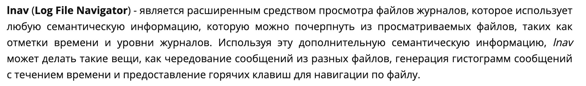
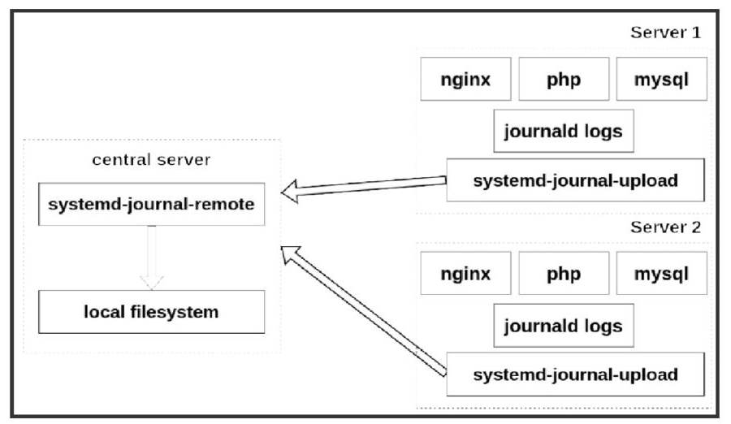
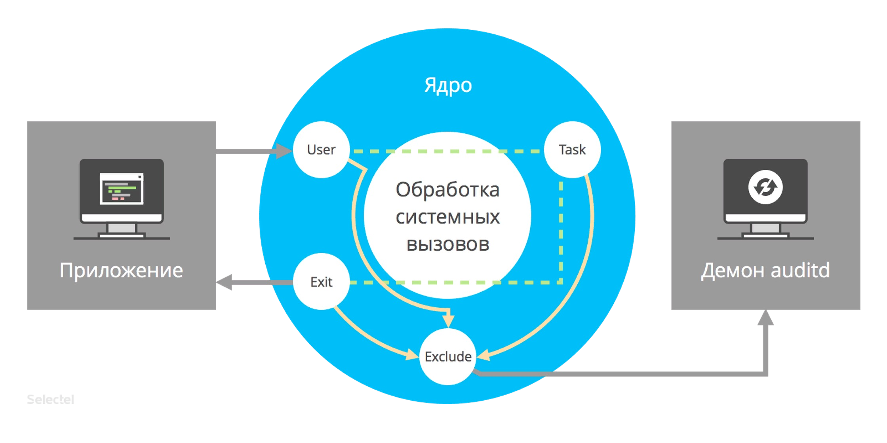

# Логи системы

### /var/log/syslog | messages
- глобальный системный журнал, с момента запуска системы
  - от ядра
  - служб
  - устройств
  - сетевых интерфейсов
  - ...
/etc/rsyslog.conf

### /var/log/auth.log | secure
- инф-я об авторизации пользователей (удачные/неудачные попытки входа в систему), а так же задействованные механизмы аутентификации

### /var/log/dmesg
- информация о работе драйверов устройств
    - ```--level=``` - можно задавать фильтр по критерию значимости

| Уровни журналирования (приоритеты) |                                               |
| ---------------------------------- | --------------------------------------------- |
| - emerg                            | - система неиспользуемая                      |
| - alert                            | - действие должно быть произведено немедленно |
| - crit                             | - условия критичности                         |
| - err                              | - условия ошибок                              |
| - warn                             | - условия предупреждений                      |
| - notice                           | - обычные, но значимые условия                |
| - info                             | - информационный                              |
| - debug                            | - отладочные сообщения                        |

```bash 
dmesg -l err
```


### /var/log/alternatives.log 
- вывод программы update-alternatives, в котором находятся символические ссылки на команды или библиотеки по умолчанию

### /var/log/anaconda.log
- Записи, зарегистрированные  во время установки системы

### /var/log/audit 
- записи службы auditd
### /var/log/boot.log
- информация, которая пишется при загрузке системы
### /var/log/cron
- отчет службы crond об исполняемых командах и сообщения от самих команд
### /var/log/cups
- всё, что связано с печатью и принтерами
### /var/log/kern.log
- сообщения от ядра и предупреждения, которые могут быть полезны при устранении ошибок пользовательских модулей, встроенных в ядро
### /var/log/maillog | mail.log
- журнал почтового сервера
### /var/log/pm-powersave.log
- сообщения службы экономии заряда батареи
### /var/log/samba
- логи файлового сервера samba
### /var/log/spooler
- для представителей старой школы, содержит сообщения USENET (чаще всего бывает пустым)
### /var/log/Xorg.0.log
- логи Х сервера. Чаще всего бесполезны. Обращать внимание на сообщения EE
### /var/log/yum.log | emerge.log | dpkg.log
- журнал менеджера пакетов

## Бинарные логи
### /var/log/lastlog
- последняя сессия пользователей. прочитать командой last
### /var/log/tallylog
- аудит неудачных попыток входа в систему
### /var/log/btmp
- еще один журнал записи неудачных попыток входа в систему. Следы активности взломщиков
### /var/log/wtmp
- еще один журнал записи входа пользователей в систему. Вывод на экран командой _utmpdump_

```bash
last - успешные авторизации
lastb - неуспешные авторизации
```
## Другие журналы
### /var/log/mysql
### /var/log/httpd | apache2
### /var/log/lighthttpd
### /var/log/nginx

> _В домашнем каталоге могут находиться журналы графических приложений DE_

- ~/.xsession-errors  - вывод stderr графических приложений X11
- ~/.xfce4-session.verbose-log - вывод сообщений рабочего стола XFCE4

## Утилиты для просмотра логов
- tail | tail -f
- grep -B 5 -A 2 'keyword' /path/to/file.log
- cat
- less
- zcat
- zgrep
- zmore
- lnav - log file navigator


 
# Минусы локального хранения логов
0:43

❖ Выделение дискового пространства под хранение логов локально

❖ Неудобство анализа логов в любых инфраструктурах

❖ Локальные логи проще удалить или подделать

❖ Нагрузка на дисковую подсистему при большом потоке логов

# rsyslog - rocket fast system for log processing
/etc/rsyslog.conf

### Особенности:
- многопоточный
- TCP, SSL, TLS, RELP
- сохранение логов в базы данных (MySQL, PostgreSQL, Oracle)
- фильтрация по любой части лога полностью настраиваемый формат вывода
### Модули
|модули|назначение|примеры|
|---|---|---|
|**Модули ввода**|начинаются с im, собирают информацию из различных источников|imtcp, imjournal, imudp, imrelp ...|
|**Модули вывода**|начинаются на om. Отправляют сообщения. Могут отправлять сообщения как в файл так и по сети или складывать в базу|omelasticsearch, omfile, ommysql ...|
|**Модули фильтрации**|начинаются с fm. Фильтруют сообщения по разным параметрам||
|**Модули парсинга**|начинаются с pm. Позволяют проводить синтаксический анализ|pmciscoios, pmlastmsg ...|
|**Модули модификации сообщений**|начинаются с mm. Меняют содержимое обрабатываемых сообщений|mmcount, mmfields ...|
|**Модули генерации строк**|начинаются с sm. Позволяют генерировать строки на основе обрабатываемых сообщений|smfile, smfwd, smtradfile|

### severity
Severity (важность) принимает значения от 0 (emergency,самая высокая) до 7 (debug, самая низкая)

links:
[Полный список severity](https://en.wikipedia.org/wiki/Syslog)

### наборы правил
ruleset - содержит список правил, которые состоят из фильтра и привязанных к фильтру действий (Actions). Можно задавать несколько наборов правил, чтобы разделить
обработку различных сообщений.

### применение фильтров

```bash
rsyslog: применение фильтров
kern.* # все логи ядра
mail.crit # все критические события от объекта mail
cron.!info,!debug # все от демона crond кроме уровней info и
debug
*.=crit /var/log/somefile
& root
& /var/log/criticalmessages
# фильтруем сообщения
*.* /var/log/allmsgs-incl-informational.log
:msg, contains, "informational" ~
*.* /var/log/allmsgs-no-informational.log
```

# logrotate
1:12

подсистема для автоматической ротации логов, с возможностью сжатия, удаления, перемещения и гибкой настройкой под каждый вид лог файлов Как правило, инструмент Logrotate установлен по умолчанию и базово настроен для обработки ротации логов всех установленных пакетов, включая rsyslog, обработчик системных логов по умолчанию.

    /etc/logratate.conf

### Конфигурация Logrotate
В Ubuntu информацию о конфигурации Logrotate обычно можно найти в двух местах:
- _/etc/logrotate.conf_: этот файл содержит стандартные параметры и настраивает ротацию
для нескольких логов, которые не принадлежат никаким системным пакетам. Он также
использует оператор include для извлечения конфигурации из любого файла в каталоге
/etc/logrotate.d.
- _/etc/logrotate.d/_: этот каталог содержит конфигурацию Logrotate для всех
устанавливаемых вами пакетов, которым требуется помощь в ротации логов. В
стандартной установке там уже должны быть файлы для основных системных
инструментов, таких как apt, dpkg, rsyslog и так далее.
- По умолчанию logrotate.conf настраивает еженедельную ротацию, при этом логи
принадлежат пользователю root и группе syslog. Одновременно сохраняются четыре
файла (rotate 4), а новые пустые логи создаются после ротации текущего лога (create)
### Частота проверки по условиям:
- hourly - каждый час
- daily - каждый день
- weekly - каждую неделю
- monthly - каждый месяц
- yearly - каждый год
### Основные параметры конфигов logrotate
|условия||
|---|---|
|❖ rotate| — указывает, сколько старых логов нужно хранить (в параметрах передается количество);|
|❖ create| — создание пустого файла лога после перемещения старого;|
|❖ dateext| — перед заголовком старого лога добавляется дата ротации;|
|❖ compress| — сжатие логов;|
|❖ delaycompress| — не сжимать последний и предпоследний журнал;|
|❖ extension| — сохранять оригинальный лог-файл после ротации, если у него указано расширение;|
|❖ mail| — отправлять e-mail после завершения ротации;|
|❖ maxage| — выполнять ротацию журналов, если они старше, чем указано;|
|❖ missingok| — не выдавать ошибки, если лог-файла не существует;|
|❖ olddir| — перемещать старые логи в отдельную папку;|
|❖ start| — номер, с которого будет начинаться нумерация старых логов;|
|❖ size| — размер лога, когда он будет перемещен.|
|❖ notifempty| – не ротировать файл лога, если он пуст.|
|❖ copytruncate| – обрезать оригинальный файл до нулевого размера после создания копии вместо переименования оригинального файла и создания нового|
|❖ postrotate/prerotate -> endscript| – cтроки, находящиеся между данными служебными словами, каждое из которых должно находиться в отдельной строке, выполняются с использованием /bin/sh после ротации файла журнала.|

Параметр sharedscripts означает, что скрипт postrotate будет выполнятся только один раз, а не после обработки каждого файла.

```bash
# пример конфигурации
[root@logs ~]# cat /etc/logrotate.d/nginx
/var/log/nginx/*.log {
daily
missingok
rotate 52
compress
delaycompress
notifempty
create 0640 www-data adm
sharedscripts
prerotate
if [ -d /etc/logrotate.d/httpd-prerotate ]; then \
run-parts /etc/logrotate.d/httpd-prerotate; \
fi \
endscript
#Проверка конкретного конфига logrotate без применения:
logrotate -d /etc/logrotate.d/chrony
#Применение конкретного конфига logrotate с выводом сообщений в консоль:
logrotate -v /etc/logrotate.d/auth
#Запуск всех конфигов logrotate:
logrotate -v /etc/logrotate.conf
```

# journald - бинарный формат
1:25

journald - система регистрации событий в systemd

### Особенности:
- бинарный формат логов (защита от подделки, возможность конвертации в другие
форматы)
- не требует специальной настройки
- структурированные данные (multi-field, multi-line)
- индексированные данные
- центральное хранилище логов

### принимает логи ...
- простые syslog логи логи ядра (kmsg)
- структурированные данные через Journal API
- логи и статусы systemd юнитов записи системы аудита (auditd)    

### условия работы
- сервис - systemd-journald
- основной конфиг - /etc/systemd/journald.conf
- временное хранилище логов - /run/log/journal/*
- постоянное хранилище логов - /var/log/journal/*
- чтение из хранилища доступно только для группы systemd-journald

### параметры конфигурации
- _Storage (volatile, persistent, auto, none)_ - по-умолчанию auto (пишет логи в
tmpfs), чтобы писать логи на диск - нужно поставить persistent
- _Compress (yes, no)_ - сжимает данные перед записью
- _Seal (yes, no)_ - накладывает криптографическую печать
- _ForwardToSyslog, ForwardToKMsg, ForwardToConsole, ForwardToWall_ - опции
перенаправления сообщений 
- MaxLevelStore, MaxLevelSyslog, MaxLevelKMsg, MaxLevelConsole, MaxLevelWall - задаем уровни важности сообщений для разных логов 
- SystemMaxUse - максимальный объем, который логи могут занимать на диске
- SystemKeepFree - объем свободного места на диске, после сохранения логов
- SystemMaxFileSize - объем файла лога, по достижении которого он должен быть удален с диска
- RuntimeMaxUse - максимальный объем, который логи могут занимать в файловой системе /run
- RuntimeKeepFree - объем свободного места на /run, после
сохранения логов
- RuntimeMaxFileSize - объем файла лога, по достижении которого
он должен быть удален из файловой системы/run

### варианты просмотра логов
```bash
#Вывод сообщений в структурированном json:
journalctl -xe -o json-pretty
#Вывод списка ID загрузок:
journalctl --list-boots
#Вывод сообщений позапрошлой загрузки системы:
journalctl -b -2
#Просмотр сообщений за заданный период времени:
journalctl --since "2020-01-13 00:01" --until "2020-01-14 23:59"
#Вывод сообщений за прошедшие 10 часов:
journalctl --since "10 hours ago"
#Вывод сообщений по заданному systemd юниту в формате чтения из файла:
journactl -u mysqld.service -f
#Вывод сообщений процессов, запущенных от имени пользователя с заданным UID:
journalctl _UID=1001
#Вывод последних трех сообщений с уровнем важности crit:
journalctl -n 3 -p crit
#Перенести все логи из /run в /var:
journalctl --flush
#Задать максимальный размер хранящихся логов:
journalctl --vacuum-size=1G
#Задать максимальное время хранения логов:
journalctl --vacuum-time=1years
#Показать занимаемый логами объем диска:
journalctl --disk-usage
```
# централизованное хранение

1:43
- systemd-journal-remote - демон для приема и сбора логов с удаленных хостов (работает в активном или пассивном режиме)
- systemd-journal-gatewayd - http-сервер для приема логов на центральный хост по
протоколу http - systemd-journal-upload - демон для загрузки логов с локальной машины в удаленное хранилище




# audit
1:46

В подсистему аудита входят демон auditd и несколько вспомогательных утилит:
|||
|---|---|
|auditd |- подсистема аудита в ядре Linux, отслеживает критичные с точки зрения безопасности системные события|
|auditctl |— утилита для управления демоном auditd; позволяет получать информацию о текущем состоянии подсистемы аудита, а также добавлять и удалять правила;
|autrace| — утилита для аудита событий, порождаемых процессами (работает по тому же принципу, что и strace);|
|ausearch| — утилита для поиска событий в журнальных файлах;|
|aureport| — утилита для генерации отчётов о работе системы аудита.|




- Пишет логи аудита
- Для удобства просмотра логов можно использовать ausearch и aureport
- Команда auditctl позволяет настраивать правила аудита вручную
- После загрузки системы правила читаются из ```/etc/audit/audit.rules```
- Некоторые параметры auditd можно изменить в ```/etc/audit/auditd.conf```

### Конфигурирование auditd

Настройки подсистемы аудита хранятся в конфигурационном файле ```/etc/audit/auditd.conf```. Он содержит в числе прочих следующие параметры:

❖ log_file — файл, в котором будут храниться логи подсистемы аудита;

❖ log_format — формат, в котором будет сохранены логи;

❖ freq — максимальное число записей протокола, которые могут храниться в буфере;

❖ flush — режим синхронизации буфера с диском 
- _none_ — ничего не делать, 
- _incremental_ — переносить данные из буфера на диск с частотой, указанной в значении параметра freq; 
- _data_ — синхронизировать немедленно, 
- _sync_ — синхронизировать как данные, так и метаданные файла при записи на диск;

❖ max_log_file — максимальный размер файла лога в мегабайтах;

❖ max_log_file_action — действие при превышении максимального размера файла лога;

❖ space_left — минимум свободного пространства в мегабайтах, по достижении которого должно быть осуществлено действие, указанное в следующем параметре;

❖ space_left_admin — указывает, что делать, когда на диске недостаточно свободного места (ignore — ничего не делать;
- _syslog_ — отправлять в syslog, 
- _email_ — отправлять уведомление по почте; 
- _suspend_ — прекратить запись логов на диск;
- _single_ — перейти в однопользовательский режим; 
- _halt_ — выключить машину

❖ disk_full_action — действие, которое нужно осуществить при переполнении диска (этот параметр может принимать те же значения, что и space_left_admin).

### Создание правил auditd

```bash
auditctl -a <список>, <действие> -S <имя системного вызова> -F <фильтры>
```
**<список>** - куда нужно добавить правило:
|||
|---|---|
❖ task — события, связанные с созданием новых процессов;
❖ entry — события, которые имеют место при входе в системный вызов;
❖ exit — события, которые имеют место при выходе из системного вызова;
❖ user — события, использующие параметры пользовательского пространства;
❖ exclude — используется для исключения событий.
---


**<действие>** - что делать после наступления события
|||
|---|---|
❖ always - события будут записываться в журнал
❖never - не будут
---

**<имя системного вызова>** - после -S идёт имя системного вызова, при котором событие нужно перехватить (open, close и т.п.).
**<фильтры>** - после опции -F указываются дополнительные параметры фильтрации.

_Пример:_
```bash
#Если нам требуется вести аудит обращений к файлам из каталога /etc, правило будет выглядеть так:
sudo auditctl -a exit,always -S open -F path=/etc
```


    audit.log


