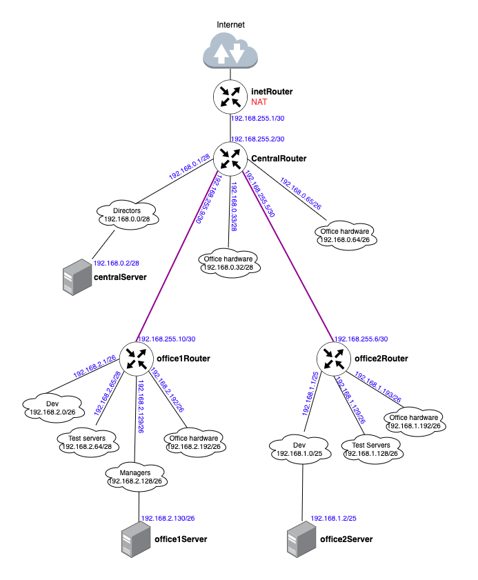

# Less28. Архитектура сетей
- [Less28. Архитектура сетей](#less28-архитектура-сетей)
    - [Цель:](#цель)
    - [Содержание:](#содержание)
    - [Результаты:](#результаты)
    - [Компетенции](#компетенции)
    - [Задание:](#задание)
    - [Формат сдачи:](#формат-сдачи)
    - [Критерии оценки:](#критерии-оценки)
    - [Комментарии к выполнению задания:](#комментарии-к-выполнению-задания)
      - [Теоретическая часть.](#теоретическая-часть)
      - [Практическая часть](#практическая-часть)
    - [Links:](#links)

### Цель: 
- понимать как строятся сети передачи данных;
- ориентироваться в сетевых протоколах;
- осуществлять базовую настройку сети;
- Научиться менять базовые сетевые настройки в Linux-based системах;
  
### Содержание:
- обзор Модели OSI;
- инкапсуляция;

- протоколы ARP, IP, TCP/UDP;
- протоколы прикладного уровня;
- сетевые интерфейсы в Linux.
 
### Результаты:
- рассказать о сетевой модели OSI и о протоколах каждого ее уровня
также смогут настроить сетевой интерфейс на отдельно взятой машине, сменить IP адрес, подсеть, прописать маршрут.

### Компетенции

Работа с сетевой подсистемой
- анализировать и отлавливать сетевой трафик, проходящий через компьютер или локальную сеть

### Задание:

1. Скачать и развернуть Vagrant-стенд https://github.com/erlong15/otus-linux/tree/network
2. Построить следующую сетевую архитектуру:
Сеть office1
- 192.168.2.0/26      - dev
- 192.168.2.64/26     - test servers
- 192.168.2.128/26    - managers
- 192.168.2.192/26    - office hardware

Сеть office2
- 192.168.1.0/25      - dev
- 192.168.1.128/26    - test servers
- 192.168.1.192/26    - office hardware

Сеть central
- 192.168.0.0/28     - directors
- 192.168.0.32/28    - office hardware
- 192.168.0.64/26    - wifi

Итого должны получиться следующие сервера:
- inetRouter
- centralRouter
- office1Router
- office2Router
- centralServer
- office1Server
- office2Server

_Задание состоит из 2-х частей: теоретической и практической._

В теоретической части требуется: 
- Найти свободные подсети
- Посчитать количество узлов в каждой подсети, включая свободные
- Указать Broadcast-адрес для каждой подсети
- Проверить, нет ли ошибок при разбиении

В практической части требуется: 
- Соединить офисы в сеть согласно логической схеме и настроить роутинг
- Интернет-трафик со всех серверов должен ходить через inetRouter
- Все сервера должны видеть друг друга (должен проходить ping)
- У всех новых серверов отключить дефолт на NAT (eth0), который vagrant поднимает для связи
- Добавить дополнительные сетевые интерфейсы, если потребуется

### Формат сдачи: 
Рекомендуется использовать Vagrant + Ansible для настройки данной схемы. 

### Критерии оценки:
Статус «Принято» ставится при выполнении следующих условий:
1. Сcылка на репозиторий GitHub.
2. Vagrantfile, который будет разворачивать виртуальные машины
3. Настройка виртуальных машин либо вручную, либо с помощью Ansible.
4. Документация по каждому заданию:
Создайте файл README.md и снабдите его следующей информацией:
- название выполняемого задания;
- текст задания;
- схема сети;
- описание команд и их вывод;
- особенности проектирования и реализации решения, 
- заметки, если считаете, что имеет смысл их зафиксировать в репозитории.

### Комментарии к выполнению задания:
> _Задание выполнено c использованием Vagrant, libvirt, vagrant box ubuntu/jammy64_

#### Теоретическая часть.
Используемые и свободные подсети. ([в формате ods](./appendix/networks.ods))
| Name                                   | Network            | Netmask         | count hosts | Hostmin         | Hostmax         | Broadcast       |
| -------------------------------------- | ------------------ | --------------- | ----------- | --------------- | --------------- | --------------- |
| **Central Network**                    |                    |                 |             |                 |                 |                 |
| _Directors_                            | 192.168.0.0/28     | 255.255.255.240 | 14          | 192.168.0.1     | 192.168.0.14    | 192.168.0.15    |
| _Office hardware_                      | 192.168.0.32/28    | 255.255.255.240 | 14          | 192.168.0.33    | 192.168.0.46    | 192.168.0.47    |
| _Wifi(mgt network)_                    | 192.168.0.64/26    | 255.255.255.192 | 62          | 192.168.0.65    | 192.168.0.126   | 192.168.0.127   |
| **Office 1 network**                   | ---                | ---             | ---         | ---             | ---             | ---             |
| _Dev_                                  | 192.168.2.0/26     | 255.255.255.192 | 62          | 192.168.2.1     | 192.168.2.62    | 192.168.2.63    |
| _Test servers_                         | 192.168.2.64/26    | 255.255.255.192 | 62          | 192.168.2.65    | 192.168.2.126   | 192.168.2.127   |
| _Managers_                             | 192.168.2.128/26   | 255.255.255.192 | 62          | 192.168.2.129   | 192.168.2.190   | 192.168.2.191   |
| _Office hardware_                      | 192.168.2.192/26   | 255.255.255.192 | 62          | 192.168.2.193   | 192.168.2.254   | 192.168.2.255   |
| **Office 2 network***                  |                    |                 |             |                 |                 |                 |
| _Dev_                                  | 192.168.1.0/25     | 255.255.255.128 | 126         | 192.168.1.1     | 192.168.1.126   | 192.168.1.127   |
| _Test servers_                         | 192.168.1.128/26   | 255.255.255.192 | 62          | 192.168.1.129   | 192.168.1.190   | 192.168.1.191   |
| _Office hardware_                      | 192.168.1.192/26   | 255.255.255.192 | 62          | 192.168.1.193   | 192.168.1.254   | 192.168.1.255   |
| **InetRouter — CentralRouter network** |                    |                 |             |                 |                 |                 |
| _Inet — central_                       | 192.168.255.0/30   | 255.255.255.252 | 2           | 192.168.255.1   | 192.168.255.2   | 192.168.255.3   |
| **Свободные подсети**                  |                    |                 |             |                 |                 |                 |
|                                        | 192.168.0.16/28    | 255.255.255.240 | 14          | 192.168.0.17    | 192.168.0.30    | 192.168.0.31    |
|                                        | 192.168.0.48/28    | 255.255.255.240 | 14          | 192.168.0.49    | 192.168.0.62    | 192.168.0.63    |
|                                        | 192.168.0.128/25   | 255.255.255.128 | 126         | 192.168.0.129   | 192.168.0.254   | 192.168.0.255   |
|                                        | 192.168.255.4/30   | 255.255.255.252 | 2           | 192.168.255.5   | 192.168.255.6   | 192.168.255.7   |
|                                        | 192.168.255.8/29   | 255.255.255.248 | 6           | 192.168.255.9   | 192.168.255.14  | 192.168.255.15  |
|                                        | 192.168.255.16/28  | 255.255.255.240 | 14          | 192.168.255.17  | 192.168.255.30  | 192.168.255.31  |
|                                        | 192.168.255.32/27  | 255.255.255.224 | 30          | 192.168.255.33  | 192.168.255.62  | 192.168.255.63  |
|                                        | 192.168.255.64/26  | 255.255.255.192 | 62          | 192.168.255.65  | 192.168.255.126 | 192.168.255.127 |
|                                        | 192.168.255.128/25 | 255.255.255.128 | 126         | 192.168.255.129 | 192.168.255.254 | 192.168.255.255 |

На схеме:
- неверно указано наименование сети 192.168.0.64/26 - должно быть Wifi(mgt network)
- неверно указан адрес office1Router в подсети 192.168.2.192/26 - должен быть 192.168.2.193/26
- неверно указана маска подсети Test Servers - должна быть 192.168.2.64/26

#### Практическая часть
При использовании провайдера libvirt Vagrant поднимает сетевой интерфейс по дефолту с именем eth5. Это учтено при выполнении задания в плейбуке ansible при отключении NAT.

1. [Vagrantfile](./vagrant/Vagrantfile)
2. [Ansible playbook](./vagrant/ansible/provision.yml)
3. [Каталог с шаблонами ansible ](./vagrant/ansible/templates/)
4. [Листинг выполнения команды и вывод проверки связанности серверов](./appendix/typescript01)

### Links:

- [Vagrant libvirt](https://vagrant-libvirt.github.io/vagrant-libvirt/configuration.html)
- ---
Полезные ссылки по git:  
- <https://git-scm.com/book/ru/v1/%D0%92%D0%B2%D0%B5%D0%B4%D0%B5%D0%BD%D0%B8%D0%B5>  
- <https://githowto.com/ru>  
- <https://learngitbranching.js.org/>  
- ---
Рекомендуемые источники
- Статья «Маршрутизация в linux» - https://losst.ru/marshrutizatsiya-v-linux 
- Статья «NAT для новичков» - https://habr.com/ru/post/583172/
- Статья «Templating(Jinja2)» - https://docs.ansible.com/ansible/2.9/user_guide/playbooks_templating.html 
- Статья «Ansible Provisioner» - https://www.vagrantup.com/docs/provisioning/ansible 
