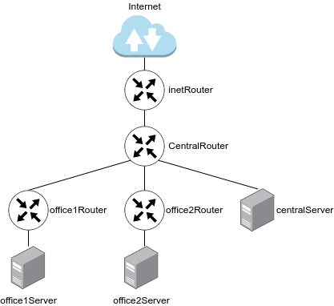

# Less28. Архитектура сетей
- [Less28. Архитектура сетей](#less28-архитектура-сетей)
    - [Цель:](#цель)
    - [Содержание:](#содержание)
    - [Результаты:](#результаты)
    - [Компетенции](#компетенции)
    - [Задание:](#задание)
    - [Формат сдачи:](#формат-сдачи)
    - [Критерии оценки:](#критерии-оценки)
    - [Комментарии к выполнению задания:](#комментарии-к-выполнению-задания)
    - [Links:](#links)

### Цель: 
- понимать как строятся сети передачи данных;
- ориентироваться в сетевых протоколах;
- осуществлять базовую настройку сети;
- Научиться менять базовые сетевые настройки в Linux-based системах;
  
### Содержание:
- обзор Модели OSI;
- инкапсуляция;

- протоколы ARP, IP, TCP/UDP;
- протоколы прикладного уровня;
- сетевые интерфейсы в Linux.
 
### Результаты:
- рассказать о сетевой модели OSI и о протоколах каждого ее уровня
также смогут настроить сетевой интерфейс на отдельно взятой машине, сменить IP адрес, подсеть, прописать маршрут.

### Компетенции

Работа с сетевой подсистемой
- анализировать и отлавливать сетевой трафик, проходящий через компьютер или локальную сеть

### Задание:

1. Скачать и развернуть Vagrant-стенд https://github.com/erlong15/otus-linux/tree/network
2. Построить следующую сетевую архитектуру:
Сеть office1
- 192.168.2.0/26      - dev
- 192.168.2.64/26     - test servers
- 192.168.2.128/26    - managers
- 192.168.2.192/26    - office hardware

Сеть office2
- 192.168.1.0/25      - dev
- 192.168.1.128/26    - test servers
- 192.168.1.192/26    - office hardware

Сеть central
- 192.168.0.0/28     - directors
- 192.168.0.32/28    - office hardware
- 192.168.0.64/26    - wifi

Итого должны получиться следующие сервера:
- inetRouter
- centralRouter
- office1Router
- office2Router
- centralServer
- office1Server
- office2Server

_Задание состоит из 2-х частей: теоретической и практической._

В теоретической части требуется: 
- Найти свободные подсети
- Посчитать количество узлов в каждой подсети, включая свободные
- Указать Broadcast-адрес для каждой подсети
- Проверить, нет ли ошибок при разбиении

В практической части требуется: 
- Соединить офисы в сеть согласно логической схеме и настроить роутинг
- Интернет-трафик со всех серверов должен ходить через inetRouter
- Все сервера должны видеть друг друга (должен проходить ping)
- У всех новых серверов отключить дефолт на NAT (eth0), который vagrant поднимает для связи
- Добавить дополнительные сетевые интерфейсы, если потребуется

### Формат сдачи: 
Рекомендуется использовать Vagrant + Ansible для настройки данной схемы. 

### Критерии оценки:
Статус «Принято» ставится при выполнении следующих условий:
1. Сcылка на репозиторий GitHub.
2. Vagrantfile, который будет разворачивать виртуальные машины
3. Настройка виртуальных машин либо вручную, либо с помощью Ansible.
4. Документация по каждому заданию:
Создайте файл README.md и снабдите его следующей информацией:
- название выполняемого задания;
- текст задания;
- схема сети;
- описание команд и их вывод;
- особенности проектирования и реализации решения, 
- заметки, если считаете, что имеет смысл их зафиксировать в репозитории.

### Комментарии к выполнению задания:

### Links:

Полезные ссылки по git:  
- <https://git-scm.com/book/ru/v1/%D0%92%D0%B2%D0%B5%D0%B4%D0%B5%D0%BD%D0%B8%D0%B5>  
- <https://githowto.com/ru>  
- <https://learngitbranching.js.org/>  
- ---
Рекомендуемые источники
- Статья «Маршрутизация в linux» - https://losst.ru/marshrutizatsiya-v-linux 
- Статья «NAT для новичков» - https://habr.com/ru/post/583172/
- Статья «Templating(Jinja2)» - https://docs.ansible.com/ansible/2.9/user_guide/playbooks_templating.html 
- Статья «Ansible Provisioner» - https://www.vagrantup.com/docs/provisioning/ansible 
