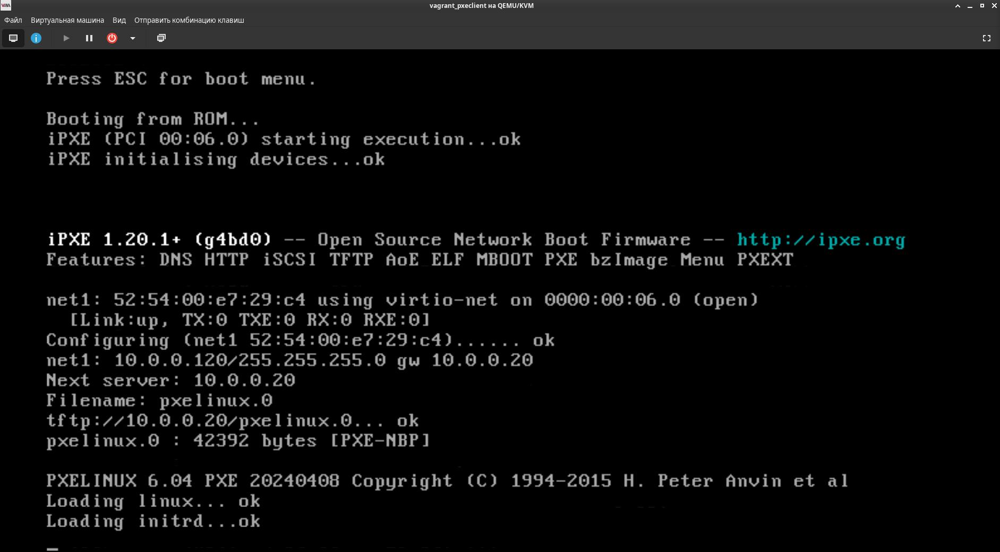
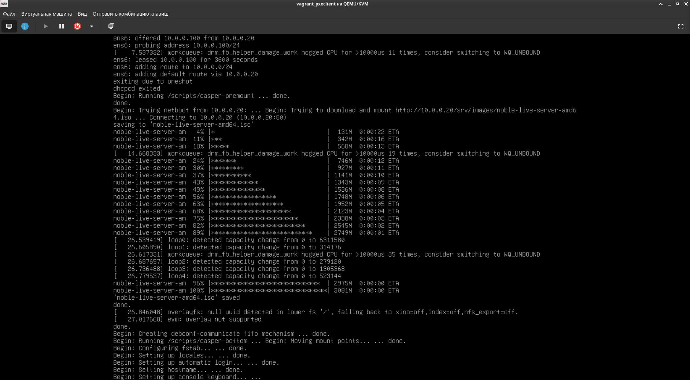
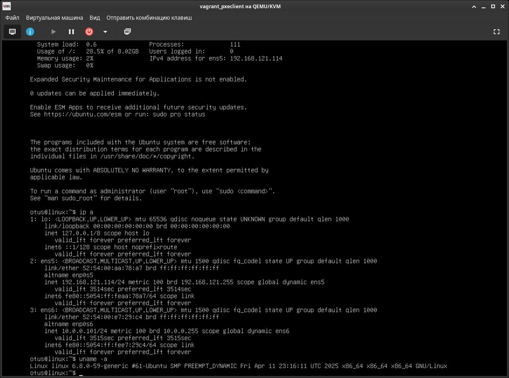

# Less29. DHCP, PXE
- [Less29. DHCP, PXE](#less29-dhcp-pxe)
    - [Цель:](#цель)
    - [Содержание:](#содержание)
    - [Результаты:](#результаты)
    - [Компетенции](#компетенции)
    - [Задание:](#задание)
    - [Формат сдачи:](#формат-сдачи)
    - [Критерии оценки:](#критерии-оценки)
    - [Комментарии к выполнению задания:](#комментарии-к-выполнению-задания)
    - [Links:](#links)

### Цель: 
- понимать принцип работы спецификации PXE;
- знать, какую роль в ней играют протоколы dhcp, tftp;
- рассмотреть, как происходит загрузка в ОС по сети и как это используется для сетевой установки;
- Отработать навыки установки и настройки DHCP, TFTP, PXE загрузчика и автоматической загрузки
  
### Содержание:
- вспомним как происходит загрузка в ОС и в чём специка загрузки в ОС по сети;
- спецификация PXE;
- протокол DHCP;
- настройка dhcp-сервера;
- протокол tftp;
- загрузчик pxelinux;
- загрузка по сети;
- установка ОС через PXE;
 
### Результаты:
- узнать на каких компонентах базируется спецификация PXE и как их связать вместе;
- смогут использовать PXE для установки ОС по сети в автоматическом режиме;
- смогут настроить dhcp-сервер, tftp;
### Компетенции

Работа с сетевой подсистемой
- настраивать сервисы DHCP, PXE с загрузкой ОС по сети
- 
### Задание:

Настройка PXE сервера для автоматической установки
1. Настроить загрузку по сети дистрибутива Ubuntu 24
2. Установка должна проходить из HTTP-репозитория.
3. Настроить автоматическую установку c помощью файла user-data
4. * Настроить автоматическую загрузку по сети дистрибутива Ubuntu 24 c использованием UEFI

### Формат сдачи: 
Формат сдачи ДЗ - vagrant + ansible

### Критерии оценки:
Статус "Принято" ставится при выполнении следующих условий:

1. Ссылка на репозиторий github.
2. Vagrantfile с шагами установки необходимых компонентов
3. Исходный код для настройки сервера (Ansible-playbook)
Если какие-то шаги невозможно или сложно автоматизировать, то инструкции по ручным шагам для настройки

### Комментарии к выполнению задания:
> _Задание выполнено c использованием Vagrant, libvirt, vagrant box ubuntu/jammy64, noble-live-server-amd64.iso, noble-netboot-amd64.tar.gz_

- [Vagrantfile](./vagrant/Vagrantfile)
- [Ansible playbook](./vagrant/ansible/provision.yml)
- [Файл user-data для автоматической установки ОС](./vagrant/ansible/templates/user-data)
- [Каталог с шаблонами файлов конфигураций](./vagrant/ansible/templates/)

1. Развернут сервер сетевой установки ОС Ubuntu
2. На клиентском хосте автоматически устанавливается ОС по сети  

### Links:

- [Vagrant libvirt](https://vagrant-libvirt.github.io/vagrant-libvirt/configuration.html)

- [Статья о TFTP](https://ru.wikipedia.org/wiki/Trivial_File_Transfer_Protocol)
- [Статья о DHCP](https://ru.wikipedia.org/wiki/DHCP)
- [Статья о Dnsmasq](https://ru.wikipedia.org/wiki/Dnsmasq)
- [Статья «PXE Boot : Configure PXE Server»](https://www.server-world.info/en/note?os=CentOS_8&p=pxe&f=1)
- [Статья «Configure IPv4 UEFI PXE Boot with Kickstart [RHEL/CentOS 8]»](https://www.golinuxcloud.com/configure-uefi-pxe-boot-with-kickstart/)
- [Статья «How to netboot the server installer on amd64»](https://ubuntu.com/server/docs/how-to-netboot-the-server-installer-on-amd64)
- [Статья «Ubuntu (Focal) PXE Boot with autoinstall»](https://www.laroberto.com/ubuntu-pxe-boot-with-autoinstall/)
- [Статья «Как установить Ubuntu через PXE-сервер»](https://blog.sedicomm.com/2019/11/12/kak-ustanovit-ubuntu-cherez-pxe-server/)

