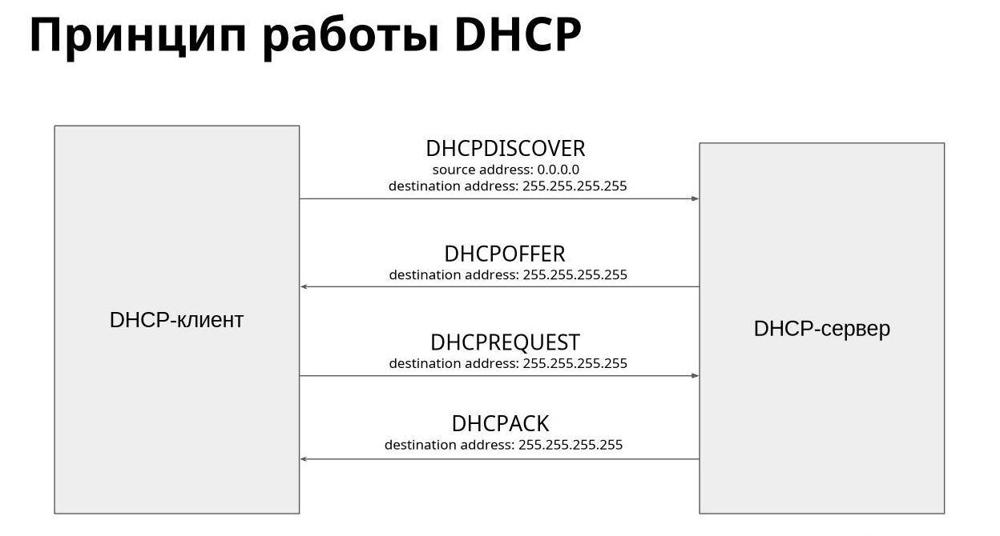
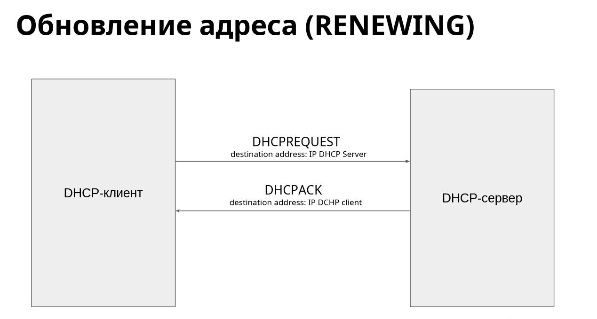
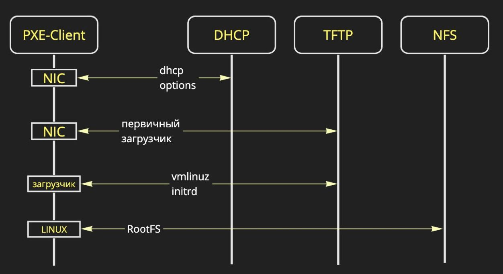

dhcp - протокол динамической настройки узла
DHCP (Dynamic Host Configuration Protocol) — протокол динамической настройки узла.
Позволяет сетевым устройствам автоматически получать настройки для работы в сети:
● IP-адрес
● Netmask
● Gateway
● DNS
Работает поверх UDP на портах:
● 67 — сервер
● 68 — клиент
Аббревиатура DORA для получения адреса:
○ Discovery
○ Offer
○ Request
○ Acknowledgement

DORA
discovery
offer
request
acknolage

PXE
0:26

PXE (Preboot eXecution Environment) — среда для загрузки компьютера с помощью сетевой
карты без использования локальных носителей данных (HDD, USB-накопителя и т. д.).
● Используется для загрузки ОС
бездисковых станций (тонкий клиент)
● Использует протоколы:
○ DHCP / BOOTP
○ TFTP
● Требует сетевую карту (NIC)
с поддержкой UNDI ROM
UNDI (Universal Network Device Interface)

TFTP
udp 69 port 

