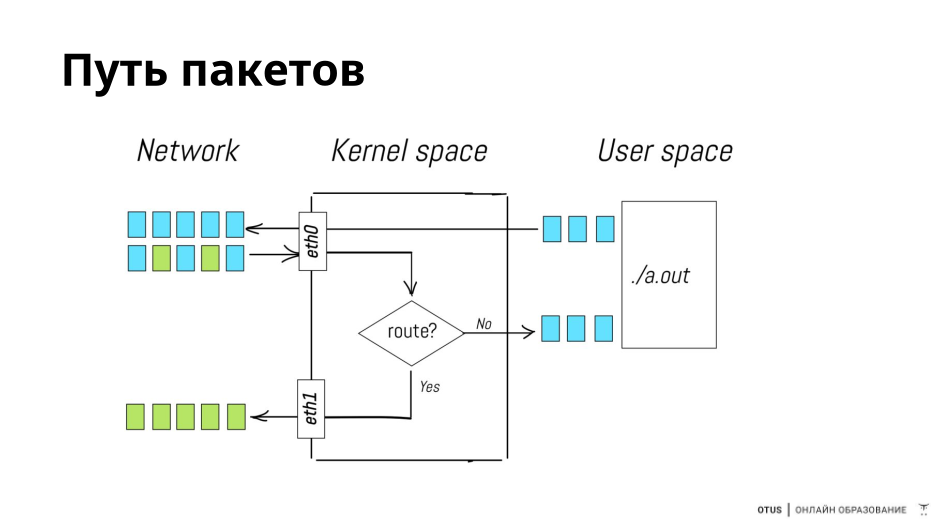
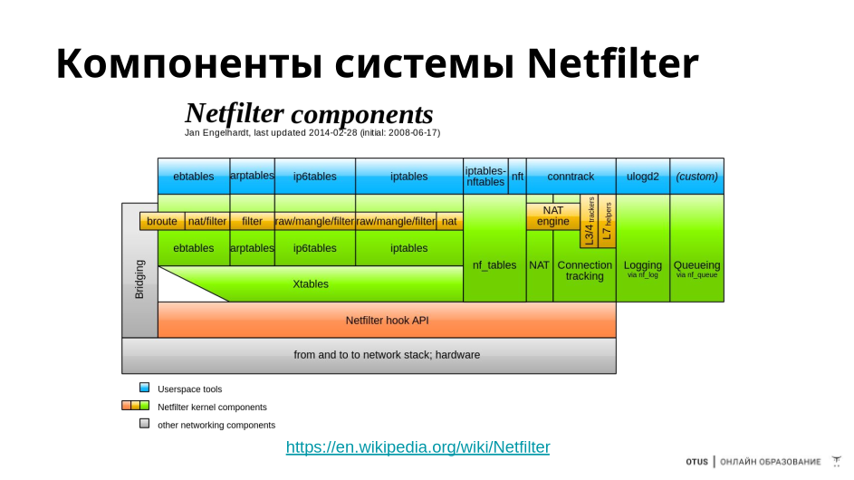
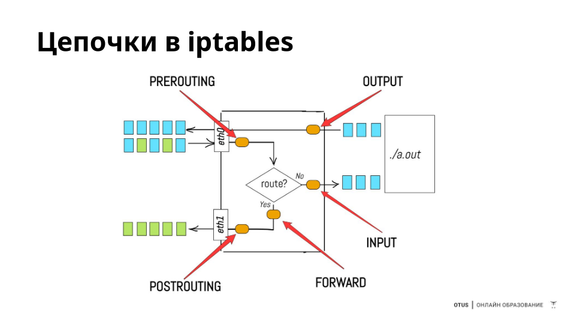
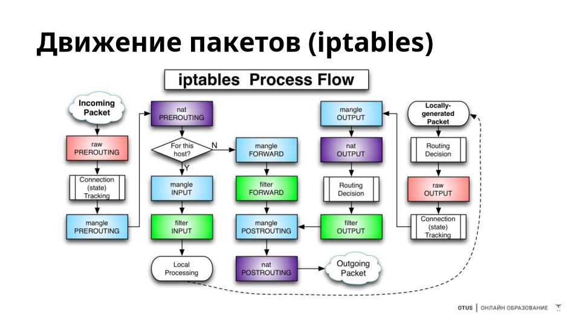
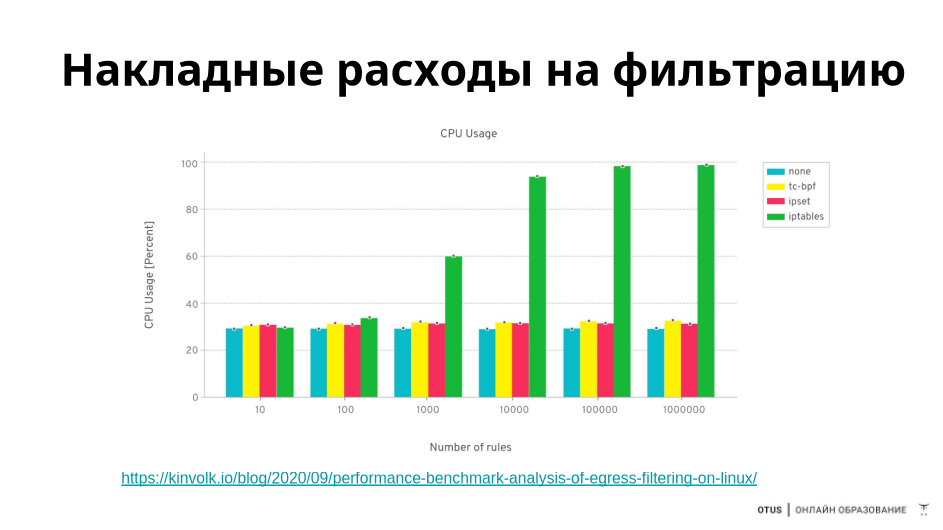

Подсистема netfilter
    - iptables
    - ip6tables
  Надстройки
  - ufw (ubuntu) над iptables
  - firewalld (centos) над iptables b nf_tables

Иерархия

 - таблицы (raw, mangle, nat, filter)
 - цепочки (PREROUTING, INPUT, FORWARD, OUTPUT, POSTROUTING)
 - правила
   - размещаются на пересечении таблиц и цепочек
   - применяются по порядку

## Команды iptables

- iptables -L – просмотр списка правил
- iptables -F – сброс правил (политика остаётся)
- iptables -P – установка политики по умолчанию
- iptables -I – вставить правило в начало списка
- iptables -A – добавить правило в конец списка
- iptables -D – удалить правило

## Критерии правил в iptables
- -p – проколол
- -i – интерфейс источника
- -o – интерфейс назначения
- -s – адрес источника
- --dport – порт назначения
- --sport – порт источника
- -m multiport --dports – несколько портов назначения
- -m conntrack --ctstate – статус соединения (или ранее -m state --state)
- --icmp-type – тип ICMP-сообщения
- -j – действие

## Действия с пакетами — target, jump (-j)
- ACCEPT — разрешить
- DROP — выкинуть
- REJECT — отклонить
  - iptables -A INPUT -s 10.26.95.20 -j REJECT --reject-with tcp-reset
  - iptables -A INPUT -p tcp -j REJECT --reject-with tcp-reset 
  - iptables -A INPUT -p udp -j REJECT --reject-with icmp-port-unreachable
  - iptables -A INPUT -j REJECT --reject-with icmp-proto-unreachable
- REDIRECT — перенаправить
  - iptables -t nat -I PREROUTING -p tcp --dport 80 -j REDIRECT --to-port 8080
- DNAT/SNAT — destination/source NAT (network address translation)
  - iptables -t nat -A PREROUTING -p tcp --dport 9022 -j DNAT --to 192.168.56.6:22
- LOG — записать в лог
- RETURN — выйти из цепочки

## Состояния пакетов
- Сохранение состояния соединений — stateful firewall
- lsmod | grep conntrack
- iptables -A INPUT -m conntrack --ctstate INVALID -j DROP
- NEW — пакет для создания нового соединения
- ESTABLISHED — пакет, принадлежащий к существующему соединению
- RELATED — пакет для создания нового соединения, но связанный с существующим (например, FTP)
- INVALID — пакет не соответствует ни одному соединению из таблицы
- UNTRACKED — пакет был помечен как неотслеживаемый в таблице raw

## Сохранение правил в iptables
- Временно:
  - iptables-save > ./iptables.rules
  - iptables-restore < ./iptables.rules
- Постоянно:
  - apt install iptables-persistent netfilter-persistent
  - netfilter-persistent save
  - netfilter-persistent start

iptables -nvL -t <таблица>

nft list ruleset < правила nft>
nft flush ruleset < сброс правил nft>

which iptables
ls -al /usr/sbin/iptables

chain

# IPset

## Использование списков ipset
- Создать (отдельные IP): ipset -N ddos iphash
- Создать (подсети): ipset create blacklist nethash
- Добавить подсеть: ipset -A ddos 109.95.48.0/21
- Посмотреть список: ipset -L ddos
- Проверить: ipset test ddos 185.174.102.1
- Сохранение: sudo ipset save blacklist -f ipset-blacklist.backup
- Восстановление: sudo ipset restore -! < ipset-blacklist.backup
- Очистка: sudo ipset flush blacklist
- Правило: iptables -I PREROUTING -t raw -m set --match-set ddos src -j DROP
- Сохранение постоянно: apt install ipset-persistent

# Добавление кастомных цепочек
1:25

