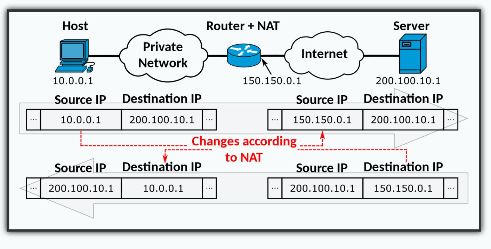

## Конфигурация firewalld
| назначение                       | каталог/файл                      |
| -------------------------------- | --------------------------------- |
| -  Общий каталог (по умолчанию): | /usr/lib/firewalld                |
| -  Зоны (по умолчанию):          | /usr/lib/firewalld/zones/*.xml    |
| -  Сервисы (по умолчанию):       | /usr/lib/firewalld/services/*.xml |
| -  Настройки системы:            | /etc/firewalld/*                  |
| -  Активная конфигурация:        | runtime                           |
| -  Постоянная конфигурация:      | permanent                         |

## Зоны в firewalld
|                  |                                                                                                                   |
| ---------------- | ----------------------------------------------------------------------------------------------------------------- |
| -  **drop**:     | самый низкий уровень доверия, DROP                                                                                |
| -  **block**:    | отклоняются с сообщением icmp-host-prohibited или icmp6-adm-prohibited, REJECT                                    |
| -  **public**:   | публичные сети, к которым нет доверия                                                                             |
| -  **external**: | внешние сети, эта зона настроена для работы с NAT                                                                 |
| -  **internal**: | для внутренней части шлюза                                                                                        |
| -  **dmz**:      | используется для компьютеров в ДМЗ (изолированные компьютеры, у которых нет доступа к остальной части вашей сети) |
| -  **work**:     | используется для рабочих компьютеров                                                                              |
| -  **home**:     | домашняя среда, доверие большей части других компьютеров                                                          |
| -  **trusted**:  | все соединения разрешены                                                                                          |

### Настройки зоны
|                   |                |
| ----------------- | -------------- |
| -  Сервисы        | (service)      |
| -  Порты          | (port)         |
| -  Блоки ICMP     | (icmp-block)   |
| -  Маскарадинг    | (masquerade)   |
| -  Проброс портов | (forward-port) |
| -  Rich rules     | (rule)         |

## Утилита firewall-cmd (база)
|                                                        |                                           |
| ------------------------------------------------------ | ----------------------------------------- |
| ```firewall-cmd --get-default-zone```                  | # — выводит зону по умолчанию             |
| ```firewall-cmd --get-active-zones```                  | # — список активных зон                   |
| ```firewall-cmd --get-zones```                         | # — список всех доступных зон             |
| ```firewall-cmd --list-all```                          | # — список всех служб текущей зоны        |
| ```firewall-cmd --set-default-zone=work```             | # — изменить зону по умолчанию            |
| ```firewall-cmd --get-services```                      | # — список всех доступных служб в системе |
| ```firewall-cmd --zone=home --change-interface=eth0``` | # — изменение зоны интерфейса             |

## Утилита firewall-cmd (сервисы)
|                                                                 |                                       |
| --------------------------------------------------------------- | ------------------------------------- |
| ```firewall-cmd --zone=public --add-service=http```             | # — разрешить временно                |
| ```firewall-cmd --zone=public --add-service=ftp```              |                                       |
| ```firewall-cmd --permanent --zone=public --add-service=http``` | — разрешить постоянно                 |
| ```firewall-cmd --permanent --zone=public --add-service=ftp```  |                                       |
| ```firewall-cmd --reload```                                     | — подгрузка правил из permanent       |
| ```firewall-cmd [--permanent] --zone=public --list-services```  | -- список временных/постоянных правил |

## firewall-cmd (проброс портов, NAT)
```bash
#
firewall-cmd --permanent --new-zone=otus
#
firewall-cmd --zone=otus \ --add-forward-port=port=2222:proto=tcp:toport=22:toaddr=1.1.1.1
#
firewall-cmd --zone=otus --add-masquerade
```

## firewall-cmd (ipset)
```bash 
firewall-cmd --get-ipset-types
firewall-cmd --permanent --new-ipset=test --type=hash:net
firewall-cmd --permanent --info-ipset=test
firewall-cmd --permanent --ipset=test --add-entry=192.168.0.1
firewall-cmd --permanent --ipset=test --get-entries
firewall-cmd --permanent --ipset=test --add-entries-from-file=ipl
firewall-cmd --permanent --zone=drop --add-source=ipset:test
```

## firewall-cmd (rich rules)
```bash
rule
    [source]
    [destination]
        service|port|protocol|icmp-block|icmp-type|
        masquerade|forward-port|source-port
    [log]
    [audit]
    [accept|reject|drop|mark]
```

    ● rule
        ○ rule [family="ipv4|ipv6"] [priority="priority"]
    ● source
        ○  source [not] \
            address="address[/mask]"|mac="mac-address"|ipset="ipset"
    ● destination
        ○ destination [not] address="address[/mask]"
    ● service
        ○ service name="service name"
    ● port
        ○ port port="port value" protocol="tcp|udp"
    ● protocol
        ○ protocol value="protocol value"
    ● icmp-block
        ○ icmp-block name="icmptype name"
    ● forward-port
        ○ forward-port port="port value" protocol="tcp|udp" \
            to-port="port value" to-addr="address"
    ● source-port
        ○ source-port port="port value" protocol="tcp|udp"
    ● log
        ○ log [prefix="prefix text"] [level="log level"] [limit \
            value="rate/duration"]
    ● audit
        ○ audit [limit value="rate/duration"]

## firewall-cmd (rich rules actions)
    ● action
        ○ accept [limit value="rate/duration"]
        ○ reject [type="reject type"] [limit value="rate/duration"]
        ○ drop [limit value="rate/duration"]
        ○ mark set="mark[/mask]" [limit value="rate/duration"]

### firewall-cmd (rich rules примеры)
```bash 
#
firewall-cmd --add-rich-rule rule service name="http" log limit
value="1/m" audit accept
#
firewall-cmd --zone=otus --permanent --add-rich-rule 'rule
family="ipv4" source address="10.51.21.42" service name="mysql"
accept'
#
firewall-cmd --add-rich-rule rule family="ipv4" source
address="192.168.2.3" reject type="icmp-admin-prohibited"
```
## firewall-cmd (direct)
    firewall-cmd --permanent ...
    firewall-cmd --direct
        --passthrough { ipv4/ipv6/eb } <args>
        --add-chain { ipv4/ipv6/eb } <table> <chain>
        --remove-chain { ipv4/ipv6/eb } <table> <chain>
        --query-chain { ipv4/ipv6/eb } <table> <chain>
        --get-chains { ipv4/ipv6/eb } <table>
        --add-rule { ipv4/ipv6/eb } <table> <chain> <priority> <args>
        --remove-rule { ipv4/ipv6/eb } <table> <chain> <args>
        --query-rule { ipv4/ipv6/eb } <table> <chain> <args>
        --get-rules { ipv4/ipv6/eb } <table> <chain>
### firewall-cmd (direct примеры)
```bash
#
firewall-cmd --direct --add-rule ipv4 filter IN_public_allow 0 -m
tcp -p tcp --dport 666 -j ACCEPT
#
firewall-cmd --direct --get-rules ipv4 filter IN_public_allow
#
firewall-cmd --direct --remove-rule ipv4 filter IN_public_allow 0
-m tcp -p tcp --dport 666 -j ACCEPT
```

## Настройка шлюза (iptables)
0:44

```bash
# Включаем forwarding пакетов:
echo 1 > /proc/sys/net/ipv4/ip_forward
# Включаем маскарадинг
iptables -t nat -A POSTROUTING -o enp0s3 -j MASQUERADE
# Разрешаем трафик в цепочке FORWARD
iptables -A FORWARD -i enp0s8 -o enp0s3 -j ACCEPT
iptables -A FORWARD -m state --state ESTABLISHED,RELATED -j ACCEPT
# Вариант с SNAT
iptables -t nat -A POSTROUTING -o enp0s3 -j SNAT --to-source 172.16.16.94
iptables -t nat -A POSTROUTING -s 192.168.99.0/24 -j SNAT --to-source 172.16.16.94
```
## Маскарадинг (NAT)
