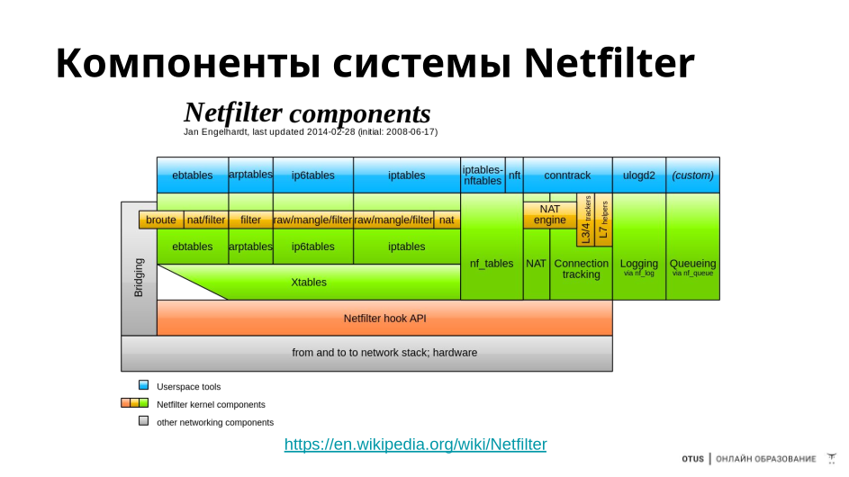

# nftables





## Недостатки iptables
● Линейное исполнение правил
● Отсутствие встроенных наборов (отдельный ipset)
● Низкая производительность при большом числе правил
● Сложный синтаксис команд
● Недостаточная гибкость
● Одно действие в правиле
● Раздельное управление для IPv4 и IPv6 и других протоколов

## Особенности nftables
● Замена системы iptables (xtables)
● Гибкая конфигурация цепочек и таблиц
● Управление правилами на всех протоколах
● Включена в ядро в 2014 году
● Иерархическая структура правил
● Использует хуки в Netfilter
● Поддержка списков (sets)
● Несколько действий на одно правило
● Команды читаемы, автоматизация
● Совместимость с правилами iptables через трансляцию
● Счетчики опциональны

## Проверка работы nftables или iptables
● Модули ядра:
```lsmod | grep -E "^nf_|^ip_"```
● Утилиты:
iptables -V: iptables v1.8.10 (nf_tables)
iptables-nft — работа с nftables в режиме совместимости (команды iptables)
iptables-legacy — работа с iptables
● Одновременная работа iptables и nftables возможна, но нежелательна (работает за счет разных приоритетов хуков)

## Компоненты nftables
● Family — семейства протоколов
● Ruleset — набор всех таблиц, цепочек и правил
● Table — таблицы, контейнеры для цепочек
● Chain — наборы правил, привязываются к Netfilter-хукам

## Синтаксис nftables
● Нижний регистр
● Необходимо экранировать для выполнения в bash (; и т.д.)
● Каждое правило на своей строчке
● Может быть несколько действий в правиле
● Опциональные счетчики (counter), зависит от положения слова в правиле
● Формат вывода почти соответствует формату конфигурации
● nft -i — интерактивная консоль
```
nft add table ip filter
nft 'add chain ip filter input { type filter hook input priority 0 ; policy accept; }'
```

## Просмотр правил
● iptables -V — проверка режима iptables (legacy, nf_tables)
● nft list ruleset — просмотр всей конфигурации
● nft list table ip filter — просмотр правил таблицы filter
● nft flush ruleset — очистка правил
● nft list tables — список всех таблиц
● nft list tables ip — список таблиц семейства ip (IPv4)
● nft list chains — список цепочек

## Семейства цепочек и таблиц
● ip (default) — IPv4 протокол: по умолчанию, если не указано
● ip6 — IPv6 протокол
● inet — IPv4 и IPv6 протоколы
● arp — ARP протокол
● bridge — мосты (свичи)
● netdev — привязка к одному интерфейсу, весь трафик (ingress хук)

## Типы цепочек
● filter — для фильтрации пакетов. Семейства таблиц arp, bridge, ip, ip6 и inet
● route — перенаправление пакетов. Семейства таблиц ip, ip6 inet
● nat — Networking Address Translation (NAT). Только первый пакет в соединении
попадает в цепочку. Семейства таблиц ip, ip6 inet


## Хуки для цепочек (hooks)
● ingress (только в netdev (4.2) и inet (5.10): видит пакеты сразу после
драйвера сетевого интерфейса, даже до prerouting. Альтернатива для tc
● prerouting: все входящие пакеты до решения о роутинге
● input: входящие пакеты в сторону локальной системы
● forward: входящие пакеты не в локальную систему
● output: исходящие пакеты, сформированы в локальной системе
● postrouting: все пакеты после роутинга, как раз до выхода из локальной
системы

## Приоритеты цепочек
● Целое значение со знаком (чем меньше, тем приоритетнее)
● Указывает в каком порядке обрабатывать цепочки с одинаковыми хуками
● Если пакет был принят на одной цепочке и есть следующая цепочка на этом
hook, то он будет обработан снова (до drop)

## Политики цепочек
● accept — по умолчанию, пакет продолжает обрабатываться по стеку
● drop — пакет отбрасывается, обработка завершается

### Приоритеты — пример
```bash
table inet filter {
    # цепочка обрабатывается первой по приоритету
    chain ssh {
        type filter hook input priority 0; policy accept;
        # разрешаем пакеты на 22 порт
        tcp dport ssh accept
    }
    # цепочка обрабатывается второй по приоритету
    chain input {
        type filter hook input priority 1; policy drop;
        # пакет дропается по политике цепочки
    }
}
```
### Работа с таблицами и цепочками
```bash
# Таблицы
nft list tables [<family>]
nft list table [<family>] <name> [-n] [-a]
nft (add | delete | flush) table [<family>] <name>
# Цепочки
nft (add | create) chain [<family>] <table> <name> [ { type <type> hook <hook> [device
<device>] priority <priority> \; [policy <policy> \;] } ]
nft (delete | list | flush) chain [<family>] <table> <name>
nft rename chain [<family>] <table> <name> <newname>
```
### Базовая конфигурация nftables
```bash
nft add table ip filter
nft 'add chain ip filter input { type filter hook input priority 0; policy accept; }'
nft add rule filter input tcp dport 22 counter accept
nft add rule filter input tcp dport {80, 443} ct state new accept
nft add rule filter input ct state related,established accept
nft add rule filter input ct state invalid drop
nft add rule filter input iifname "lo" accept
nft add rule filter input ip protocol icmp accept
nft 'chain filter input { policy drop; }'
```

## Удаление и замена правил
```bash
nft --handle list chain filter input
nft --handle --numeric list chain filter input
nft delete rule filter input handle 3
nft replace rule filter input handle 11 tcp dport 80 ct state new counter accept
nft add rule [<family>] <table> <chain> <matches> <statements>
nft insert rule [<family>] <table> <chain> [position <position>] <matches> <statements>
nft replace rule [<family>] <table> <chain> [handle <handle>] <matches> <statements>
nft delete rule [<family>] <table> <chain> [handle <handle>]
```
## Сохранение и восстановление правил
● echo "flush ruleset" > /etc/nftables.conf
● nft -s list ruleset >> /etc/nftables.conf
● nft -f nft.rules — атомарная загрузка правил
● systemctl enable nftables.service — включаем сервис
● nft reset counters — сброс счетчиков
● (echo "flush ruleset"; nft --stateless list ruleset) | nft -f -

## Переход с iptables на nftables
```bash
● iptables-translate -A INPUT -p tcp --dport 22 -m conntrack
--ctstate NEW -j ACCEPT
● ip6tables-translate -A FORWARD -i eth0 -o eth3 -p udp -m
multiport --dports 111,222 -j ACCEPT
● ipset-translate restore < sets.ipset
● iptables-save > save.txt
● iptables-restore-translate -f save.txt > ruleset.nft
```

# Настройка nftables

## Критерии для ipv4 и ipv6
● ip protocol tcp
● ip protocol 6
● ip protocol != tcp
● ip protocol { icmp, esp, ah, comp, udp, udplite, tcp, dccp, sctp }
● ip saddr 192.168.2.0/24
● ip daddr 192.168.0.1
● ip ttl 0
● ip length != 333-453
● ip6 saddr ::/64
● ip6 daddr 1234:1234:1234:1234:1234:1234:1234:1234
● ip6 version 6

## Критерии для tcp и udp
● tcp dport 22
● tcp dport != 33-45
● tcp dport { 33-55 }
● tcp dport {telnet, http, https }
● tcp dport vmap { 22 : accept, 23 : drop }
● tcp sport 22
● tcp flags { fin, syn, rst, psh, ack, urg, ecn, cwr}
● udp dport 22
● udp sport { 33, 55, 67, 88}
● udp checksum 22

## Критерии для icmp и icmpv6
● icmp type {echo-reply, destination-unreachable, source-quench,
redirect, echo-request, time-exceeded, parameter-problem,
timestamp-request, timestamp-reply, info-request, info-reply,
address-mask-request, address-mask-reply, router-advertisement,
router-solicitation}
● icmp mtu 12343
● icmpv6 type {destination-unreachable, packet-too-big, time-exceeded,
echo-request, echo-reply, mld-listener-query, mld-listener-report,
mld-listener-reduction, nd-router-solicit, nd-router-advert,
nd-neighbor-solicit, nd-neighbor-advert, nd-redirect,
parameter-problem, router-renumbering}

## Действия с пакетами
● accept — принимает пакет и завершает обработку (только в текущей цепочке)
● reject — отклоняет пакет с сообщением ICMP
(reject with icmp type host-unreachable)
● drop — дропает пакет и завершает обработку (сразу же, без захода в другие цепочки)
● queue — поставка пакет в очередь для обработки приложением, завершает обработку
● continue — переход к следующему правилу
● return — выход из текущей цепочки
● jump chain — переход с точкой возврата
● goto chain — переход без точки возврата

## Отладка правил
● nft add rule ip filter input tcp dport 22 meta nftrace set 1 accept
● nft add chain filter trace_chain \
{ type filter hook prerouting priority -301\; }
● nft add rule filter trace_chain meta nftrace set 1
● nft delete chain filter trace_chain
● nft monitor trace

## Примеры правил
```bash 
# Отрицание
nft add rule ip filter input tcp dport != 80
# Диапазоны
add rule ip filter input tcp dport 10-1024
add rule ip filter input meta skuid 1000-1100
# Префиксы
add rule ip filter input ip daddr 192.168.10.0/24
add rule ip filter input meta mark 0xffffffff/24
# Состояния
add rule ip filter input ct new,established
# Маркировка пакетов
add rule ip filter input ct mark set 10
```
## Дополнительные возможности

### Счётчики
```bash
# Счетчики опциональны
# позиция в синтаксисе имеет значение
nft add rule filter input ip protocol tcp counter
nft add rule filter input ip counter protocol tcp
nft add rule filter input counter ip protocol tcp
```
### Переход к другой цепочке
```bash
# SRC=1.1.1.1 DST=2.2.2.2 TCP SPORT 111 DPORT 222
table ip filter {
chain input {
type filter hook input priority 0; policy accept;
# первое правило
ip saddr 1.1.1.1 ip daddr 2.2.2.2 tcp sport 111 tcp dport 222 jump other-chain
# третье правило (после возврата)
ip saddr 1.1.1.1 ip daddr 2.2.2.2 tcp sport 111 tcp dport 222 accept
}
chain other-chain {
# второе правило
counter packets 8 bytes 2020
}
}
```
### Трансляция адресов (NAT)
```bash
# SNAT
nft add table nat
nft 'add chain nat postrouting { type nat hook postrouting priority 100 ; }'
nft add rule nat postrouting ip saddr 192.168.1.0/24 oif eth0 snat to 1.2.3.4
# Masquerading
nft add rule nat postrouting masquerade
# DNAT
nft add table nat
nft 'add chain nat prerouting { type nat hook prerouting priority -100; }'
nft 'add rule nat prerouting iif eth0 tcp dport { 80, 443 } dnat to 192.168.1.120'
# Redirect (local DNAT) входящий
nft add rule nat prerouting tcp dport 22 redirect to 2222
# Redirect (local DNAT) исходящий
nft add rule nat output tcp dport 853 redirect to 10053
```
### Именованные лимиты
```bash table inet limit_demo {
limit lim_400ppm { rate 400/minute ; comment "use to limit in icmp" ; }
limit lim_1kbps { rate over 1024 bytes/second burst 512 bytes ; comment "in smtp" ; }
chain IN {
type filter hook input priority filter; policy drop;
meta l4proto icmp limit name "lim_400ppm" accept
tcp dport 25 limit name "lim_1kbps" accept
}
}
nft list limit [family] [table_name] [limit_name]
nft list limits table [family] [table_name]
nft list limits
```
### Конкатенация — объединение условий
```bash 
nft add rule ip filter input ip saddr . ip daddr . ip protocol { \
1.1.1.1 . 2.2.2.2 . tcp, 1.1.1.1 . 3.3.3.3 . udp} counter accept
nft add map filter whitelist { type ipv4_addr . inet_service : verdict \; }
nft add rule filter input ip saddr . tcp dport vmap @whitelist
nft add element filter whitelist { 1.2.3.4 . 22 : accept}
```
---

nft -t list ruleset # < вывод правил без сетов
    --stateless # < без счетчиков

nft flash ruleset

vmap - verdict map
