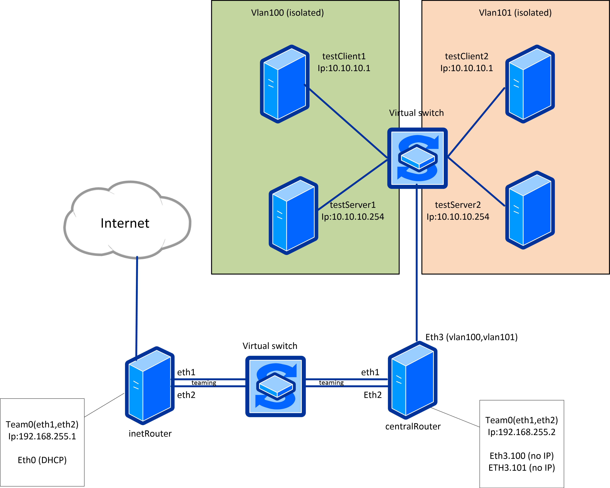

# Less37. Сетевые пакеты. VLAN'ы. LACP
### _Комментарии к выполнению задания и результаты вывода команд_

> Таймкоды лекции:
> - 0:57 ДЗ
> - 1:10 топологии с избыточностью
> - 1:55 ДЗ
> - 2:01 динамическое агрегирование

================================



#### 1. Настройка VLAN

На хостах testClient1, testServer1, testClient2, testServer2 созданы VLAN интерфейсы. Сети VLAN1 и VLAN2 изолированы друг от друга.

```bash
# Настройка сетевого интерфейса на хосте testClient1
root@testClient1:~# cat /etc/netplan/50-cloud-init.yaml 
network:
    version: 2
    ethernets:
        enp0s3:
            dhcp4: true
        enp0s8: {}
    vlans:
        vlan1:
          id: 1
          link: enp0s8
          dhcp4: no
          addresses: [10.10.10.254/24]

root@testClient1:~# ip a
...
5: vlan1@enp0s8: <BROADCAST,MULTICAST,UP,LOWER_UP> mtu 1500 qdisc noqueue state UP group default qlen 1000
    link/ether 08:00:27:9c:b1:a7 brd ff:ff:ff:ff:ff:ff
    inet 10.10.10.254/24 brd 10.10.10.255 scope global vlan1
       valid_lft forever preferred_lft forever
    inet6 fe80::a00:27ff:fe9c:b1a7/64 scope link 
       valid_lft forever preferred_lft forever
# ======================================================
# Настройка сетевого интерфейса на хосте testServer1
root@testServer1:~# cat /etc/netplan/50-cloud-init.yaml
network:
    version: 2
    ethernets:
        enp0s3:
            dhcp4: true
        enp0s8: {}
    vlans:
        vlan1:
          id: 1
          link: enp0s8
          dhcp4: no
          addresses: [10.10.10.1/24]

root@testServer1:~# ip a
...
5: vlan1@enp0s8: <BROADCAST,MULTICAST,UP,LOWER_UP> mtu 1500 qdisc noqueue state UP group default qlen 1000
    link/ether 08:00:27:a1:67:1c brd ff:ff:ff:ff:ff:ff
    inet 10.10.10.1/24 brd 10.10.10.255 scope global vlan1
       valid_lft forever preferred_lft forever
    inet6 fe80::a00:27ff:fea1:671c/64 scope link 
       valid_lft forever preferred_lft forever

```

#### 2. Настройка LACP между хостами inetRouter и centralRouter

```bash
# Проверка соединения через bond0 на сервере centralRouter
root@centralRouter:~# tcpdump -ni bond0
tcpdump: verbose output suppressed, use -v[v]... for full protocol decode
listening on bond0, link-type EN10MB (Ethernet), snapshot length 262144 bytes
...
13:59:35.839964 ARP, Request who-has 192.168.255.101 tell 192.168.255.101, length 28
13:59:35.840021 IP6 fe80::88f8:3aff:fe1c:1350 > ff02::1: ICMP6, neighbor advertisement, tgt is fe80::88f8:3aff:fe1c:1350, length 32
13:59:35.846112 IP6 fe80::88f8:3aff:fe1c:1350 > ff02::16: HBH ICMP6, multicast listener report v2, 1 group record(s), length 28
13:59:44.827295 ARP, Request who-has 192.168.255.101 tell 192.168.255.100, length 46
13:59:44.827327 ARP, Reply 192.168.255.101 is-at 8a:f8:3a:1c:13:50, length 28
13:59:45.854327 ARP, Request who-has 192.168.255.101 tell 192.168.255.100, length 46
13:59:45.854380 ARP, Reply 192.168.255.101 is-at 8a:f8:3a:1c:13:50, length 28
13:59:46.870468 ARP, Request who-has 192.168.255.101 tell 192.168.255.100, length 46
...

# отключаем интерфейс enp0s8
root@centralRouter:~# ip link set dev enp0s8 down

# проверка состояния интерфейса enp0s8
root@centralRouter:~# ip a
...
3: enp0s8: <BROADCAST,MULTICAST,SLAVE> mtu 1500 qdisc fq_codel master bond0 state DOWN group default qlen 1000
    link/ether 8a:f8:3a:1c:13:50 brd ff:ff:ff:ff:ff:ff permaddr 08:00:27:6d:b7:45
4: enp0s9: <BROADCAST,MULTICAST,SLAVE,UP,LOWER_UP> mtu 1500 qdisc fq_codel master bond0 state UP group default qlen 1000
    link/ether 8a:f8:3a:1c:13:50 brd ff:ff:ff:ff:ff:ff permaddr 08:00:27:bf:95:2a
...
```

```bash
# проверка состояния виртуального интерфейса bond0
# интерфейс enp0s8 отключен, но соединение не прервано
# в данный момент активен интерфейс enp0s9
root@centralRouter:~# cat /proc/net/bonding/bond0
Ethernet Channel Bonding Driver: v5.15.0-138-generic

Bonding Mode: fault-tolerance (active-backup)
Primary Slave: enp0s8 (primary_reselect always)
Currently Active Slave: enp0s9
MII Status: up
MII Polling Interval (ms): 100
Up Delay (ms): 0
Down Delay (ms): 0
Peer Notification Delay (ms): 0

Slave Interface: enp0s9
MII Status: up
Speed: 1000 Mbps
Duplex: full
Link Failure Count: 0
Permanent HW addr: 08:00:27:bf:95:2a
Slave queue ID: 0

Slave Interface: enp0s8
MII Status: down
Speed: 1000 Mbps
Duplex: full
Link Failure Count: 1
Permanent HW addr: 08:00:27:6d:b7:45
Slave queue ID: 0

```Less37. Сетевые пакеты. VLAN'ы. LACP