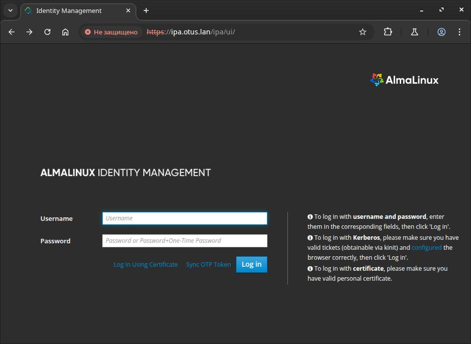
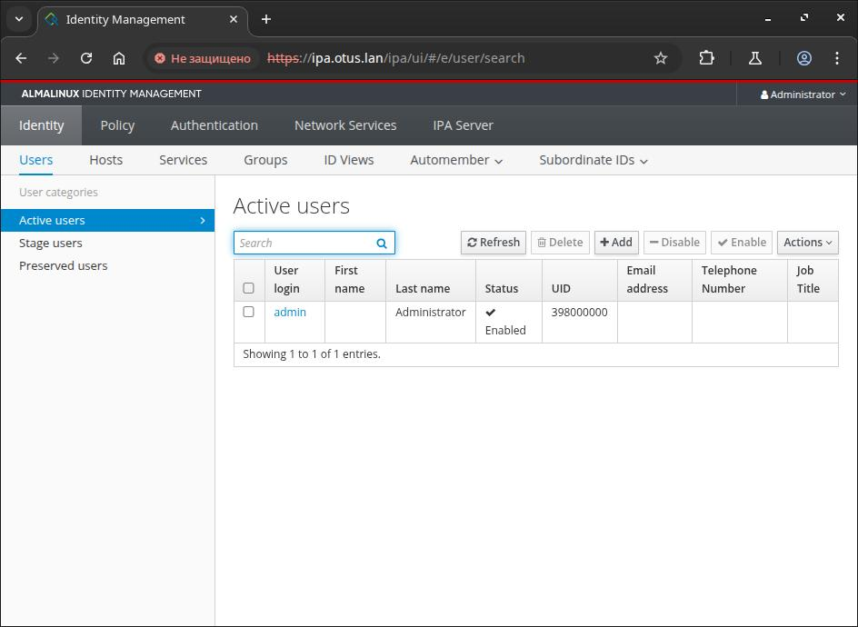
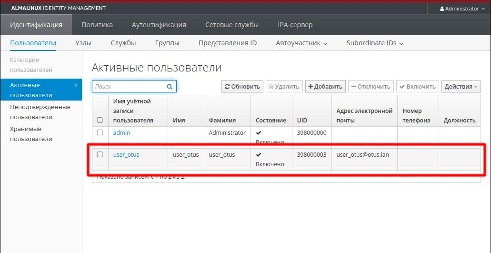

# Less38. LDAP. Централизованная авторизация и аутентификация 

#### _Таймкоды:_
- 0:52 FreeIPA
- 1:08 install freeipa
    - использование FQDN
    - rhel8/alma8 особенности установки
- 1:18 когда не создается домашний каталог в home
- sssd


## 1. Установка FreeIPA сервера

  1. Выполнены предварительные настройки сервера IPA
     1. установлен часовой пояс
     2. настроена утилита chrony
     3. выключен firewall
     4. остановлен SELinux
     5. для разрешения имени без dns-сервера добавлена запись в файл hosts
     6. установлен модуль DL1
     7. установлен и настроен сервер ipa-server

```bash
# set up timezone
[root@ipa ~]# date
Sun Jun 15 20:18:00 +07 2025
[root@ipa ~]# 

# ===========================================================
# chronyd status
[root@ipa ~]# systemctl status chronyd
● chronyd.service - NTP client/server
   Loaded: loaded (/usr/lib/systemd/system/chronyd.service; enabled; vendor preset: enabled)
   Active: active (running) since Sun 2025-06-15 20:04:14 +07; 14min ago
     Docs: man:chronyd(8)
           man:chrony.conf(5)
 Main PID: 8857 (chronyd)
    Tasks: 1 (limit: 12272)
   Memory: 1.2M
   CGroup: /system.slice/chronyd.service
           └─8857 /usr/sbin/chronyd

Jun 15 20:04:14 ipa.otus.lan systemd[1]: Stopped NTP client/server.
Jun 15 20:04:14 ipa.otus.lan systemd[1]: Starting NTP client/server...
Jun 15 20:04:14 ipa.otus.lan chronyd[8857]: chronyd version 4.5 starting (+CMDMON +NTP +REFCLOCK +RTC +PRIVDROP +SCFILTER +SIGND +ASYNCDNS +NTS +SECH>
Jun 15 20:04:14 ipa.otus.lan chronyd[8857]: Loaded 0 symmetric keys
Jun 15 20:04:14 ipa.otus.lan chronyd[8857]: Frequency 84.626 +/- 0.927 ppm read from /var/lib/chrony/drift
Jun 15 20:04:14 ipa.otus.lan chronyd[8857]: Using right/UTC timezone to obtain leap second data
Jun 15 20:04:14 ipa.otus.lan systemd[1]: Started NTP client/server.
Jun 15 20:04:19 ipa.otus.lan chronyd[8857]: Selected source 91.201.254.110 (2.almalinux.pool.ntp.org)
Jun 15 20:04:19 ipa.otus.lan chronyd[8857]: System clock TAI offset set to 37 seconds
Jun 15 20:05:24 ipa.otus.lan chronyd[8857]: Selected source 162.159.200.123 (2.almalinux.pool.ntp.org)

# ===========================================================
# disable firewalld
[root@ipa ~]# systemctl status firewalld
● firewalld.service - firewalld - dynamic firewall daemon
   Loaded: loaded (/usr/lib/systemd/system/firewalld.service; disabled; vendor preset: enabled)
   Active: inactive (dead)
     Docs: man:firewalld(1)

# ===========================================================
# disable selinux
[root@ipa ~]# cat /etc/selinux/config
# This file controls the state of SELinux on the system.
# SELINUX= can take one of these three values:
#     enforcing - SELinux security policy is enforced.
#     permissive - SELinux prints warnings instead of enforcing.
#     disabled - No SELinux policy is loaded.
#SELINUX=enforcing
SELINUX=disabled
# SELINUXTYPE= can take one of these three values:
#     targeted - Targeted processes are protected,
#     minimum - Modification of targeted policy. Only selected processes are protected. 
#     mls - Multi Level Security protection.
SELINUXTYPE=targeted

# ===========================================================
[root@ipa ~]# cat /etc/hosts
127.0.0.1   localhost localhost.localdomain localhost4 localhost4.localdomain4
::1         localhost localhost.localdomain localhost6 localhost6.localdomain6
127.0.1.1 ipa.otus.lan ipa
192.168.57.10 ipa.otus.lan ipa

# ===========================================================
==============================================================================
Setup complete

Next steps:
	1. You must make sure these network ports are open:
		TCP Ports:
		  * 80, 443: HTTP/HTTPS
		  * 389, 636: LDAP/LDAPS
		  * 88, 464: kerberos
		UDP Ports:
		  * 88, 464: kerberos
		  * 123: ntp

	2. You can now obtain a kerberos ticket using the command: 'kinit admin'
	   This ticket will allow you to use the IPA tools (e.g., ipa user-add)
	   and the web user interface.

Be sure to back up the CA certificates stored in /root/cacert.p12
These files are required to create replicas. The password for these
files is the Directory Manager password
The ipa-server-install command was successful

# ===========================================================
# проверка конфигурации kerberos
[root@ipa ~]# kinit admin
Password for admin@OTUS.LAN: 
[root@ipa ~]# klist
Ticket cache: KCM:0
Default principal: admin@OTUS.LAN

Valid starting       Expires              Service principal
06/15/2025 20:25:55  06/16/2025 20:22:17  krbtgt/OTUS.LAN@OTUS.LAN

# ===========================================================

```
Сервер доступен с хоста по адресу https://ipa.otus.lan/





## 2. Ansible playbook для конфигурации клиента

Для настройки клиентов используется плейбук [Ansible-playbook](../vagrant38/ansible/provision.yml)
  - настроена синхронизация времени и часовой пояс
  - отключен firewall
  - отключен SElinux
  - в файл hosts добавлена запись с FreeIPA-сервером и хостом
  - установлен ipa-client
  - выполнено добавление хоста к домену


```bash
# проверка получения билета с client
[root@client2 ~]# kinit admin
Password for admin@OTUS.LAN: 
[root@client2 ~]# klist
Ticket cache: KCM:0
Default principal: admin@OTUS.LAN

Valid starting       Expires              Service principal
06/15/2025 23:22:26  06/16/2025 22:38:15  krbtgt/OTUS.LAN@OTUS.LAN
```
На сервере IPA добавлен новый пользователь user_otus



```bash
# ===================================================
# проверка получения билета от пользователя user_otus
[root@client2 ~]# kinit user_otus
Password for user_otus@OTUS.LAN: 
Password expired.  You must change it now.
Enter new password: 
Enter it again: 
[root@client2 ~]# 

```
## 
