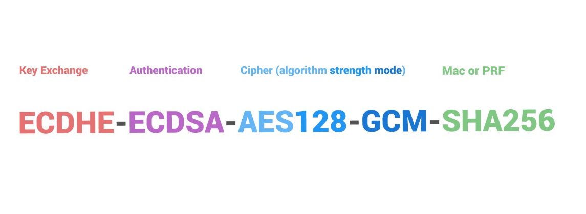

# HTTP — методы, коды, заголовки

## HTTP-методы
    ● GET — получить содержимое указанного ресурса
    ● HEAD — получить только заголовки
    ● POST — отправить данные
    ● DELETE — удалить указанный ресурс
    ● OPTIONS — определить параметры сервера
    ● PUT — обновление
    ● PATCH — частичное обновление
    ● TRACE — возврат с трассировкой
    ● CONNECT — Преобразует соединение запроса в прозрачный TCP/IP-
    туннель

## HTTP-заголовки
    ● Данные, уточняющие запрос или ответ
    ● Используются для управления запросом и или ответом
    ● Кэширование
    ● Сжатие
    ● Идентификация
    ● Аутентификация
    ● Безопасность
    ● Свойства запроса/ответа
    ● Keep-alive соединения
    ● Cookie – куки

## Коды ответа в HTTP
    ● 1xx: Informational (информационные)
    ● 2xx: Success (успешно)
    ● 3xx: Redirection (перенаправление)
        ○ 301 Moved Permanently («перемещено навсегда»)
        ○ 302 Found («найдено»)
    ● 4xx: Client Error (ошибка клиента)
        ○ 403 Forbidden («запрещено (не уполномочен)»)
        ○ 404 Not Found («не найдено»)
    ● 5xx: Server Error (ошибка сервера)
        ○ 500 Internal Server Error («внутренняя ошибка сервера»)
        ○ 502 Bad Gateway («плохой, ошибочный шлюз»)
        ○ 504 Gateway Timeout («шлюз не отвечает»)
## HTTPS
    ● HTTPS — расширение HTTP для работы с SSL/TLS
    ● Версии протоколов:
        ○ SSL 2.0 (1995–2011)
        ○ SSL 3.0 (1996)
        ○ TLS 1.0 (1999–2021)
        ○ TLS 1.1 (2006–2021)
        ○ TLS 1.2 (2008)
        ○ TLS 1.3 (2018)

### Шифры в TLS 




### Установка соединения TLS


## PKI и создание сертификатов
### Термины PKI
    ● PKI — Инфраструктура открытых ключей (ИОК, public key infrastructure) — набор средств, распределённых служб и компонентов, в совокупности используемых для поддержки криптозадач, на основе закрытого и открытого ключей.
    ● CA — Удостоверяющий центр, он же и центр сертификации (УЦ или CA — certificate authority) является основной структурой, формирующей цифровые сертификаты подчиненных центров сертификации и конечных пользователей.
    ● Сертификат открытого ключа (сертификат, certificate) — это данные
    пользователя/сервера и его открытый ключ, скреплённые электронной подписью
    удостоверяющего центра.
    ● Ключевая пара — это набор, состоящий из двух ключей: закрытого ключа (private key) и открытого ключа (public key), эти ключи создаются вместе.

### Принципы PKI
    1. Закрытый ключ (private key) известен только его владельцу.
    2. Удостоверяющий центр (УЦ или CA — certificate authority) создает электронный документ — сертификат открытого ключа, таким образом удостоверяя факт того, что закрытый (секретный) ключ известен эксклюзивно владельцу этого сертификата, открытый ключ (public key) свободно передается.
    3. Никто не доверяет друг другу, но все доверяют удостоверяющему центру.
    4. Удостоверяющий центр подтверждает или опровергает принадлежность открытого ключа заданному лицу, которое владеет соответствующим закрытым ключом.

### Самоподписанные сертификаты
#### Генерация сертификатов


### Создание сертификата
```bash
# Интерактивный режим
openssl req -x509 -nodes -days 365 -newkey rsa:2048 \
    -keyout /etc/ssl/private/selfsigned.key \
    -out /etc/ssl/certs/selfsigned.crt
# Сертификат для localhost
openssl req -x509 -out localhost.crt -keyout localhost.key \
    -newkey rsa:2048 -nodes -sha256 \
    -subj '/CN=localhost' -extensions EXT -config <( \
    printf "[dn]\nCN=localhost\n[req]\ndistinguished_name = dn\n[EXT]\nsubjectAltName=DNS:localhost\nkeyUsage=digitalSignature\nextendedKeyUsage=serve
rAuth")

```
    ● req: использовать управление запросами подписи сертификатов X.509 (CSR).
    X.509 — это стандарт инфраструктуры открытых ключей, используемый SSL и TLS
    для управления ключами и сертификатами
    ● x509: создать самоподписанный сертификат, а не CSR
    ● nodes: пропустить опцию защиты сертификата с помощью пароля.
    ● days 365: срок, в течение которого сертификат будет считаться действительным
    ● newkey rsa:2048: сгенерировать новый сертификат и новый ключ
    одновременно
    ● keyout: где мы разместим создаваемый закрытый ключ
    ● out: куда поместить создаваемый сертификат

### Сертификаты от Let’s Encrypt

Создание бесплатного сертификата

    ● ACME — Automatic Certificate Management Environment: протокол для
    автоматизированного управления сертификатами в рамках PKI
    ● Let's Encrypt (LE) — Некоммерческий Центр сертификации,
    предоставляющий сертификаты TLS
### Создание сертификата LE
```bash
# Автоматическая конфигурация
certbot --nginx -d example.com -d www.example.com
# Только получить сертификат (WebRoot)
certbot certonly --webroot -w /home/www -d site.ru -d www.site.ru
# Только получить сертификат — wildcard (DNS)
certbot certonly --agree-tos --manual --preferred-challenges dns \
--server https://acme-v02.api.letsencrypt.org/directory \
-d "*.site.ru" -d "site.ru"
```

### Links:

- https://en.wikipedia.org/wiki/List_of_HTTP_header_fields
- https://ru.wikipedia.org/wiki/%D0%A1%D0%BF%D0%B8%D1%81%D0%BE%D0%BA_%D0%BA%D0%BE%D0%B4%D0%BE%D0%B2_%D1%81%D0%BE%D1%81%D1%82%D0%BE%D1%8F%D0%BD%D0%B8%D1%8F_HTTP
- https://letsencrypt.org/ru/how-it-works/
- https://certbot.eff.org/
- https://github.com/plinss/acmebot
- https://github.com/acmesh-official/acme.sh
  
-----
Список материалов для изучения
1. https://pki-tutorial.readthedocs.io/en/latest/simple/index.html
2. https://github.com/plinss/acmebot
3. https://github.com/acmesh-official/acme.sh
4. https://theconversation.com/how-the-internet-was-born-a-stuttered-hello-67903
5. https://ru.wikipedia.org/wiki/Китов,_Анатолий_Иванович
6. https://certbot.eff.org/
7. https://en.wikipedia.org/wiki/List_of_HTTP_header_fields
8. https://ssl-config.mozilla.org/