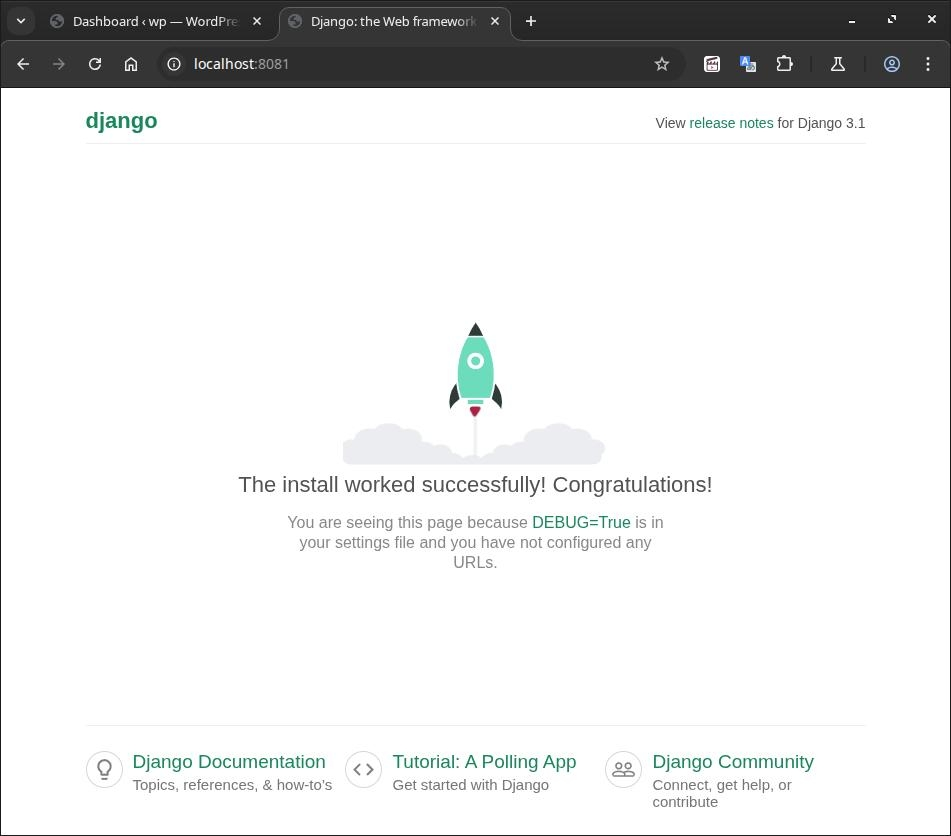
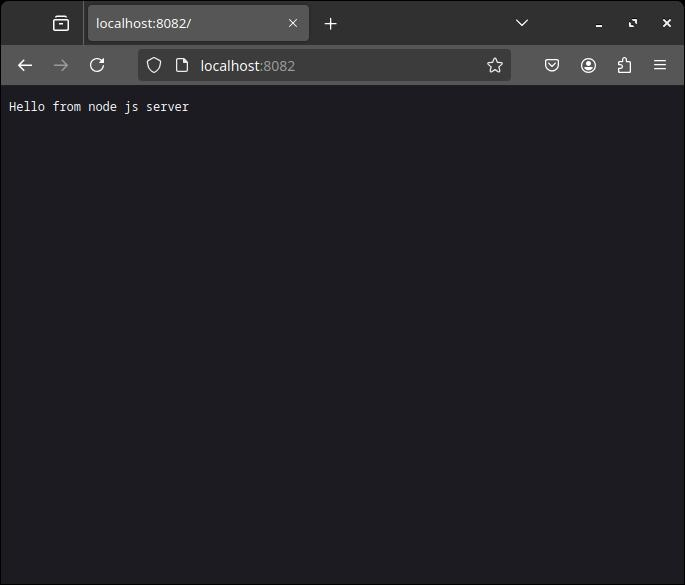
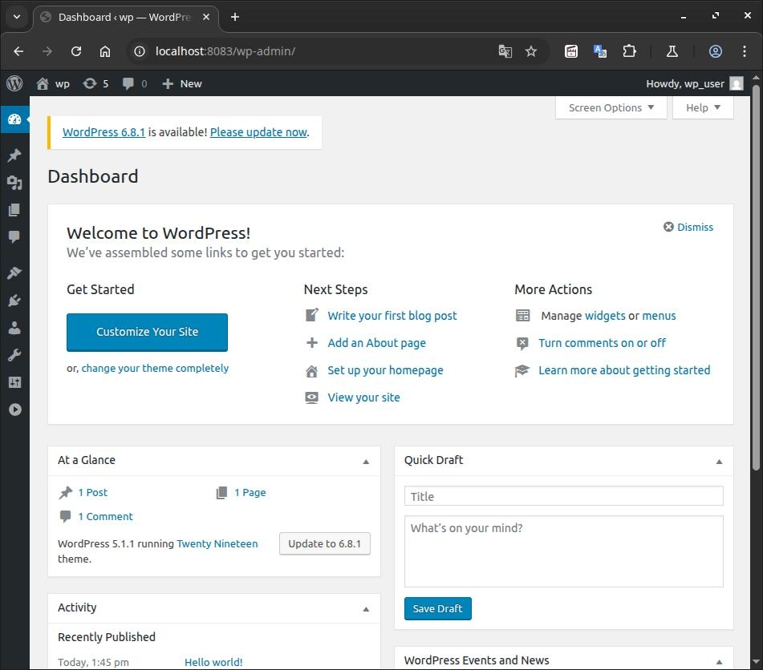

# Less42. Динамический веб 
- [Less42. Динамический веб](#less42-динамический-веб)
    - [Цель:](#цель)
    - [Содержание:](#содержание)
    - [Результаты:](#результаты)
    - [Компетенции](#компетенции)
    - [Задание:](#задание)
    - [Формат сдачи:](#формат-сдачи)
    - [Критерии оценки:](#критерии-оценки)
    - [Комментарии к выполнению задания:](#комментарии-к-выполнению-задания)
      - [Проверка доступности web-серверов](#проверка-доступности-web-серверов)
  - [](#)
  - [](#-1)
  - [Links:](#links)

### Цель: 
- разбираться в CGI/FCGI/WSGI/mod_xxx;
- настраивать uwsgi/php_fpm;
- понимать Ajax/Long Pooling/Websockets.
- Получить практические навыки в настройке инфраструктуры с помощью манифестов и конфигураций;
- Отточить навыки использования ansible/vagrant/docker;
  
### Содержание:
- взаимодействие между клиентом и сервером по unix/tcp сокету;
- история развития динамических интерфейсов; CGI/FCGI/WSGI/;
- сравниваем на практике работу prefork_mpm/event_mpm;
- настройки php_fpm;
- настройки uwsgi;
- логику работы Ajax/LongPooling/Websockets.
 
### Результаты:
- настраивать uwsgi/php_fpm.

### Компетенции

Настройка базовых сервисов ОС Linux
  - настраивать веб-сервера
 
### Задание:
- Развертывание веб приложения
- 
Что нужно сделать?

1)Варианты стенда:
  -  nginx + php-fpm (laravel/wordpress) + python (flask/django) + js(react/angular);
  -  nginx + java (tomcat/jetty/netty) + go + ruby;
  -  можно свои комбинации.

Реализации на выбор:
  -  на хостовой системе через конфиги в /etc;
  -  деплой через docker-compose.

Для усложнения можно попросить проекты у коллег с курсов по разработке

К сдаче принимается:

  -  vagrant стэнд с проброшенными на локалхост портами
  -  каждый порт на свой сайт
  -  через нжинкс


### Формат сдачи: 
Формат сдачи ДЗ - vagrant + ansible

### Критерии оценки:
Статус "Принято" ставится при выполнении основных требований. 

### Комментарии к выполнению задания:

> _Задание выполнено с использованием:_
> - Vagrant 2.4.5
> - Virtualbox 7.1.8 r168469
> - vagrant box: bento/ubuntu-20.04
> - Ansible [core 2.18.5]

  - файл vagrant [./vagrant42/Vagrantfile](./vagrant42/Vagrantfile)
  - ansible playbook [./vagrant42/ansible/provision.yml](./vagrant42/ansible/provision.yml)
  - файл inventory [./vagrant42/ansible/hosts](./vagrant42/ansible/hosts)
  - каталог docker [./vagrant42/ansible/docker-project/](./vagrant42/ansible/docker-project/)
  - файл docker-compose [./vagrant42/ansible/docker-project/docker-compose.yml](./vagrant42/ansible/docker-project/docker-compose.yml)
  - конфигурация сервера nginx [./vagrant42/ansible/docker-project/nginx-conf/nginx.conf](./vagrant42/ansible/docker-project/nginx-conf/nginx.conf)
 
 Запускает виртуальную машину с контейнерами:
 ```bash
 vagrant@DynamicWeb:~/docker-project$ docker ps
CONTAINER ID   IMAGE                        COMMAND                  CREATED          STATUS          PORTS                                                                     NAMES
4216ff79be7a   docker-project-app           "gunicorn --workers=…"   12 minutes ago   Up 12 minutes                                                                             app
2415c72ae0ed   nginx:1.15.12-alpine         "nginx -g 'daemon of…"   40 minutes ago   Up 40 minutes   80/tcp, 0.0.0.0:8081-8083->8081-8083/tcp, [::]:8081-8083->8081-8083/tcp   nginx
d9a8df79a4e3   wordpress:5.1.1-fpm-alpine   "docker-entrypoint.s…"   40 minutes ago   Up 40 minutes   9000/tcp                                                                  wordpress
a2260e517b43   mysql:5.7                    "docker-entrypoint.s…"   40 minutes ago   Up 40 minutes   3306/tcp, 33060/tcp                                                       wp-database
9e1a8099706a   node:16.13.2-alpine3.15      "docker-entrypoint.s…"   40 minutes ago   Up 40 minutes                                                                             node

 ```
#### Проверка доступности web-серверов

----
  1. веб-сервер python (django)

----

  2. веб-сервер js(node.js)
   
----

  3. веб-сервер wordpress (nginx, php-fpm,mysql)



## Links:

- Протоколы взаимодействия [https://unit.nginx.org/](https://unit.nginx.org/)
- CGI [https://httpd.apache.org/docs/2.4/howto/cgi.html](https://httpd.apache.org/docs/2.4/howto/cgi.html)
- uWCGI [http://nginx.org/en/docs/http/ngx_http_uwsgi_module.html](http://nginx.org/en/docs/http/ngx_http_uwsgi_module.html)
- WebSocket nginx [https://www.nginx.com/blog/websocket-nginx/](https://www.nginx.com/blog/websocket-nginx/)
- Методы обработки соединений [http://nginx.org/ru/docs/events.html](http://nginx.org/ru/docs/events.html)
=========
- Список материалов для изучения
1. https://habr.com/ru/articles/259403/
2. http://nginx.org/ru/docs/events.html
3. https://habr.com/ru/articles/416669/
4. https://www.nginx.com/blog/websocket-nginx/
5. https://www.ibm.com/support/pages/flowchart-tcp-connections-and-their-definition
6. https://www.digitalocean.com/community/tutorials/how-to-install-wordpress-with-docker-compose-ru
7. https://unit.nginx.org/
==========
- Документация Vagrant – [https://www.vagrantup.com/docs](https://www.vagrantup.com/docs)
- Документация Ansible – [https://docs.ansible.com/ansible/latest/collections/index.html](https://docs.ansible.com/ansible/latest/collections/index.html)
- Документация Docker – [https://docs.docker.com/compose/gettingstarted/](https://docs.docker.com/compose/gettingstarted/)
- Документация Nginx – [https://nginx.org/ru/docs/](https://nginx.org/ru/docs/)
- Docker Hub – [https://hub.docker.com/(https://hub.docker.com/)

