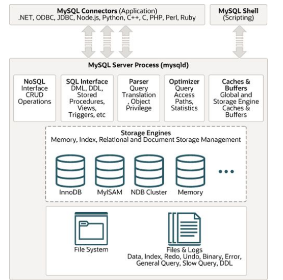

# Less43/ MySQL

## Варианты MySQL
    ● Oracle MySQL Community Edition, Enterprise Edition
        ○ Innovation
    ● Percona server for MySQL
    ● MariaDB

## Установка MySQL 8.0
```bash
# Устанавливаем MySQL
apt install mysql-server-8.0
# Запускаем скрипт безопасности для MySQL
mysql_secure_installation
# Заходим в root-аккаунт
sudo mysql    
```

## Файловая структура MySQL
    ● Настройки системные: /etc/mysql/mysql.conf.d/, /etc/mysql/conf.d/
    ● Базы данных и бинлоги: /var/lib/mysql/
    ● Настройки клиента: ~/.my.cnf
    ● https://dev.mysql.com/doc/refman/8.0/en/option-files.html

## Пользователи в MySQL
    ● use mysql;
    ● SELECT * FROM user WHERE User='root'\G
    ● ALTER USER 'root'@'localhost' IDENTIFIED WITH 'caching_sha2_password' BY '1';
    ● ALTER USER 'root'@'localhost' IDENTIFIED WITH 'mysql_native_password' BY '1';
    ● UPDATE mysql.user SET Host='%' WHERE Host='localhost' AND User='root';
    ● FLUSH PRIVILEGES;
    ● CREATE USER repl@'%' IDENTIFIED WITH 'caching_sha2_password' BY 'Slave#2023';
    ● GRANT REPLICATION SLAVE ON *.* TO repl@'%';

## Архитектура MySQL



## Процесс и потоки MySQL
    ● Один процесс
    ● Многопоточная модель
        ○ ps ax | grep mysqld
    ● Посмотреть потоки:
        ○ ps -eLf | grep mysqld
    ● Низкая стоимость создания коннектов

## Команды для администрирования
    ● SHOW PROCESSLIST;
    ● SHOW FULL PROCESSLIST;
    ● SHOW ENGINE INNODB STATUS\G
    ● SHOW TABLE STATUS;
    ● SHOW VARIABLES LIKE ‘%’;
    ● SHOW STATUS LIKE ‘%’;
    ● SHOW GLOBAL STATUS LIKE ‘%’;
    ● SHOW DATABASES;
    ● SHOW TABLES;
    ● mysqladmin ext -ri1 | grep Innodb_buffer_pool_reads

## Движки хранения данных в MySQL

    ● InnoDB — ACID (Atomicity, Consistency, Isolation, Durability) совместимое, MVCC (Percona-XtraDB)
    ● BLACKHOLE — /dev/null, все что вы сюда пишите — исчезает
    ● MyISAM — базовый тип хранилища MySQL (нет блокировок на строки, нет транзакций)
    ● MEMORY — таблицы в памяти (аналог MyISAM в памяти, кэш)
    ● PERFORMANCE_SCHEMA — для хранения отчетов о производительности (мониторинг)
    ● ARCHIVE — сжатие данные для быстрой вставки и выборки (логи, хранение мелких файлов)
    ● CSV — хранение в csv файлах
    ● FEDERATED — ссылка на таблицу в другом MySQL сервере
    ● MRG_MYISAM — объединение идентичных MYISAM таблиц (вариант партиционирования)
    ● NDB — кластер

### MyISAM
    ● Простой, быстрый
    ● Блокировка на уровне таблиц
        ○ Можно читать если нет блокировки на запись
        ○ Можно писать если нет блокировок
    ● Не поддерживает транзакции
    ● Не поддерживает внешние ключи
    ● Поддерживает восстановление по времени (binary log)
    ● Репликация поддерживается
    ● Кластеризация не поддерживается
    ● Поддерживает конкурентный INSERT
```bash 
    CREATE TABLE t_myisam (
        t_id INT PRIMARY KEY AUTO_INCREMENT,
        t_text VARCHAR(100)
    ) ENGINE MYISAM;
```
### InnoDB
    ● Поддержка транзакций (ACID)
    ● Хранение строк на основе clustered index
    ● Блокировка на уровне строк
    ● Мультиверсионность и согласованное чтение (MVCC)
    ● UNDO и REDO
    ● Поддержка ограничений целостности
    ● Поддерживает восстановление по времени
    ● Поддерживает репликацию и кластеризацию

## Настройки и оптимизация MySQL
###    Общие настройки
    ● open_files_limit = 100000
    ● table_open_cache = 40000
    ● table_definition_cache = 32000
    ● tmp_table_size = 64M
    ● max_heap_table_size = 64M
    ● max_connections = 1000
    ● skip_name_resolve

###    Настройки для MyISAM
    ● key_buffer_size = 500M — кэш индексов
    ● Данные кэшируются средствами ОС
    ● Общие настройки

###    Настройки для InnoDB
    ● innodb_file_per_table = 1
    ● innodb_open_files = 2000
    ● innodb_flush_method = O_DIRECT
    ● innodb_buffer_pool_size = 4G
    ● innodb_flush_log_at_trx_commit = 2 (не совместимо с ACID)
    ● innodb_log_file_size = 128M (файл лога)
    ● innodb_log_buffer_size = 32M (буфер для лога в памяти)

### Настройка логирования запросов
    ● log_output = file
    ● slow_query_log = ON
    ● slow_query_log_file = /var/log/mysql/mysql-slow.log
    ● long_query_time = 0
    ● log_slow_rate_limit = 10 (Percona)
    ● log_slow_rate_type = query (Percona)
    ● log_slow_verbosity = full (Percona)
    ● log_slow_admin_statements = ON
    ● log_slow_slave_statements = ON
    ● slow_query_log_always_write_time = 0.1 (Percona)
    ● slow_query_log_use_global_control = all (Percona)
    ● innodb_monitor_enable = all
    ● userstat = 1 (Percona)

### Настройки логирования
    ● log_bin = /var/log/mysql/mysql-bin.log
    ● sync_binlog = 0 (меньше надёжность)
    ● binlog_expire_logs_seconds = 2592000
    ● max_binlog_size = 500M
    ● log_error = /var/log/mysql/error.log

### Настройка Query Cache (до 5.7 и MariaDB)
    ● query_cache_limit = 1M
    ● query_cache_size = 128M
    ● query_cache_type = 1
    ● Плохо масштабируется (глобальные блокировки)
    ● Отсутствует в MySQL 8.0
    ● Альтернатива: ProxySQL

### Инструменты оптимизации
    ● Percona monitoring and management
    ● pt-query-digest (Percona Toolkit)
    ● pt-duplicate-key-checker (Percona Toolkit)
    ● Slow query log
    ● MySQL Workbench
    ● EXPLAIN SELECT
    ● EXPLAIN ANALYZE (8.0)

## Кодировки в MySQL
### Кодировки (charset)
    ● Нужны для поддержки символов
    ● COLLATION — правила сравнения и сортировки строк
    ● Нужно сохранять целостность по всей БД
    ● Влияют на производительность
    ● SHOW CHARACTER SET LIKE 'latin%';
    ● SHOW COLLATION WHERE Charset = 'latin1';
    ● SET NAMES utf8 COLLATE utf8_unicode_ci;
    ● Оптимальный вариант (8.0): utf8mb4_0900_ai_ci

