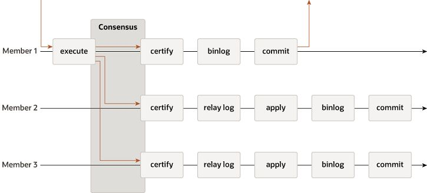

# Less44/ MySQL Backup 

pt-show-grants > grants.sql - бэкап пользователей

> для версии >=8.4
master status = show binary log status

2:00 разбор статуса реплики

## Виды резервного копирования
- ● Логические бэкапы
  - ○ Текстовый файл
  - ○ SQL
  - ○ mysqldump, mydumper
- ● Физические бэкапы
    - ○ Бинарные файлы
        - ■ Данные
        - ■ Логи
    - ○ Percona XtraBackup

### Логические бекапы
- ● Выгрузка БД в виде SQL-запросов
    - ○ Структура
    - ○ Данные
    - ○ Программный код
- ● mysqldump > back.sql
- ● Медленно
- ● Удобно
    - ○ Частичное восстановление
    - ○ Поиск данных в дампе
    - ○ Совместимость между версиями
  
#### mysqldump
- ● mysqldump --print-defaults
- ● mysqldump > back.sql
- ● mysqldump db_name tbl_name > back.sql
- ● mysqldump | gzip -1 > back.sql.gz
- ● mysqldump --single-transaction (InnoDB)
- ● mysqldump --source-data=2
- ● mysqldump --dump-replica=2 (не для gtid_mode)
- ● mysqldump --events --routines --triggers

#### mysqldump — неблокирующий режим
```bash
mysqldump --add-drop-table --add-locks --create-options \
--disable-keys --extended-insert --single-transaction --quick \
--set-charset --events --routines --triggers
```
#### Восстановление из логических бекапов
```bash
mysql < back.sql
# Вырезаем таблицу из общего файла дампа
sed -n -e '/DROP TABLE.*`mytable`/,/UNLOCK TABLES/p' \
mydump.sql > tabledump.sql
```
### Физические бэкапы
- ● Percona XtraBackup (Percona Server, Oracle MySQL)
- ● Копирование бинарных файлов + логи
- ● Полные и инкрементальные бэкапы
- ● Отправка на другой сервер (stream)
- ● Онлайн-бэкапы
- ● Быстрое восстановление
- ● MySQL Enterprise Backup ($$$)

#### Percona XtraBackup
- ● Полный (full) бэкап
- ● Сжатый (compressed) бэкап
- ● Частичный (partial) бэкап
- ● Инкрементальный (incremental) бэкап
- ● Важно: версия PXB должна соответствовать MySQL/Percona Server

#### Percona XtraBackup – полный бэкап
```bash
xtrabackup --user=root --password=1 --backup --target-dir=/home/db/backups/
xtrabackup --prepare --target-dir=/home/db/backups/
```
#### Percona XtraBackup – сжатый бэкап
```bash
xtrabackup --user=root --password=1 --compress=lz4 --compress-threads=4
--backup --target-dir=/home/db/backups/
xtrabackup --decompress --parallel=4 --remove-original
--target-dir=/home/db/backups/
xtrabackup --prepare --target-dir=/home/db/backups/
```

#### Percona XtraBackup – восстановление
```bash
(full, incremental, compressed)
xtrabackup --prepare --target-dir=/home/db/backups/
systemctl stop mysql
rm -rf /var/lib/mysql/*
xtrabackup --copy-back || --move-back --target-dir=/home/db/backups/
chown -R mysql:mysql /var/lib/mysql
systemctl start mysql
```
#### Percona XtraBackup – восстановление (partial)
```bash
1. xtrabackup --prepare --export --target-dir=/path/to/directory/base
2. CREATE DATABASE;
3. CREATE TABLE;
4. ALTER TABLE <table_name> DISCARD TABLESPACE;
5. Копируем файлы таблицы
6. ALTER TABLE <table_name> IMPORT TABLESPACE;
```
#### Percona XtraBackup – частичный (partial)
```bash
xtrabackup --user=root --password=1 --backup --databases=employees
--target-dir=/home/db/employees/
xtrabackup --prepare --export --target-dir=/home/db/employees/
```
#### Percona XtraBackup в докере
```bash
mkdir /backup
chown 999:999 /backup
docker create --name percona-xtrabackup --volumes-from mysql8slave -v /backup:/backup
--user 999:999 --network mysql-docker-repl_app-network percona/percona-xtrabackup
xtrabackup --backup --datadir=/var/lib/mysql/ --target-dir=/backup --user=root
--password=NykArNq1 --host=mysql8slave
docker start -ai percona-xtrabackup
```
#### Percona XtraBackup point-in-time recovery
```bash
# находим стартовую позицию бинлога для восстановления
cat /path/to/directory/base/xtrabackup_info
# стартуем восстановление до нужной точки
mysqlbinlog /path/to/datadir/binlog.file1 /path/to/datadir/binlog.file2
--start-position=<number> --stop-datetime=”<datetime>” > mybinlog.sql
```


# Репликация в MySQL
Задачи репликации
● Высокая доступность (переключение в случае сбоя)
● Горизонтальное масштабирование
● Источник бекапа БД
● Геораспределение нагрузки
● Разделение по типам нагрузки (OLTP, OLAP)
## Виды репликации
### Master-slave (source-replica) Asynchronous (асинхронная)
- Записи binlog мастера передаются в relay log слейва
- Relay log проигрывается на слейве

- Скорость работы, не нужно ждать слейвов
- Масштабирование по чтению
- Непредсказуемые задержки на слейве
- Нет масштабирования по записи

### Semisynchronous (полусинхронная)


- Меньшее отставание слейва
- Масштабирование по чтению
- Мастер ждёт доставки relay log
- Нет масштабирования по записи

### Group Replication (групповая)


- Высокая отказоустойчивость
- Основа InnoDB Cluster
- Каждый сервер хранит полную копию данных
- Нет масштабирования по записи


## Форматы бинарных логов
- Statement-based (STATEMENT)
    - ○ в лог пишутся SQL (UPDATE, DELETE, INSERT)
    - ○ триггеры будут отрабатывать и на мастере, и на слейвах
    - ○ опасность разных таймстампов (NOW(), CURRENT_TIMESTAMP)
- ● Row-based (ROW)
    - ○ в лог пишутся строки (каждую изменённую строку)
    - ○ получаются большие логи
    - ○ отключены триггеры
- ● Mixed (MIXED)
    - ○ для safe стейтментов пишутся SQL
    - ○ для unsafe — строки
- ● show variables like '%binlog%';

## Настройки бинарных логов
- binlog_cache_size — кэш в памяти
- ● binlog_format = ROW | STATEMENT | MIXED
- ● binlog_encryption — шифрование
- ● binlog_error_action — реакция на ошибку
- ● binlog_expire_logs_seconds — хранение бинлогов в секундах

## Настройка репликации (binlog position)
### Порядок действий (binlog position based replication)
1. Снимаем копию с мастера
2. Проверяем позицию бинлога
3. Создаем пользователя для репликации
4. Меняем UUID (/var/lib/mysql/auto.cnf)
5. Поднимаем копию на слейве
6. Меняем server_id на слейве
7. Запускаем команду CHАNGE SOURCE с позицией бинлога

## Настройка репликации (GTID)

### GTID-репликация
- ● Global Transaction IDentifier
- ● Имеет формат: GTID = source_id:transaction_id
- ● 3E11FA47-71CA-11E1-9E33-C80AA9429562:2
- ● Позволяет убедиться, что транзакция принадлежит только одному серверу
- ● Позволяет убедиться, что транзакция применена только 1 раз в системе
- ● Удобная настройка репликации

### GTID жизненный цикл
1. Транзакция выполняется и коммитится на мастере
2. Назначается GTID, записывается в binlog
3. Реплика считывает GTID с relay-лога и прописывает его в gtid_next
4. Реплика производит проверку что такой GTID не используется
5. Для записи в бинлог реплика использует gtid_next
6. После коммита транзакция добавляется в gtid-executed

```bash
## Конфиг MySQL (source)
[mysqld]
server-id = 1
log-bin = mysql-bin
binlog_format = row
gtid-mode=ON
enforce-gtid-consistency
log-replica-updates

### Конфиг MySQL (replica)
[mysqld]
server-id = 2
log-bin = mysql-bin
relay-log = relay-log-server
read-only = ON
gtid-mode=ON
enforce-gtid-consistency
log-replica-updates
```
### Порядок действий (GTID based replication)
1. Включаем поддержку GTID на мастере и слейве
2. Снимаем копию с мастера
3. Создаем пользователя для репликации
4. Меняем UUID (/var/lib/mysql/auto.cnf)
5. Поднимаем копию на слейве
6. Меняем server_id на слейве
7. Запускаем команду CHАNGE SOURCE … SOURCE_AUTO_POSITION = 1

### Фильтрация репликации на реплике
```bash
CHANGE REPLICATION FILTER filter[, filter]
[, ...] [FOR CHANNEL channel]
filter:
REPLICATE_DO_DB = (db_list)
| REPLICATE_IGNORE_DB = (db_list)
| REPLICATE_DO_TABLE = (tbl_list)
| REPLICATE_IGNORE_TABLE = (tbl_list)
| REPLICATE_WILD_DO_TABLE = (wild_tbl_list)
| REPLICATE_WILD_IGNORE_TABLE = (wild_tbl_list)
| REPLICATE_REWRITE_DB = (db_pair_list)
```

### Фильтрация — примеры
```bash
CHANGE REPLICATION FILTER
REPLICATE_DO_DB = (d1), REPLICATE_IGNORE_DB = (d2);
CHANGE REPLICATION FILTER
REPLICATE_WILD_DO_TABLE = ('db1.old%');
CHANGE REPLICATION FILTER
REPLICATE_WILD_IGNORE_TABLE = ('db1.new%', 'db2.new%');
```

