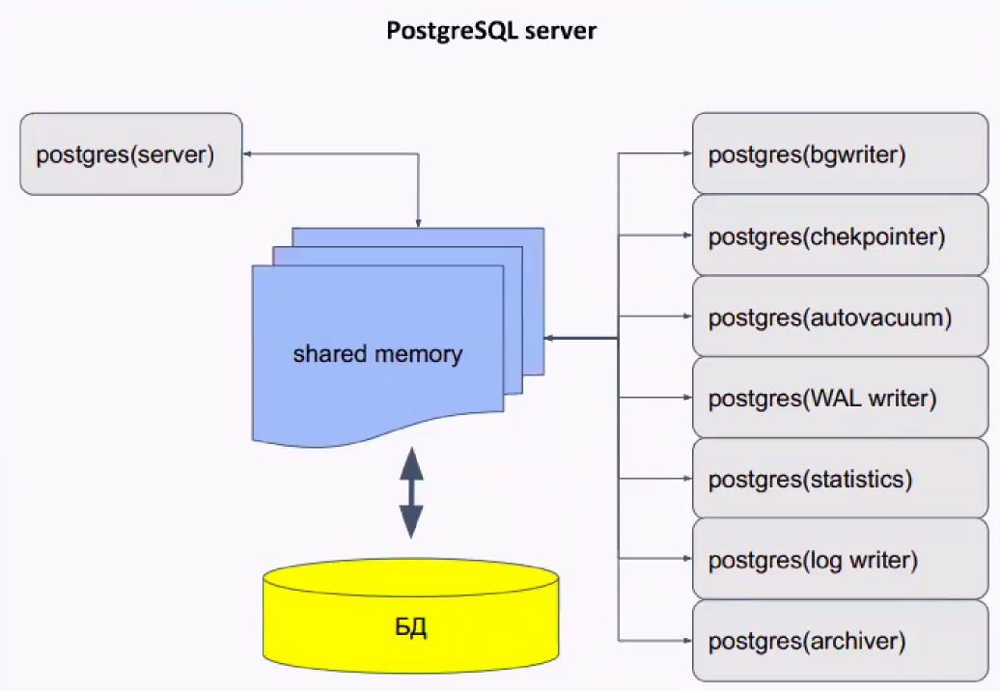

# Less45. PostgreSQL



## ПО для работы с PostgreSQL
- DBeaver
- pgAdmin
- DG DataGrip (для разработчиков, платная)
- phpPgAdmin (аналог phpMysql)

## psql
```bash
# В psql есть алиасы, упрощающие работу:
\c - информация о соединении
\l - список баз
\du - список пользователей
\dt - список таблиц
\d <table> - описание таблицы
\! - выполнение команды shell
\? - HELP
```

## config

Конфигурационные файлы:
- **postgresql.conf** - файл конфигурации, обычно находится в каталоге данных, может редактироваться вручную.

`структура файла <name> = <value>`

_может быть несколько значений одного параметра, тогда вступает в силу последнее значение_
- **postgresql.auto.conf** - имеет тот же формат, что и _postgresql.conf_, но предназначен для автоматического изменения.
- **pg_hba.conf** - задает способ доступа к базам и к репликации из различных источников
> Пример параметров:
> - trust - не проверять доступ
> - md5 - проверка по логину-паролю
> - peer - сопоставление с пользователем системы (доступно только для локальных подключений)

postgresql.conf

pg_hba.conf
конфигурация подключения к БД

- локальное подключение через unix.socket
- сетевое

порт 4253

pgBouncer - пул коннектов

PG Tune - онлайн-конструктор параметров для конфига

## Журнал предзаписи WAL (Write Ahead Log)
Проблема: при сбое теряются данные из оперативной памяти, не записанные
на диск

Журнал
- ● поток информации о выполняемых действиях, позволяющий повторно
выполнить потерянные при сбое операции
- ● запись попадает на диск раньше, чем измененные данные

Журнал защищает
- ● страницы таблиц, индексов и других объектов
- ● статус транзакций (clog)

Журнал не защищает
- ● временные и нежурналируемые таблицы