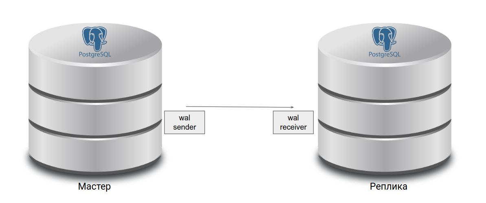

# Less46. PostgreSQL. Репликация
- [Less46. PostgreSQL. Репликация](#less46-postgresql-репликация)
  - [Журнал предзаписи WAL (Write Ahead Log) - журнал упреждающей записи](#журнал-предзаписи-wal-write-ahead-log---журнал-упреждающей-записи)
    - [Журнал содержит:](#журнал-содержит)
    - [Журнал защищает:](#журнал-защищает)
    - [Журнал не защищает:](#журнал-не-защищает)
- [Репликация](#репликация)
  - [Задачи репликации:](#задачи-репликации)
  - [Виды репликации:](#виды-репликации)
  - [Репликация: цели и задачи](#репликация-цели-и-задачи)
    - [Потоковая репликация](#потоковая-репликация)
    - [Логическая репликация](#логическая-репликация)
  - [Установка PostgreSQL](#установка-postgresql)
    - [Нода 1 — конфигурация](#нода-1--конфигурация)
    - [Нода 2 — конфигурация](#нода-2--конфигурация)
    - [Проверка репликации](#проверка-репликации)
- [](#)
  - [Инструменты для резервного копирования](#инструменты-для-резервного-копирования)
    - [На что обратить внимание при выборе инструмента](#на-что-обратить-внимание-при-выборе-инструмента)
  - [Хранение данных](#хранение-данных)
  - [Разделение данных](#разделение-данных)
  - [Версионность БД](#версионность-бд)
  - [Режимы работы](#режимы-работы)
  - [Сервисность](#сервисность)
  - [Валидирование](#валидирование)
- [](#-1)
- [Практика:](#практика)
  - [Настройка бэкапа с помощью Barman](#настройка-бэкапа-с-помощью-barman)
    - [Нода 1 — подготовка](#нода-1--подготовка)
    - [Сервер Barman — подготовка](#сервер-barman--подготовка)
    - [Сервер Barman — /etc/barman.conf](#сервер-barman--etcbarmanconf)
    - [Сервер Barman — /etc/barman.d/node1.conf](#сервер-barman--etcbarmandnode1conf)
    - [Сервер Barman — проверка](#сервер-barman--проверка)


## Журнал предзаписи WAL (Write Ahead Log) - журнал упреждающей записи
> В WAL записывается информация, достаточная для повторного выполнения всех действий с БД. Записи этого журнала обязаны попасть на диск раньше, чем изменения в соответствующей странице. Журнал состоит из нескольких файлов (обычно по 16МБ), которые циклически перезаписываются.

> Проблема: при сбое теряются данные из оперативной памяти, не записанные на диск

### Журнал содержит:
    ● поток информации о выполняемых действиях, позволяющий повторно выполнить потерянные при сбое операции
    ● запись попадает на диск раньше, чем измененные данные
### Журнал защищает:
    ● страницы таблиц, индексов и других объектов
    ● статус транзакций (clog)
### Журнал не защищает:
    ● временные и нежурналируемые таблицы

# Репликация 
- процесс синхронизации нескольких копий одного объекта. Решает задачу отказоустойчивости и масштабируемости.
## Задачи репликации:
    • балансировка нагрузки
    • резервирование (НЕ БЭКАП, бэкап можно делать с реплики)
    • обновление без остановки системы
    • горизонтальное масштабирование
    • геораспределение нагрузки

## Виды репликации:
    •  Физическая репликация - описание изменений на уровне файлов. Побайтовая копия данных.
    • Логическая репликация - изменения данных в терминах строк таблиц. Более высокий уровень, чем файлы

> Помимо репликации, рекомендуется создавать резервные копии. Они могут потребоваться, если вдруг сервера СУБД выйдут из строя. 
## Репликация: цели и задачи
Репликация — процесс синхронизации нескольких копий кластера баз данных на разных серверах (дублирование)
- для повышения отказоустойчивости
- для повышения производительности
### Потоковая репликация
Особенности:
- От основного сервера PostgreSQL на реплики передается WAL
- Все серверы должны быть одной версии, работать на одной ОС и архитектуре
- Реплицируется кластер целиком
Режимы:
- Асинхронный
- Синхронный


> _slot репликации - для отслеживания Мастером состояния принятых логов на Слэйве_

### Логическая репликация
Особенности:
- Механизм публикации/подписки
- Подписываться можно не на все изменения, а выборочно
- Может работать между разными версиями PostgreSQL, ОС и архитектурами
- Нельзя реплицировать изменения структуры БД

| Когда используют потоковую репликацию    | Когда используют логическую репликацию |
| ---------------------------------------- | -------------------------------------- |
| ● Горячий резерв для высокой доступности | ● Консолидация и общие справочники     |
| ● Балансировка нагрузки                  | ● Обновления сервера                   |
| ● Отложенная репликация                  |                                        |


##  Установка PostgreSQL
0:31

```bash
# Установка версии 14
$ yum -y update
$ yum -y install
https://download.postgresql.org/pub/repos/yum/reporpms/EL-7-x86_64/pgdg-redhat-repo-latest.noarch.rpm
; yum list -y postgre*-server*
$ yum install postgresql14-server.x86_64
# Инициализация кластера (можно только на ноде 1)
$ /usr/pgsql-14/bin/postgresql-14-setup initdb
# Запуск сервиса
$ systemctl enable postgresql-14
$ systemctl start postgresql-14
$ systemctl status postgresql-14
```
### Нода 1 — конфигурация
```bash
# Создание пользователя с правами репликации
$ su - postgres
$ psql
postgres=# create user replicator with replication encrypted password '12345';
# Редактирование postgresql.conf
listen_addresses = 'localhost, <IP master>'
hot_standby = on
wal_level = replica
max_wal_senders = 3
max_replication_slots = 3
hot_standby_feedback = on
# Редактирование pg_hba.conf
host replication replicator <IP master>/32 scram-sha-256
host replication replicator <IP slave>/32 scram-sha-256
# Перезапуск сервиса
$ systemctl restart postgresql-14
```
### Нода 2 — конфигурация
```bash
# Остановка сервиса и очистка данных кластера (если он был проинициализирован)
$ -
$ cd /var/lib/pgsql/14/data
$ rm -rf *
# Копирование данных с ноды 1
$ pg_basebackup -h <IP master> -U replicator -p 5432 -D /var/lib/pgsql/14/data/ -R -P
# Редактирование postgresql.conf
listen_addresses = 'localhost, <IP slave>'
# Запуск сервиса
$ systemctl start postgresql-14
```
### Проверка репликации
```bash 
# НА НОДЕ 1
$ su - postgres
$ psql
postgres=# create database test;
# НА НОДЕ 2
$ su - postgres
$ psql
postgres=# \l
```
- failover
- splitbrain

Patroni
- healthcheck
- кластер etcd

HubProxy -балансировщик, переключение фронтэнда на новый мастер

#

## Инструменты для резервного копирования
Ассортимент:
- pg_dump/pg_restore (логический, в виде sql)
- pg_basebackup
  
сторонние:
  - wal-e, wal-g
  - barman _(на базе pg_basebackup)_
  - pg_probackup _(на базе pg_basebackup)_
  - BART (Backup And Recovery Tool) _(на базе pg_basebackup)_

### На что обратить внимание при выборе инструмента
Важные составляющие:
- Хранение данных
- Разделение данных
- Версионность БД
- Режимы работы
- Сервисность
- Валидирование
  
## Хранение данных
- Логическая копия данных — pg_dump, pg_dumpall
- Бинарная копия — все остальные
- Управление табличными пространствами — wal-e, pg_basebackup, pg_probackup, barman

## Разделение данных
- Только схема — pg_dump, pg_dumpall
- Таблица — pg_dump
- Слияние баз — pg_dump
- Разделение баз — pg_dump

## Версионность БД
- Кроссверсионность — pg_dump, pg_dumpall
- Мультиверсионность — все, кроме встроенных
- Создание реплик, standby — все, кроме pg_dump, pg_dumpall

## Режимы работы
- SSH (rsync, scp) — barman
- Порт 5432 — все остальные + barman
- Бэкап с реплики — все
- Многопоточный dump — все, кроме pg_basebackup и BART
- PITR — все, кроме pg_dump, pg_dumpall
- Регулировка нагрузки на сеть — pg_basebackup, barman, BART
- Сжатие на лету — pg_dump, pg_dumpall, barman, pg_probackup, wal-e, wal-g

## Сервисность
- CLI — все, кроме встроенных
- Выделенный сервер — barman, BART
- Структурированное хранение бэкапов — все, кроме встроенных
- Политики хранения — barman, pg_probackup, BART

## Валидирование
- CLI для мониторинга — все, кроме встроенных
- Валидность завершения бэкапа — barman, wal-e, wal-g, pg_probackup, BART
- checksum postgresql — pg_probackup

# 
# Практика:
## Настройка бэкапа с помощью Barman
### Нода 1 — подготовка
```bash
# Установка barman-cli
$ yum -y install epel-release
$ yum -y install barman-cli
# Генерация ключей и создание пользователя barman
$ su - postgres
$ ssh-keygen -t rsa -b 4096
$ psql
postgres=# create user barman with replication encrypted password '12345';
# Добавление публичного ключа для подключения с сервера barman (должен быть сгенерирован на сервере barman)
$ su - postgres
$ vim ~/.ssh/authorized_keys
# Редактирование pg_hba.conf
host all barman <IP barman>/32 scram-sha-256
host replication barman <IP barman>/32 scram-sha-256
# Рестарт сервиса
$ systemctl restart postgresql-14
```
### Сервер Barman — подготовка
```bash 
# Установка barman
$ yum -y update
$ yum -y install epel-release
$ yum -y install
https://download.postgresql.org/pub/repos/yum/reporpms/EL-7-x86_64/pgdg-redhat-repo-latest.noa
rch.rpm; yum list -y postgre*-server*
$ yum install postgresql14 barman-cli barman
# Генерация ключей и добавление публичного ключа для подключения с ноды 1
$ su - barman
$ ssh-keygen -t rsa -b 4096
$ vim ~/.ssh/authorized_keys
# Сохраняем реквизиты подключения к ноде 1
$ echo ‘<IP node 1>:5432:*:barman:12345’ > ~/.pgpass
$ chmod 600 ~/.pgpass
# Проверка подключения
$ psql -h <IP node 1> -U barman -d postgres
```

### Сервер Barman — /etc/barman.conf
```bash
[barman]
barman_home = /var/lib/barman
configuration_files_directory = /etc/barman.d # конфиги для кластеров
barman_user = barman
log_file = /var/log/barman/barman.log
compression = gzip
backup_method = rsync
archiver = on
retention_policy = REDUNDANCY 3 # сколько копий храним
immediate_checkpoint = true # контрольная точка
last_backup_maximum_age = 4 DAYS # возраст последней копии
minimum_redundancy = 1  # мин кол-во копий
```
### Сервер Barman — /etc/barman.d/node1.conf
```bash 
[node1]
description = "backup node1"
ssh_command = ssh postgres@<IP node 1>
conninfo = host=<IP node 1> user=barman port=5432 dbname=postgres
retention_policy_mode = auto
retention_policy = RECOVERY WINDOW OF 7 days #
wal_retention_policy = main
streaming_archiver=on
path_prefix = /usr/pgsql-14/bin/
create_slot = auto
slot_name = node1
streaming_conninfo = host=<IP node 1> user=barman
backup_method = postgres # используем  встроенные средства
archiver = off
```

### Сервер Barman — проверка
```bash
# Проверка
$ barman switch-wal node1
$ barman cron
$ barman check node1
# Создание резервной копии
$ barman backup node1
# Список резервных копий
$ barman list-backup node1
# Восстановление из резервной копии
$ barman recover node1 20221008T010731 /var/lib/pgsql/14/data/ --remote-ssh-command "ssh postgres@<IP node 1>"
```