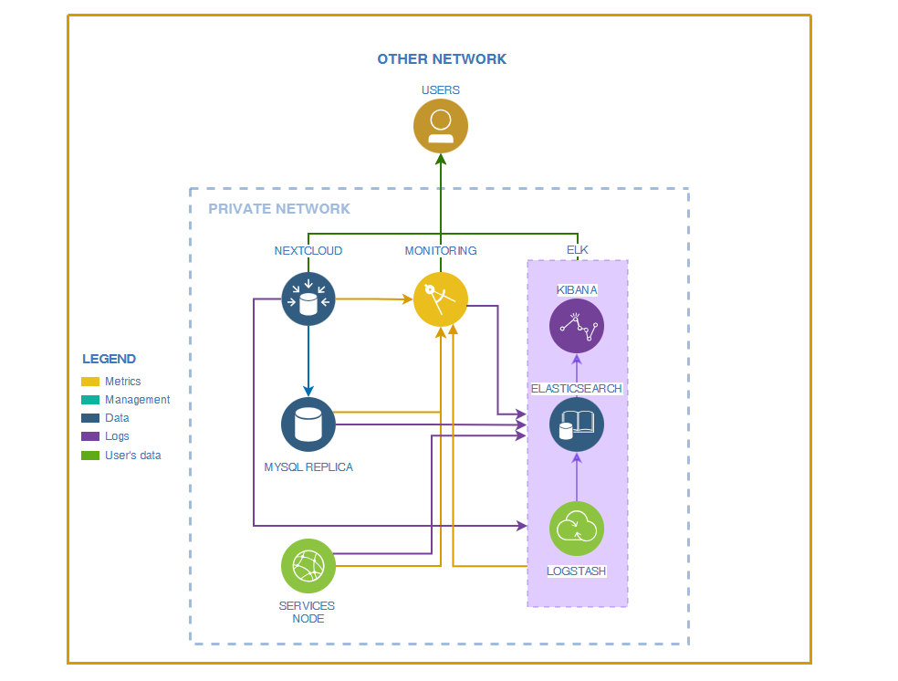

# Less48. Итоговая проектная работа
## Тема: Разработка плана восстановления работоспособности серверов в локальной сети с помощью ansible. 
- [Less48. Итоговая проектная работа](#less48-итоговая-проектная-работа)
  - [Тема: Разработка плана восстановления работоспособности серверов в локальной сети с помощью ansible.](#тема-разработка-плана-восстановления-работоспособности-серверов-в-локальной-сети-с-помощью-ansible)
    - [Цель:](#цель)
    - [Задание:](#задание)
    - [Комментарии к выполнению задания:](#комментарии-к-выполнению-задания)
      - [Схема серверов настроенного стенда](#схема-серверов-настроенного-стенда)
      - [Сетевые настройки хостов:](#сетевые-настройки-хостов)
      - [Описание файлов конфигураций и настроек](#описание-файлов-конфигураций-и-настроек)
  - [Инструкция системному администратору дежурной смены для восстановления работы серверов](#инструкция-системному-администратору-дежурной-смены-для-восстановления-работы-серверов)
    - [Подготовка сервера servicenode](#подготовка-сервера-servicenode)
    - [Восстановление сервера NEXTCLOUD](#восстановление-сервера-nextcloud)
    - [Восстановление сервера MYSQLREPL](#восстановление-сервера-mysqlrepl)
    - [Восстановление сервера MONITOR](#восстановление-сервера-monitor)
    - [Запуск настройки всех серверов на стенде](#запуск-настройки-всех-серверов-на-стенде)

### Цель: 
- Закрепить и продемонстрировать полученные знания и навыки;
- Создать веб-проект;
- Подготовить портфолио для работодателя;
  
### Задание:
Создание рабочего проекта

Веб проект с развертыванием нескольких виртуальных машин должен отвечать следующим требованиям:

- включен https;
- основная инфраструктура в DMZ зоне;
- фаерволл на входе;
- сбор метрик и настроенный алертинг;
- везде включен selinux;
- организован централизованный сбор логов;
- организован backup.

### Комментарии к выполнению задания:
> _Задание выполнено с использованием:_
> - Vagrant 2.4.5
> - Virtualbox 7.1.8 r168469
> - vagrant box: bento/ubuntu-22.04
> - Ansible [core 2.18.5]
> - nginx 1.18.0
> - Python 3.10.12
> - nextcloud 26.0.0
> - mysql 8.0.42
> - prometheus 2.44.0, node_exporter 1.9.1, alertmanager 0.28.1, grafana 11.2.2
> - elk 8.9.1 (elasticsearch, logstash, kibana, filebeat)

> Примечание:
> - Работа выполнена без использования DNS-сервера
> - Для настройки доступа к веб-сервисам использованы самоподписанные сертификаты

#### Схема серверов настроенного стенда


#### Сетевые настройки хостов:
| hostname    | ip-address    | назначение                                   |
| ----------- | ------------- | -------------------------------------------- |
| servicenode | 192.168.57.11 | резервный сервер для восстановления сервисов |
| nextcloud   | 192.168.57.12 | сервер NEXTCLOUD                             |
| mysqlrepl   | 192.168.57.13 | реплика mysql сервера nextcloud              |
| monitor     | 192.168.57.14 | сервер мониторинга                           |
| elk         | 192.168.57.15 | сервер логирования                           |

#### Описание файлов конфигураций и настроек

| Файл проекта                | Назначение                                                                                                            |
| --------------------------- | --------------------------------------------------------------------------------------------------------------------- |
| Vagrantfile                 | Конфигурация виртуальных серверов стенда                                                                              |
| provision.yml               | Настройка всех серверов                                                                                               |
| hosts                       | файл ansible inventory                                                                                                |
| prepaire_servicenode.yml    | Предварительна подготовка резервного сервера **servicenode** (~6min)                                                  |
| nextcloud_backup_play.yml   | Резервное копирование сервера **nextcloud** (~3min)                                                                   |
| nextcloud_restore_play.yml  | Восстановление работы **nextcloud** (~3min)                                                                           |
| mysqlrepl_restore_play.yml  | Восстановление сервера **mysqlrepl** (~1min)                                                                          |
| monitoring_restore_play.yml | восстановление сервера **monitor** (~2min)                                                                            |
| provision.yml               | Плейбук для настройки инфраструктуры серверов стенда. Выполняется при первоначальной настройке после запуска серверов |

---
## Инструкция системному администратору дежурной смены для восстановления работы серверов

Расположение плейбуков для восстановления: _otuslinuxprof/48-finalproject/vagrant48_
```bash
cd otuslinuxprof/48-finalproject/vagrant48
```
### Подготовка сервера servicenode
Перед выполнением восстановления любого сервера убедиться, что на хосте servicenode выполнены предварительные установки пакетов.

```bash
# Предварительная установка сервисов на резервном сервере servicenode (~6min)
ansible-playbook ./ansible/prepaire_servicenode.yml -i ./ansible/hosts --limit "servicenode"
```
_Выполняемые действия на sevicenode:_
| сервер         | используемая роль/плей                 | выполняемые задачи               |
| -------------- | -------------------------------------- | -------------------------------- |
| 1. servicenode | setup_node_exporter                    | конфигурирует node-exporter      |
|                | install_mysql                          | устанавливает сервер mysql       |
|                | setup_beats                            | конфигурирует filebeat           |
|                | install_nextcloud/tasks/preinstall.yml | устанавливает nginx, php-modules |


---
### Восстановление сервера NEXTCLOUD
1. Убедиться, что сервер servicenode доступен и подготовлен.
2. В плейбуке nextcloud_restore_play.yml в переменной _dumpfile_name_ указать имя файла восстанавливаемого дампа mysql
   ```bash
    ...
    dumpfile_name: 'mysqldump_nextcloud_2025-08-02.sql'
    ...
   ```
3. Запустить плейбук _nextcloud_restore_play.yml_

```bash
# Запуск восстановления работы nextcloud (~3min)
ansible-playbook ./ansible/nextcloud_restore_play.yml -i ./ansible/hosts
```
_Выполняемые действия на servicenode:_
|     | сервер      | используемая роль  | выполняемые задачи                                                                                                        |
| --- | ----------- | ------------------ | ------------------------------------------------------------------------------------------------------------------------- |
| 1.  | servicenode | setup_restore_node | изменяет сетевые настройки и меняет имя хоста в соответствии с восстанавливаемым сервером,                                |
| 2.  |             | install_mysql      | устанавливает сервер mysql                                                                                                |
| 3.  |             | setup_mysqlsource  | конфигурирует сервер mysql для репликации                                                                                 |
| 4.  |             | install_nextcloud  | конфигурирует сервер для выполнения сервиса nextcloud                                                                     |
| 5.  |             | setup_ssl_certs    | Копирует приватный ключ и сертификат из хранилища на сервер. Если в хранилище отсутствуют, запускает генерацию новой пары |
| 6.  | mysqlrepl   | setup_replica      | восстанавливает репликацию на сервер mysqlrepl                                                                            |


> Результат: 
> - Доступен сервис nextcloud по адресу https://nextcloud.loc
> - работоспособная репликация mysql; на сервере MYSQLREPL проверить статус реплики:
> 
```bash
mysql > SHOW REPLICA STATUS\G;
```

---
### Восстановление сервера MYSQLREPL
1. Убедиться, что сервер servicenode доступен и подготовлен.
2. Запустить плейбук _mysqlrepl_restore_play.yml_
```bash
# Запуск восстановления сервисов на сервере mysqlrepl (~1min)
ansible-playbook ./ansible/mysqlrepl_restore_play.yml -i ./ansible/hosts
```
_Выполняемые действия на servicenode:_
|     | сервер      | используемая роль  | выполняемые задачи                                                                        |
| --- | ----------- | ------------------ | ----------------------------------------------------------------------------------------- |
| 1.  | servicenode | setup_restore_node | изменяет сетевые настройки и меняет имя хоста в соответствии с восстанавливаемым сервером |
| 2.  |             | install_mysql      | устанавливает сервер mysql                                                                |
| 3.  | nextcloud   | create_mysql_dump  | создаёт бэкап БД на мастере                                                               |
| 4.  | servicenode | setup_replica      | восстанавливает репликацию                                                                |


> Результат: 
> - Готовый дамп БД mysql сервера nextcloud, 
> - рабочая реплика mysql, на сервере MYSQLREPL проверить статус реплики:
> 
```bash
mysql > SHOW REPLICA STATUS\G;
```

---
### Восстановление сервера MONITOR
1. Убедиться, что сервер servicenode доступен и подготовлен.
2. Запустить плейбук monitoring_restore_play.yml_
```bash
# Запуск восстановления сервисов на сервере mysqlrepl (~1min)
ansible-playbook ./ansible/monitoring_restore_play.yml -i ./ansible/hosts
```
_Выполняемые действия на servicenode:_
|     | сервер      | используемая роль  | выполняемые задачи                                                                                                        |
| --- | ----------- | ------------------ | ------------------------------------------------------------------------------------------------------------------------- |
| 1.  | servicenode | setup_restore_node | изменяет сетевые настройки и меняет имя хоста в соответствии с восстанавливаемым сервером                                 |
| 2.  |             | setup_monitoring   | конфигурирует сервер мониторинга                                                                                          |
|     |             | setup_ssl_certs    | Копирует приватный ключ и сертификат из хранилища на сервер. Если в хранилище отсутствуют, запускает генерацию новой пары |

> Результат: 
> - доступный сервер prometheus по адресу https://prometheus.loc/
> - доступный сервер grafana по адресу https://monitor.loc/
> - наличие дашборда https://monitor.loc/dashboards
> - доступные алерты https://prometheus.loc/alerts?search=

---
### Запуск настройки всех серверов на стенде
(Выполняется только при разворачивании стенда для настройки инфрастуктуры стенда. Запускается после завершения работы vagrant)
После запуска всех виртуальных серверов запустить плейбук _provision.yml_
```bash
# Запуск настройки инфраструктуры всех серверов
ansible-playbook ./ansible/provision.yml  -i ./ansible/hosts
```
_Выполняемые действия:_ 
| сервер         | используемая роль   | выполняемые задачи                                      |
| -------------- | ------------------- | ------------------------------------------------------- |
| 1. servicenode | setup_node_exporter | конфигурирует node-exporter                             |
|                | install_mysql       | устанавливает сервер mysql                              |
|                | setup_beats         | конфигурирует filebeat                                  |
| 2. nextcloud   | setup_node_exporter | конфигурирует node-exporter                             |
|                | install_mysql       | устанавливает сервера mysql                             |
|                | setup_mysqlsource   | конфигурирует mysql source                              |
|                | install_nextcloud   | конфигурирует веб-сервер nginx, конфигурирует nextcloud |
|                | create_mysql_dump   | создаёт бэкап сервера mysql                             |
|                | setup_beats         | конфигурирует filebeat                                  |
| 3. mysqlrepl   | setup_node_exporter | конфигурирует node-exporter                             |
|                | setup_replica       | настраивает репликацию                                  |
| 4. monitor     | setup_node_exporter | конфигурирует node-exporter                             |
|                | setup_monitoring    | конфигурирует сервер мониторинга                        |
|                | setup_beats         | конфигурирует filebeat                                  |
| 5. elk         | setup_node_exporter | устанавливает node-exporter                             |
|                | setup_elk           | конфигурирует сервер логирования                        |


